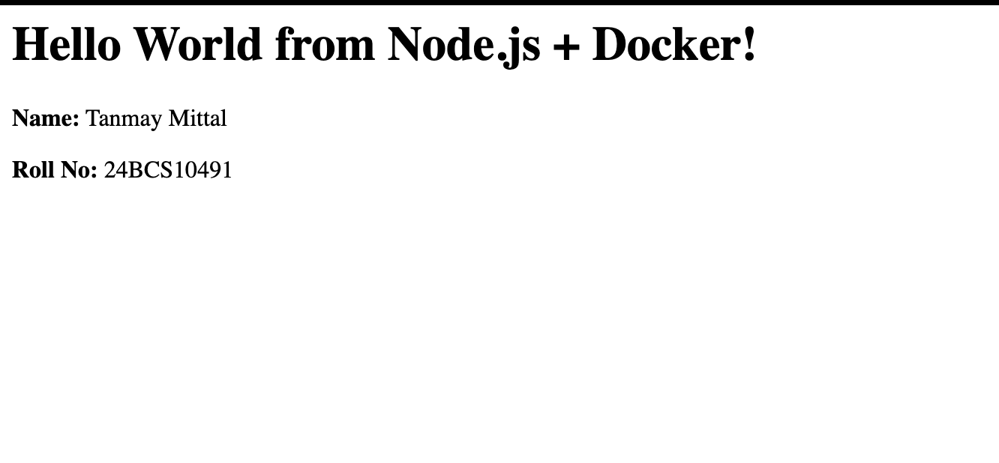
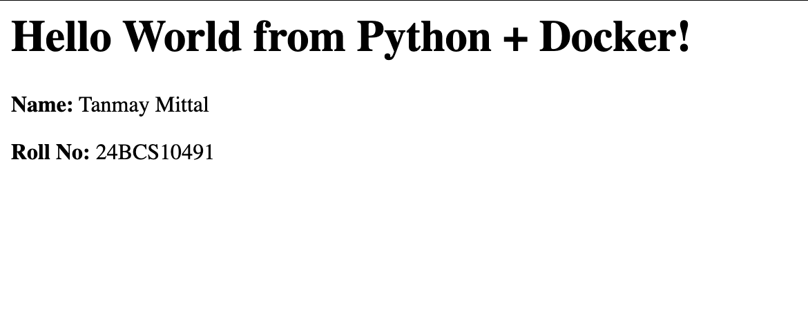
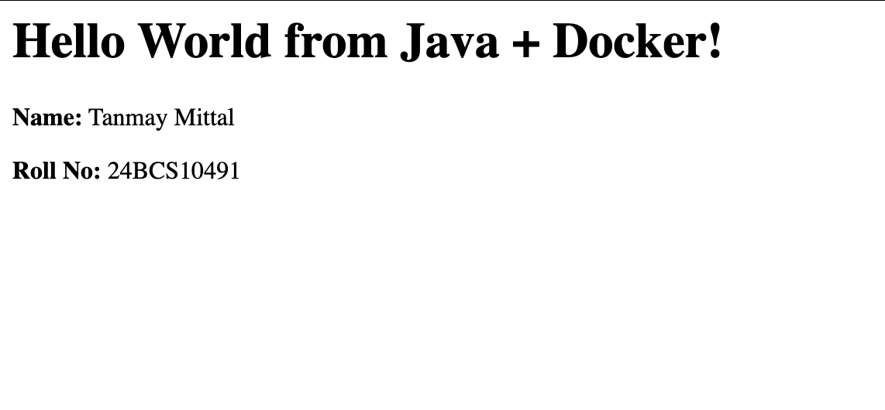
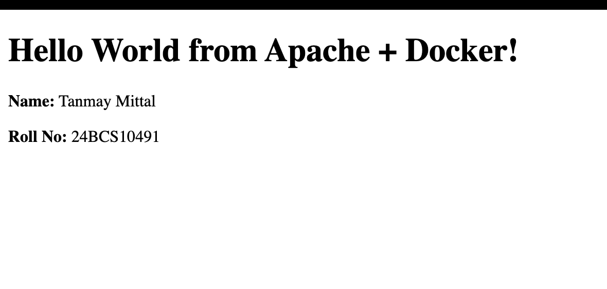

# Docker Images — Hello World Applications

## Overview

This practical focused on creating and running simple web applications using Docker.

Four different applications were containerized:

1. Node.js
2. Python
3. Java
4. Apache HTTP Server

For each application, a separate folder and Dockerfile were created. The Docker images were built successfully and the containers were run and verified through a web browser.

---

# 1. Node.js Application

## Objective

Create a simple Node.js web application, containerize it using Docker, and access it through a browser.

## Application Code

    const http = require("http");

    const server = http.createServer((req, res) => {
        res.writeHead(200, { "Content-Type": "text/html" });

        res.end(`
            <h1>Hello World from Node.js + Docker!</h1>
            
<strong>Name:</strong> Tanmay Mittal

            
<strong>Roll No:</strong> 24BCS10491

        `);
    });

    server.listen(3000, () => {
        console.log("Server running on port 3000");
    });

## Dockerfile

    FROM node:22-alpine

    WORKDIR /app

    COPY package.json .
    COPY server.js .

    EXPOSE 3000

    CMD ["npm", "start"]

## Build Image

    docker build -t hello-node .

## Run Container

    docker run -d --name hello-node-container -p 3000:3000 hello-node

The application was accessed at:

    http://localhost:3000

## Output

The Node.js application successfully displayed the Hello World webpage.

---

# 2. Python Application

## Objective

Create a simple Python web application using Flask, containerize it using Docker, and access it through a browser.

## Application Code

    from flask import Flask

    app = Flask(__name__)

    @app.route("/")
    def hello():
        return """
        <h1>Hello World from Python + Docker!</h1>
        
<strong>Name:</strong> Tanmay Mittal

        
<strong>Roll No:</strong> 24BCS10491

        """

    app.run(host="0.0.0.0", port=5000)

## Requirements

    flask

## Dockerfile

    FROM python:3.12-slim

    WORKDIR /app

    COPY requirements.txt .
    RUN pip install --no-cache-dir -r requirements.txt

    COPY app.py .

    EXPOSE 5000

    CMD ["python", "app.py"]

## Build Image

    docker build -t hello-python .

## Run Container

Port `5001` was used on the host because port `5000` was already occupied.

    docker run -d --name hello-python-container -p 5001:5000 hello-python

The application was accessed at:

    http://localhost:5001

## Output

The Python application successfully displayed the Hello World webpage.

---

# 3. Java Application

## Objective

Create a simple Java web application, containerize it using Docker, and access it through a browser.

## Application Code

The application uses Java's built-in `HttpServer` to create a lightweight HTTP server.

    import com.sun.net.httpserver.HttpServer;
    import java.io.IOException;
    import java.io.OutputStream;
    import java.net.InetSocketAddress;

    public class Main {
        public static void main(String[] args) throws IOException {
            HttpServer server = HttpServer.create(new InetSocketAddress(8080), 0);

            server.createContext("/", exchange -> {
                String response = """
                    <h1>Hello World from Java + Docker!</h1>
                    
<strong>Name:</strong> Tanmay Mittal

                    
<strong>Roll No:</strong> 24BCS10491

                    """;

                exchange.sendResponseHeaders(200, response.getBytes().length);

                try (OutputStream os = exchange.getResponseBody()) {
                    os.write(response.getBytes());
                }
            });

            server.start();

            System.out.println("Java server running on port 8080");
        }
    }

## Dockerfile

    FROM eclipse-temurin:21-jdk-alpine

    WORKDIR /app

    COPY Main.java .

    RUN javac Main.java

    EXPOSE 8080

    CMD ["java", "Main"]

## Build Image

    docker build -t hello-java .

## Run Container

    docker run -d --name hello-java-container -p 8080:8080 hello-java

The application was accessed at:

    http://localhost:8080

## Output

The Java application successfully displayed the Hello World webpage.

---

# 4. Apache Web Server

## Objective

Create a simple webpage and serve it using the Apache HTTP Server running inside a Docker container.

## HTML Application

    <!DOCTYPE html>
    <html>
    <head>
        <title>Apache Docker App</title>
    </head>
    <body>
        <h1>Hello World from Apache + Docker!</h1>
        
<strong>Name:</strong> Tanmay Mittal

        
<strong>Roll No:</strong> 24BCS10491

    </body>
    </html>

## Dockerfile

    FROM httpd:2.4-alpine

    COPY index.html /usr/local/apache2/htdocs/

    EXPOSE 80

## Build Image

    docker build -t hello-apache .

## Run Container

Port `8081` on the host was mapped to port `80` inside the Apache container.

    docker run -d --name hello-apache-container -p 8081:80 hello-apache

The application was accessed at:

    http://localhost:8081

## Output

The Apache web server successfully served the Hello World webpage.

---

# Docker Concepts Practiced

## Dockerfile

A Dockerfile contains instructions used to build a Docker image.

| Instruction | Purpose |
|---|---|
| `FROM` | Specifies the base image |
| `WORKDIR` | Sets the working directory inside the container |
| `COPY` | Copies files into the image |
| `RUN` | Executes commands during image creation |
| `EXPOSE` | Documents the port used by the application |
| `CMD` | Specifies the default command when the container starts |

## Docker Build

The `docker build` command creates a Docker image from a Dockerfile.

    docker build -t <image-name> .

## Docker Run

The `docker run` command creates and starts a container from an image.

    docker run -d --name <container-name> -p <host-port>:<container-port> <image-name>

## Port Mapping

Port mapping connects a port on the host machine to a port inside the container.

For example, the Python application used:

    Host Port 5001 → Container Port 5000

This allowed the application running on port `5000` inside the container to be accessed through port `5001` on the host machine.

---

# Verification

The Docker images created during the practical can be viewed using:

    docker images

The running containers can be viewed using:

    docker ps

The four applications were successfully built and executed using Docker.

---

# Directory Structure

    docker-images/

    ├── apache-app/
    │   ├── Dockerfile
    │   └── index.html
    │
    ├── java-app/
    │   ├── Dockerfile
    │   └── Main.java
    │
    ├── nodejs-app/
    │   ├── Dockerfile
    │   ├── package.json
    │   └── server.js
    │
    ├── python-app/
    │   ├── Dockerfile
    │   ├── app.py
    │   └── requirements.txt
    │
    ├── images/
    │   ├── ApacheApp.png
    │   ├── JavaApp.png
    │   ├── NodeApp.png
    │   └── PythonApp.png
    │
    └── README.md

---

# Result

Four different applications were successfully containerized using Docker:

- Node.js application
- Python application
- Java application
- Apache web server

Each application was built into a Docker image, run as a container, and verified through a web browser.

This practical provided hands-on experience with Dockerfiles, Docker images, containers, application port mapping, and running different technology stacks inside containers.

---

# Author

**Tanmay Mittal**

**Roll No.: 24BCS10491**