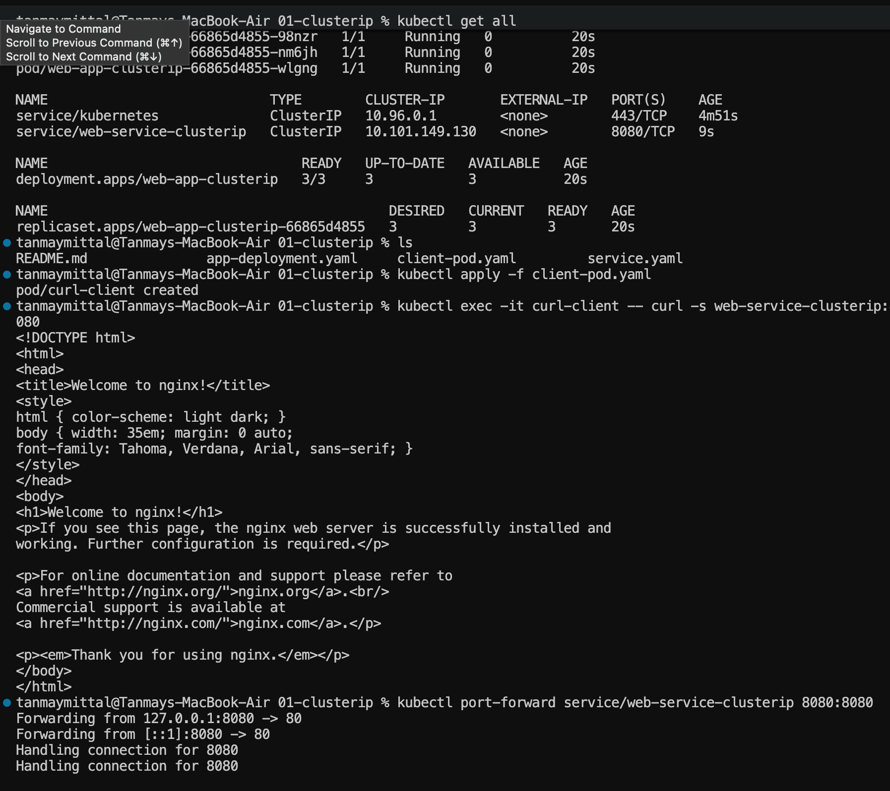
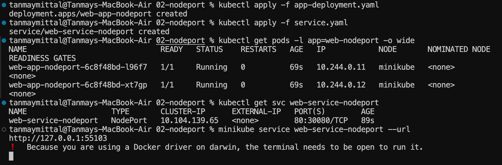
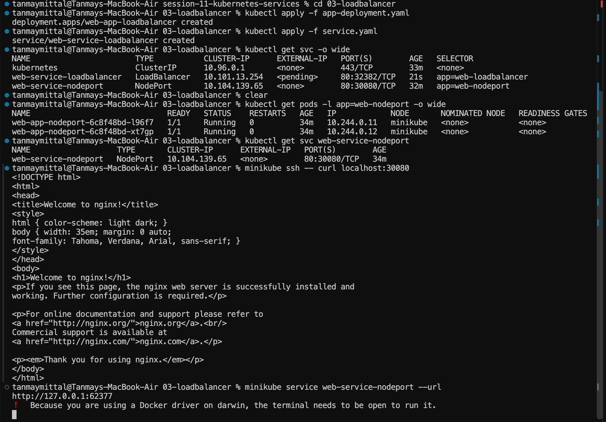
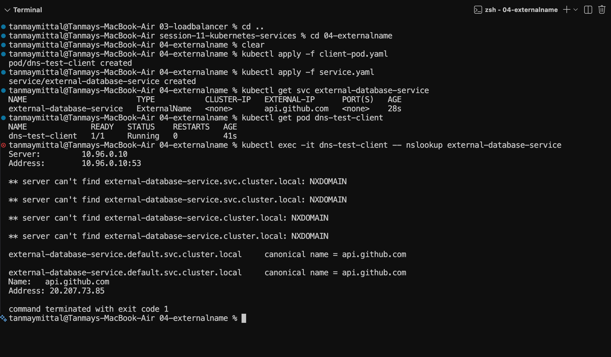
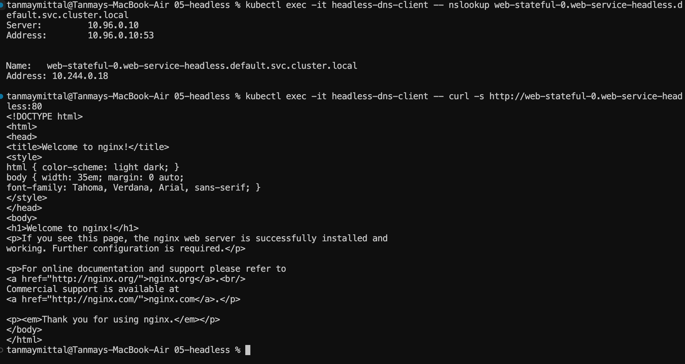
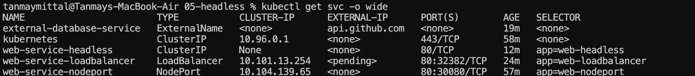

**# Kubernetes Services — Service Discovery & External Access**

**## Overview**

This session covered the major Kubernetes Service types and how they provide

internal communication, external access, DNS-based discovery, and direct Pod discovery.

The practicals covered:

1\. ClusterIP

2\. NodePort

3\. LoadBalancer

4\. ExternalName

5\. Headless Service

\---

**## Project Structure**

    session-11-kubernetes-services/

    │

    ├── 01-clusterip/

    │   ├── README.md

    │   ├── app-deployment.yaml

    │   ├── client-pod.yaml

    │   └── service.yaml

    │

    ├── 02-nodeport/

    │   ├── README.md

    │   ├── app-deployment.yaml

    │   └── service.yaml

    │

    ├── 03-loadbalancer/

    │   ├── README.md

    │   ├── app-deployment.yaml

    │   └── service.yaml

    │

    ├── 04-externalname/

    │   ├── README.md

    │   ├── client-pod.yaml

    │   └── service.yaml

    │

    ├── 05-headless/

    │   ├── README.md

    │   ├── app-statefulset.yaml

    │   ├── client-pod.yaml

    │   └── service.yaml

    │

    ├── deployment/

    ├── dns-test/

    ├── images/

    ├── service/

    ├── troubleshooting/

    ├── fqdn.md

    └── service.md

\---

**# 1. ClusterIP Service**

**## What is ClusterIP?**

\`ClusterIP\` is the default Kubernetes Service type.

It provides a stable virtual IP and DNS name for accessing a group of Pods

from inside the Kubernetes cluster.

The Service selects Pods using labels and forwards traffic to the matching Pods.

    Client Pod

         |

         \| web-service-clusterip:8080

         ↓

    ClusterIP Service

         |

         +----------+----------+

         ↓          ↓          ↓

       Pod 1      Pod 2      Pod 3

       nginx      nginx      nginx

**### Deployment**

The application was deployed with 3 nginx replicas.

    kubectl apply -f app-deployment.yaml

**### Service**

    kubectl apply -f service.yaml

The Service exposed the application internally on port \`8080\`.

**### Verification**

    kubectl get all

The output showed:

\- 3/3 Pods running

\- Deployment available

\- ClusterIP Service created

\- Service port \`8080\`

**### Internal Service Access**

A client Pod was created to test communication from inside the cluster:

    kubectl apply -f client-pod.yaml

The Service was accessed using its Kubernetes DNS name:

    kubectl exec -it curl-client -- curl -s web-service-clusterip:8080

The nginx HTML response confirmed successful communication.



**### Port Forwarding**

ClusterIP is not directly accessible from the host.

For temporary host access, port forwarding was used:

    kubectl port-forward service/web-service-clusterip 8080:8080

This mapped:

    localhost:8080

          ↓

    ClusterIP Service:8080

Port forwarding is temporary and does not change the Service type.

\---

**# 2. NodePort Service**

**## What is NodePort?**

\`NodePort\` exposes a Service on a static port on every Kubernetes node.

The default NodePort range is:

    30000–32767

The Service used:

    port:       80

    targetPort: 80

    nodePort:   30080

Therefore:

    80:30080/TCP

means:

\- \`80\` → Service port

\- \`30080\` → NodePort

\- \`80\` → container target port

**### Deployment**

Two nginx replicas were created:

    kubectl apply -f app-deployment.yaml

**### Service**

    kubectl apply -f service.yaml

**### Verification**

    kubectl get pods -l app=web-nodeport -o wide

Both Pods were running on the Minikube node.

    kubectl get svc web-service-nodeport

The Service showed:

    web-service-nodeport   NodePort   ...   80:30080/TCP

**### Testing**

With the Minikube Docker driver on macOS, the Minikube node IP was not directly reachable from the Mac.

For example:

    curl http\://$(minikube ip):30080

resulted in a connection failure.

The NodePort itself was verified from inside the Minikube node:

    minikube ssh -- curl localhost:30080

The nginx response confirmed that the NodePort routing was working.



Minikube can also provide a host-accessible URL:

    minikube service web-service-nodeport --url

\---

**# 3. LoadBalancer Service**

**## What is LoadBalancer?**

\`LoadBalancer\` is designed to expose a Kubernetes Service externally through

an external load balancer, usually provisioned by a cloud provider.

Typical flow:

    External Client

          |

          ↓

    External Load Balancer

          |

          ↓

    Kubernetes Service

          |

       +--+--+

       ↓     ↓

      Pod   Pod

**### Deployment**

The application was deployed using:

    kubectl apply -f app-deployment.yaml

**### Service**

The LoadBalancer Service was created using:

    kubectl apply -f service.yaml

**### Verification**

    kubectl get svc -o wide

The Service appeared as:

    web-service-loadbalancer   LoadBalancer   ...   \<pending>

The \`\<pending>\` external IP is expected in this local Minikube environment because

there is no cloud provider automatically provisioning an external load balancer.

The Service still receives a ClusterIP and internally behaves as a Service endpoint.



\---

**# 4. ExternalName Service**

**## What is ExternalName?**

\`ExternalName\` provides a Kubernetes DNS alias for an external hostname.

It does not create:

\- Pods

\- Selectors

\- ClusterIP

\- kube-proxy routing rules

Example:

    external-database-service

              ↓

          CoreDNS

              ↓

        api.github.com

**### Service Configuration**

    apiVersion: v1

    kind: Service

    metadata:

      name: external-database-service

    spec:

      type: ExternalName

      externalName: api.github.com

**### Deployment**

The DNS test Pod was created:

    kubectl apply -f client-pod.yaml

The Service was created:

    kubectl apply -f service.yaml

**### Verification**

    kubectl get svc external-database-service

The Service showed:

    TYPE          ExternalName

    CLUSTER-IP    \<none>

    EXTERNAL-IP   api.github.com

**### DNS Test**

    kubectl exec -it dns-test-client -- nslookup external-database-service

CoreDNS returned:

    canonical name = api.github.com

This confirms that the Kubernetes Service is acting as a DNS alias.



**### Important Point**

\`ExternalName\` performs DNS aliasing only.

It does not proxy or load-balance the external traffic.

The external hostname can be changed in the YAML and applied with:

    kubectl apply -f service.yaml

The \`etcd\` database should not be edited directly. Kubernetes API Server manages the stored Service configuration.

\---

**# 5. Headless Service**

**## What is a Headless Service?**

A Headless Service is created using:

    spec:

      clusterIP: None

Unlike a normal ClusterIP Service, it does not provide a virtual IP.

Instead, CoreDNS returns the IP addresses of the matching Pods.

    Client Pod

         |

         ↓

      CoreDNS

         |

    +----+----+----+

    ↓    ↓    ↓

   Pod 0 Pod 1 Pod 2

    IP   IP   IP

**### StatefulSet**

A StatefulSet was used to create three Pods:

    web-stateful-0

    web-stateful-1

    web-stateful-2

Unlike Deployment Pods, StatefulSet Pods have predictable identities.

**### Headless Service**

The Service used:

    spec:

      clusterIP: None

The Service was created using:

    kubectl apply -f service.yaml

The StatefulSet was created using:

    kubectl apply -f app-statefulset.yaml

**### Verification**

    kubectl get svc -o wide

The Headless Service showed:

    web-service-headless   ClusterIP   None   \<none>   80/TCP



**### Pod-Specific DNS**

A DNS test Pod was used to resolve individual StatefulSet Pods:

    kubectl exec -it headless-dns-client -- nslookup web-stateful-0.web-service-headless.default.svc.cluster.local

The result resolved the Pod directly:

    web-stateful-0.web-service-headless.default.svc.cluster.local

    → 10.244.0.18

**### Direct Pod Access**

The Pod was then accessed using its DNS name:

    kubectl exec -it headless-dns-client -- curl -s http\://web-stateful-0.web-service-headless:80

The nginx response confirmed successful direct Pod communication.



**### Important Point**

The hostname:

    web-stateful-0.web-service-headless

is Kubernetes internal DNS.

It works from inside the cluster, but the Mac's normal DNS resolver does not know this hostname.

Therefore this fails from the Mac:

    curl http\://web-stateful-0.web-service-headless:80

But this works from a Pod inside Kubernetes:

    kubectl exec -it headless-dns-client -- curl -s http\://web-stateful-0.web-service-headless:80

\---

**# 6. Service Comparison**

\| Service Type | ClusterIP | External Access | DNS Behavior | Main Use |

\|---|---|---|---|---|

\| ClusterIP | Yes | No | Resolves to Service IP | Internal applications |

\| NodePort | Yes | Yes, through node port | Resolves to Service IP | Host-level / simple external access |

\| LoadBalancer | Yes | Yes, with external LB | Resolves to Service IP | Cloud-based external traffic |

\| ExternalName | No | Not a proxy | Returns external CNAME | External DNS aliases |

\| Headless | No | No by itself | Returns Pod IPs | Stateful / direct Pod discovery |

\---

**# 7. Key Concepts Learned**

**### ClusterIP**

    Internal access

    Service IP

    Service DNS

    Load balances across matching Pods

**### NodePort**

    Node IP + NodePort

    Example: :30080

    Built on top of ClusterIP

**### LoadBalancer**

    External Load Balancer

            ↓

       Kubernetes Service

            ↓

           Pods

In local Minikube, the external IP may remain \`\<pending>\`.

**### ExternalName**

    Kubernetes DNS name

            ↓

       CNAME

            ↓

    External hostname

No Pod routing is performed by Kubernetes.

**### Headless Service**

    clusterIP: None

            ↓

         CoreDNS

            ↓

       Individual Pod IPs

Often paired with StatefulSets when stable Pod identities and direct discovery are required.

\---

**# 8. Overall Service Architecture**

    ┌──────────────────────────────────────────────────────┐

    │                    Kubernetes Cluster                │

    │                                                      │

    │  ClusterIP                                            │

    │  Client ──→ Service ──→ Pods                         │

    │                                                      │

    │  NodePort                                             │

    │  External ──→ Node:30080 ──→ Service ──→ Pods       │

    │                                                      │

    │  LoadBalancer                                         │

    │  External ──→ Load Balancer ──→ Service ──→ Pods    │

    │                                                      │

    │  ExternalName                                         │

    │  Pod ──→ CoreDNS ──→ External Hostname              │

    │                                                      │

    │  Headless                                             │

    │  Pod ──→ CoreDNS ──→ Individual Pod IPs             │

    │                                                      │

    └──────────────────────────────────────────────────────┘

\---

**# 9. Cleanup**

Resources can be removed using:

    kubectl delete -f service.yaml

    kubectl delete -f app-deployment.yaml

For the Headless Service:

    kubectl delete -f client-pod.yaml

    kubectl delete -f app-statefulset.yaml

    kubectl delete -f service.yaml

\---

**# Conclusion**

This session demonstrated how Kubernetes Services provide different networking

and service-discovery mechanisms.

The main distinction is:

    ClusterIP      → Internal Service Access

    NodePort       → Node-Level External Access

    LoadBalancer   → External Load Balancer

    ExternalName   → External DNS Alias

    Headless       → Direct Pod Discovery

Together, these Service types form the foundation for communication and

exposure of workloads in Kubernetes.

# 10. Additional Questions & Research

**Author: Tanmay**

## Q1. Difference Between DaemonSet and StatefulSet

| Feature         | DaemonSet                                | StatefulSet                                    |
| --------------- | ---------------------------------------- | ---------------------------------------------- |
| Primary purpose | Runs a Pod on every or selected node     | Runs Pods with stable identities               |
| Pod placement   | Node-oriented                            | Scheduler-oriented                             |
| Pod identity    | Not stable                               | Stable and predictable                         |
| Pod names       | Random/generated                         | Ordered, e.g. `app-0`, `app-1`                 |
| Storage         | No special storage identity              | Can provide stable PersistentVolumeClaims      |
| Scaling         | Usually tied to number of matching nodes | Explicit replica count                         |
| Typical use     | Monitoring, logging, node agents         | Databases, Kafka, distributed stateful systems |

A **DaemonSet** is used when a workload needs a copy of a Pod on each matching node, such as log collectors or node-monitoring agents. A **StatefulSet** is used when Pods need stable identities, persistent storage, or ordered deployment/scaling.

### Simple way to remember

```text
DaemonSet  →  "I need one Pod per Node."

StatefulSet →  "I need Pods with identities."
```

---

## Q2. Difference Between Deployment, ReplicaSet and DaemonSet

| Feature         | Deployment                    | ReplicaSet                        | DaemonSet                       |
| --------------- | ----------------------------- | --------------------------------- | ------------------------------- |
| Main purpose    | Manage stateless applications | Maintain a fixed number of Pods   | Run a Pod on each matching node |
| Replica control | Yes                           | Yes                               | Based on nodes                  |
| Rolling updates | Yes                           | No built-in rollout orchestration | Yes                             |
| Pod identity    | Interchangeable               | Interchangeable                   | Node-associated                 |
| Typical use     | Web/API applications          | Usually managed by Deployment     | Node-level agents               |
| Example         | Frontend with 5 replicas      | Maintain 5 identical Pods         | Log collector on every node     |

### Relationship

A Deployment normally manages a ReplicaSet, and the ReplicaSet manages the actual Pods:

```text
Deployment
    |
    ↓
ReplicaSet
    |
    +---- Pod
    +---- Pod
    +---- Pod
```

A DaemonSet works differently:

```text
DaemonSet
    |
    +---- Node 1 → Pod
    +---- Node 2 → Pod
    +---- Node 3 → Pod
```

A **Deployment** is generally the appropriate abstraction for stateless applications and provides declarative updates and rolling deployments. A **ReplicaSet** primarily maintains the desired number of identical Pods and is normally managed by a Deployment. A **DaemonSet** ensures a Pod runs on every or selected node.

---

## Q3. Research: CoreDNS and Kubernetes DNS

**CoreDNS** is the default DNS implementation used for Kubernetes cluster DNS.

It allows Pods to discover Services and other Kubernetes resources using DNS names instead of hardcoded IP addresses.

For example:

```text
web-service-clusterip
        ↓
CoreDNS
        ↓
Service ClusterIP
```

For a Headless Service:

```text
web-service-headless
        ↓
CoreDNS
        ↓
Pod IPs
```

For an `ExternalName` Service:

```text
external-database-service
        ↓
CoreDNS
        ↓
CNAME → api.github.com
```

### Why CoreDNS matters

* Provides DNS-based Service Discovery.
* Allows applications to use stable Service names instead of IP addresses.
* Resolves Kubernetes Service names such as:

```text
<service>.<namespace>.svc.cluster.local
```

* Supports Headless Service discovery by returning individual Pod addresses.
* Can be configured through its CoreDNS `Corefile`/ConfigMap.

### NodeLocal DNSCache

Kubernetes also supports **NodeLocal DNSCache**, which runs a DNS caching agent as a DaemonSet on cluster nodes.

The goal is to improve DNS performance and reduce reliance on cross-node DNS traffic, DNAT, and connection tracking.

```text
Pod
 ↓
NodeLocal DNSCache
 ↓
CoreDNS
 ↓
Kubernetes / External DNS
```

---

## Quick Revision

```text
Deployment
→ Manages stateless application releases.

ReplicaSet
→ Maintains the required number of identical Pods.

DaemonSet
→ Runs a Pod on every or selected Node.

StatefulSet
→ Runs Pods with stable identities and storage relationships.

CoreDNS
→ Provides DNS-based service discovery inside Kubernetes.
```
