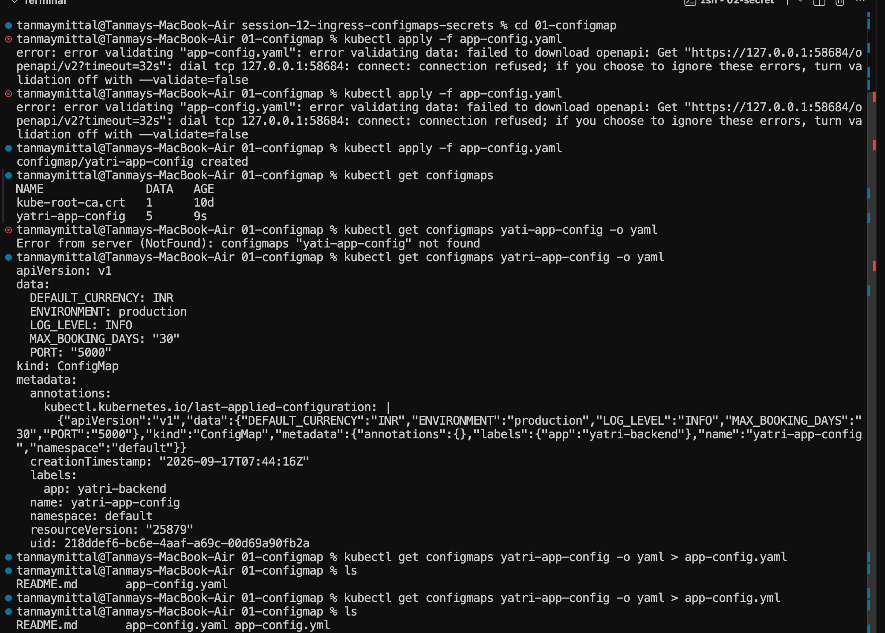
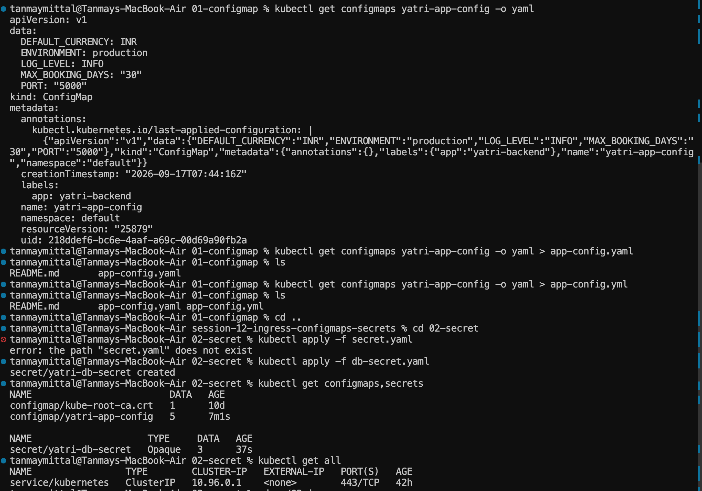
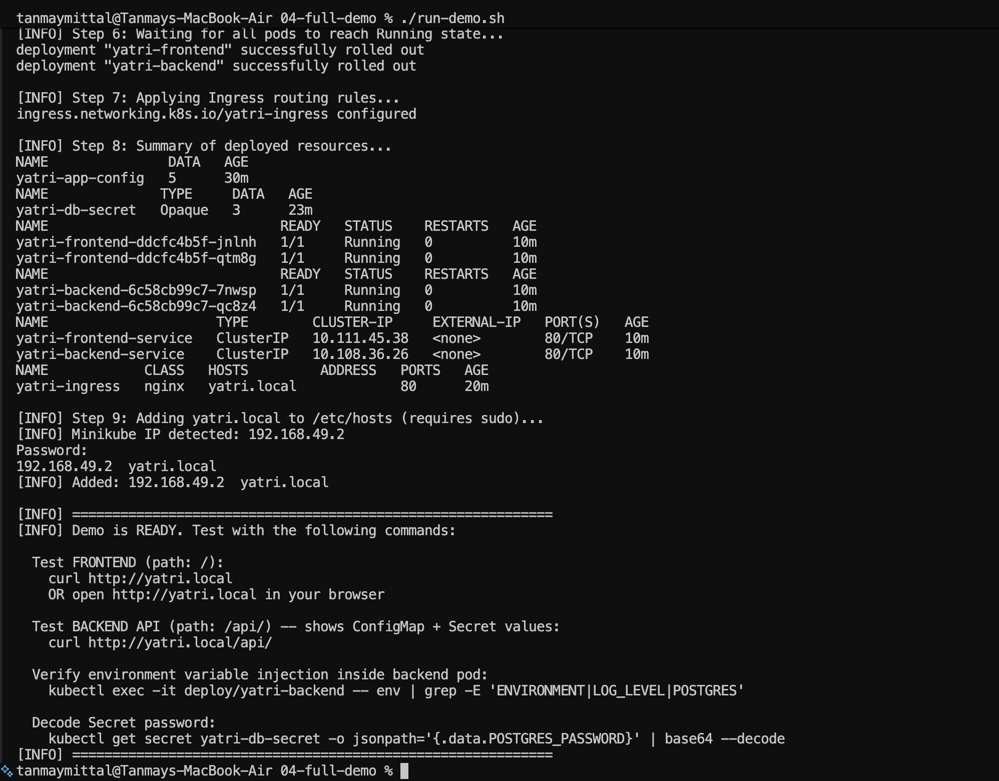

# Session 12 — Ingress, ConfigMaps & Secrets

## Overview

This session covers three important Kubernetes concepts:

- **ConfigMaps** — storing non-sensitive configuration outside container images.
- **Secrets** — storing sensitive information such as passwords and credentials.
- **Ingress** — routing external HTTP/HTTPS traffic to Kubernetes Services.

The session also combines these concepts into a complete Kubernetes application using **Minikube + NGINX Ingress**.

---

# 1. ConfigMap

## What is a ConfigMap?

A ConfigMap stores **non-sensitive configuration data** separately from the application container image.

Instead of hardcoding configuration:

```python
LOG_LEVEL = "DEBUG"
PORT = 5000
DATABASE_HOST = "localhost"
```

we can keep the configuration in Kubernetes:

```text
Application Image
       +
   ConfigMap
       ↓
Application Pod
```

This allows the same container image to be used across environments while changing only the configuration.

### Example Configuration

```yaml
apiVersion: v1
kind: ConfigMap

metadata:
  name: yatri-app-config

data:
  ENVIRONMENT: "production"
  LOG_LEVEL: "INFO"
  PORT: "5000"
  DEFAULT_CURRENCY: "INR"
  MAX_BOOKING_DAYS: "30"
```

### Apply ConfigMap

```bash
kubectl apply -f app-config.yaml
```

### View ConfigMaps

```bash
kubectl get configmaps
```

### Inspect ConfigMap

```bash
kubectl get configmap yatri-app-config -o yaml
```

### Read a Specific Value

```bash
kubectl get configmap yatri-app-config -o jsonpath='{.data.LOG_LEVEL}'
```

Expected output:

```text
INFO
```

### Important Points

- ConfigMaps are intended for **non-sensitive data**.
- Examples include log levels, feature flags, environment names and application configuration.
- ConfigMaps can be consumed as environment variables or mounted as files.
- Updating a ConfigMap does not automatically restart Pods.
- ConfigMaps have a size limit of approximately **1 MiB**.

### ConfigMap Demo



---

# 2. Secret

## What is a Secret?

A Kubernetes Secret is used to store **sensitive information**, such as:

- Database passwords
- API tokens
- User credentials
- Certificates

Example:

```yaml
apiVersion: v1
kind: Secret

metadata:
  name: yatri-db-secret

type: Opaque

data:
  POSTGRES_USER: <base64-value>
  POSTGRES_PASSWORD: <base64-value>
  POSTGRES_DB: <base64-value>
```

### Apply Secret

```bash
kubectl apply -f db-secret.yaml
```

### View Secrets

```bash
kubectl get secrets
```

### Inspect Secret

```bash
kubectl get secret yatri-db-secret -o yaml
```

Secret values are displayed as **Base64-encoded values**.

### Base64 Is Encoding, Not Encryption

For example:

```bash
echo -n "yat ri_admin" | base64
```

Output:

```text
eWF0IHJpX2FkbWlu
```

Decode it using:

```bash
echo -n "eWF0IHJpX2FkbWlu" | base64 --decode
```

Output:

```text
yat ri_admin
```

Base64 only changes the representation of the data. It should **not be treated as encryption**.

### Decode a Kubernetes Secret Value

```bash
kubectl get secret yatri-db-secret -o jsonpath='{.data.POSTGRES_PASSWORD}' | base64 --decode
```

### Secret Demo



---

# 3. Ingress

## What is Ingress?

Ingress provides rules for routing **external HTTP/HTTPS traffic** to Kubernetes Services.

Instead of exposing every application separately:

```text
Internet
   |
   +---- Service A
   |
   +---- Service B
   |
   +---- Service C
```

Ingress allows multiple applications to be accessed through a common entry point:

```text
                    Ingress
                      |
             +--------+--------+
             |                 |
          /api/                /
             |                 |
       Backend Service    Frontend Service
```

---

# 4. Ingress vs Ingress Controller

These two terms are related but **not the same thing**.

## Ingress

An **Ingress** is a Kubernetes API resource containing routing rules.

For example:

```text
yatri.local/
       ↓
Frontend Service

yatri.local/api/
       ↓
Backend Service
```

The Ingress resource describes **what routing should happen**.

It does not itself process network traffic.

---

## Ingress Controller

An **Ingress Controller** is the actual component that watches Ingress resources and implements their routing rules.

In this session we use:

```text
NGINX Ingress Controller
```

The controller receives the request and routes it according to the Ingress rules.

---

## Simple Difference

```text
Ingress
   ↓
"Here are the routing rules."

Ingress Controller
   ↓
"I will actually implement those rules."
```

### Analogy

Think of:

```text
Ingress = Traffic Rules
Ingress Controller = Traffic Police
```

The rules describe what should happen.

The controller actually observes traffic and applies those rules.

---

# 5. Creating an Ingress vs Creating an Ingress Controller

These are two separate operations.

## Creating an Ingress Resource

Example:

```bash
kubectl apply -f ingress.yaml
```

This creates an object inside Kubernetes containing routing rules.

Example:

```text
/api/  → yatri-backend-service
/      → yatri-frontend-service
```

By itself, this does **not** provide a component that processes the incoming HTTP traffic.

---

## Creating / Installing an Ingress Controller

The Ingress Controller is the actual software responsible for implementing those rules.

In Minikube, we enabled the NGINX controller using:

```bash
minikube addons enable ingress
```

The controller then runs inside the Kubernetes cluster.

Check it using:

```bash
kubectl get pods -n ingress-nginx
```

The controller must be running for the Ingress rules to actually handle traffic.

---

## How They Work Together

```text
Client
  |
  | HTTP Request
  ↓
NGINX Ingress Controller
  |
  | reads Ingress rules
  ↓
Ingress Resource
  |
  +-----------------------+
  |                       |
  ↓                       ↓
/                       /api/
  |                       |
  ↓                       ↓
Frontend Service       Backend Service
  |                       |
  ↓                       ↓
Frontend Pods          Backend Pods
```

The **Ingress resource defines the desired routing**, while the **Ingress Controller implements it**.

---

# 6. Path-Based Routing

Path-based routing uses the URL path to decide which Service receives the request.

Example:

```text
http://yatri.local/
        ↓
Frontend Service

http://yatri.local/api/
        ↓
Backend Service
```

Conceptually:

```text
yatri.local/
      ↓
Frontend

yatri.local/api/
      ↓
Backend
```

This allows multiple applications to be exposed through the same host.

---

# 7. Complete Session 12 Demo

The `04-full-demo` directory combines:

- ConfigMap
- Secret
- Frontend Deployment
- Backend Deployment
- ClusterIP Services
- NGINX Ingress Controller
- Ingress routing
- Local hostname configuration

Files used:

```text
04-full-demo/
├── README.md
├── backend.yaml
├── configmap.yaml
├── frontend.yaml
├── ingress.yaml
├── secret.yaml
├── run-demo.sh
└── cleanup.sh
```

---

## Make the Demo Script Executable

```bash
chmod +x run-demo.sh
```

Verify:

```bash
ls -l run-demo.sh
```

The executable permission is represented by `x`:

```text
-rwxr-xr-x
```

---

## Run the Full Demo

```bash
./run-demo.sh
```

The script performs the complete setup:

```text
Step 1 → Enable NGINX Ingress Controller
Step 2 → Apply ConfigMap
Step 3 → Apply Secret
Step 4 → Deploy Frontend + Service
Step 5 → Deploy Backend + Service
Step 6 → Wait for Pods
Step 7 → Apply Ingress rules
Step 8 → Display deployed resources
Step 9 → Configure yatri.local
```

The completed demo produced:

```text
yatri-app-config        ConfigMap
yatri-db-secret         Secret

yatri-frontend          2 Pods
yatri-backend           2 Pods

yatri-frontend-service  ClusterIP
yatri-backend-service   ClusterIP

yatri-ingress           nginx
```

The local hostname was configured as:

```text
192.168.49.2 yatri.local
```

---

# 8. Testing the Complete Application

## Test Frontend

```bash
curl http://yatri.local
```

Or open:

```text
http://yatri.local
```

---

## Test Backend API

```bash
curl http://yatri.local/api/
```

The API demonstrates the configuration and secret values being consumed by the backend.

---

## Verify Environment Variables

```bash
kubectl exec -it deploy/yatri-backend -- env | grep -E 'ENVIRONMENT|LOG_LEVEL|POSTGRES'
```

This verifies that the backend Pod received values from Kubernetes configuration.

---

## Decode Secret Password

```bash
kubectl get secret yatri-db-secret -o jsonpath='{.data.POSTGRES_PASSWORD}' | base64 --decode
```

---

## Full Demo Output



---

# 9. Resource Flow

The complete application can be understood as:

```text
                         Client
                           |
                           | HTTP
                           ↓
                NGINX Ingress Controller
                           |
                    Ingress Rules
                           |
              +------------+------------+
              |                         |
           /api/                         /
              |                         |
              ↓                         ↓
    Backend ClusterIP          Frontend ClusterIP
         Service                    Service
              |                         |
              ↓                         ↓
       Backend Pods              Frontend Pods
              |
              |
       +------+------+
       |             |
   ConfigMap       Secret
       |             |
       ↓             ↓
  Application      Database
  Configuration   Credentials
```

---

# 10. Homework — September 17

### 1. Run the Full Session 12 Demo

- [x] Full demo executed successfully.
- [x] `04-full-demo/run-demo.sh` executed successfully.
- [x] NGINX Ingress Controller became ready.
- [x] ConfigMap and Secret were applied.
- [x] Frontend and Backend deployments rolled out successfully.
- [x] Ingress routing was configured.
- [x] `yatri.local` was added to `/etc/hosts`.
- [x] Demo reached the `Demo is READY` state.
- [x] Output screenshots saved for documentation.

### 2. Research — Ingress vs Ingress Controller

- [x] Understand the difference between **Ingress** and **Ingress Controller**.
- [x] Understand the difference between creating an **Ingress resource** and installing/enabling an **Ingress Controller**.
- [x] Understand how the Ingress Controller uses Ingress rules to route traffic.

### 3. Lab

- [ ] Execute the **Session 12 demo in the lab**.

---

# Key Takeaways

```text
ConfigMap
→ Non-sensitive application configuration

Secret
→ Sensitive configuration / credentials

Ingress
→ Kubernetes resource containing HTTP/HTTPS routing rules

Ingress Controller
→ Component that implements those routing rules

Path-Based Routing
→ URL path determines the destination Service

ClusterIP Service
→ Internal stable endpoint for Pods

Deployment
→ Manages replicated application Pods
```

The main architecture to remember:

```text
Client
  ↓
Ingress Controller
  ↓
Ingress Rules
  ↓
Service
  ↓
Pods
  ↓
ConfigMap / Secret
```