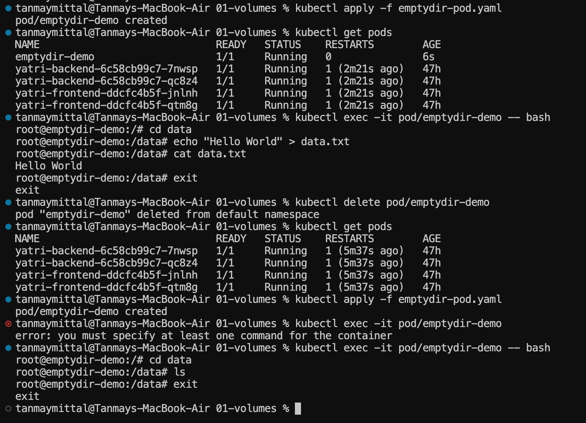
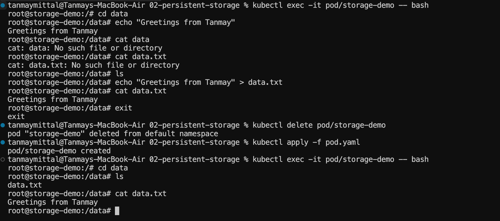
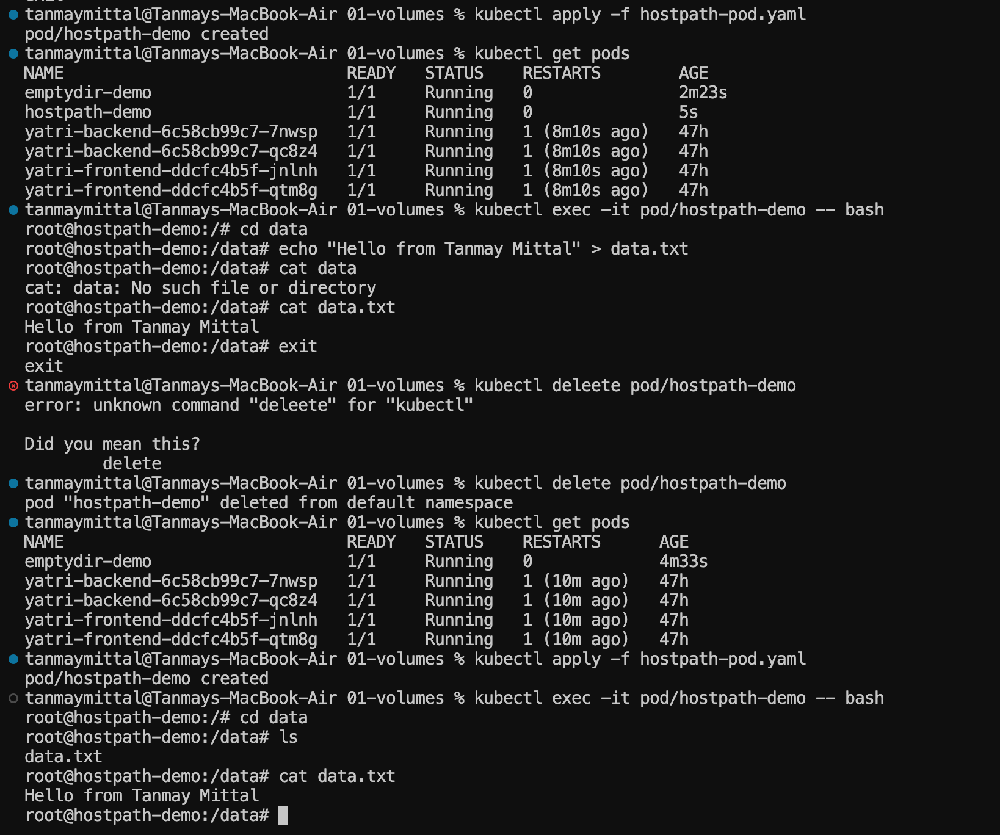
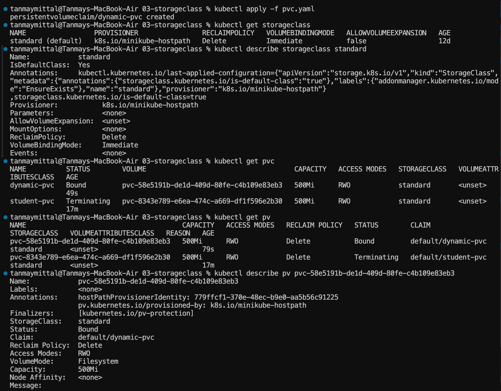
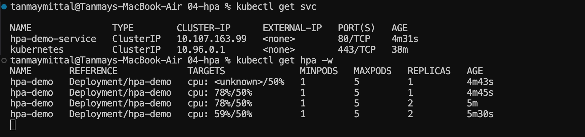
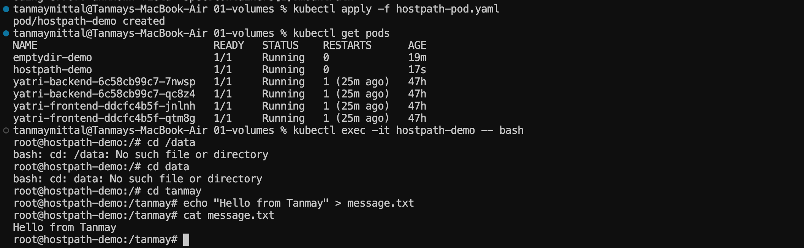

# Kubernetes Storage, HPA & Probes

A hands-on session covering Kubernetes volumes, persistent storage, dynamic provisioning, Horizontal Pod Autoscaling (HPA), and container health probes.


> This session covers Kubernetes storage, persistent storage, dynamic provisioning, Horizontal Pod Autoscaling (HPA), and container health probes.

---

## Session Overview

| Section | Topic |
|---|---|
| `01-volumes` | Kubernetes Volumes, `emptyDir`, and `hostPath` |
| `02-persistent-storage` | PersistentVolume (PV) and PersistentVolumeClaim (PVC) |
| `03-storageclass` | StorageClass and Dynamic Provisioning |
| `04-hpa` | Horizontal Pod Autoscaler and Metrics Server |
| `05-probes` | Liveness, Readiness, and Startup Probes |

---

# 1. Kubernetes Volumes

Containers are generally ephemeral. Data stored only inside a container can be lost when the container is recreated.

Kubernetes Volumes provide a way to make storage available to containers.

## Why Volumes?

Applications may need to store:

- Configuration files
- Temporary data
- Logs
- Application files
- Database data
- Shared files between containers

A Kubernetes Volume is attached to a Pod and mounted into one or more containers.

---

## 1.1 `emptyDir`

An `emptyDir` volume is created when a Pod is assigned to a node.

All containers in the same Pod can access the same `emptyDir` volume.

```text
Pod
 |
 +-- Container
 |
 +-- Container
 |
 +-- emptyDir Volume
```

### Important behavior

- The volume starts empty.
- Containers in the same Pod can share it.
- Data survives container restarts within the same Pod.
- Data is deleted when the Pod itself is deleted.

### Example

```yaml
volumes:
  - name: shared-storage
    emptyDir: {}
```

The volume was mounted at:

```text
/data
```

A file was created inside the volume:

```bash
echo "Hello World" > data.txt
```

The file was then removed when the Pod was deleted and recreated.

### Verification



The experiment demonstrates that `emptyDir` is tied to the lifecycle of the Pod.

---

## 1.2 `hostPath`

A `hostPath` volume mounts a directory from the Kubernetes node into a Pod.

```text
Kubernetes Node
      |
      | /tmp/hostpath-data
      |
      ▼
    Pod
      |
      ▼
 /tanmay
```

Example:

```yaml
volumes:
  - name: host-storage
    hostPath:
      path: /tmp/hostpath-data
      type: DirectoryOrCreate
```

The volume was mounted inside the container at:

```text
/tanmay
```

### Mount Path Experiment

The original mount path was changed from:

```text
/data
```

to:

```text
/tanmay
```

Trying to access the old path produced:

```text
bash: cd: /data: No such file or directory
```

The new mount path worked:

```bash
cd /tanmay
```

A file was then created:

```bash
echo "Hello from Tanmay" > message.txt
cat message.txt
```

Output:

```text
Hello from Tanmay
```



### HostPath Persistence

A file was created in the mounted directory, the Pod was deleted, and the Pod was recreated.

The file remained available:

```text
data.txt
Hello from Tanmay Mittal
```



### `emptyDir` vs `hostPath`

| Feature | `emptyDir` | `hostPath` |
|---|---|---|
| Storage location | Pod/node-managed volume | Kubernetes node filesystem |
| Starts empty | Yes | Depends on host directory |
| Survives Pod deletion | No | Can survive |
| Shared between containers | Yes | Yes, when mounted |
| Typical use | Temporary/shared Pod data | Local node-level storage and learning |

---

# 2. Kubernetes Persistent Storage

Pod-local storage is not sufficient for applications that need data to survive Pod deletion.

Kubernetes provides persistent storage using:

```text
PersistentVolume (PV)
        |
        ▼
PersistentVolumeClaim (PVC)
        |
        ▼
      Pod
```

---

## 2.1 PersistentVolume

A **PersistentVolume (PV)** is a storage resource available to the Kubernetes cluster.

Think of it as:

> **PV = Storage available to the cluster**

The example PV used:

- Capacity: `1Gi`
- Access Mode: `ReadWriteOnce`
- Reclaim Policy: `Retain`

Check PVs with:

```bash
kubectl get pv
```

---

## 2.2 PersistentVolumeClaim

A **PersistentVolumeClaim (PVC)** is a request for storage.

Think of it as:

> **PVC = Request for storage**

Example requirements:

- Capacity: `500Mi`
- Access Mode: `ReadWriteOnce`

A PVC can be used by a Pod to request storage without directly dealing with the underlying storage implementation.

Check PVCs:

```bash
kubectl get pvc
```

---

## 2.3 Persistent Storage Test

A Pod named `storage-demo` was connected to persistent storage.

Inside the Pod:

```bash
cd /data
echo "Greetings from Tanmay" > data.txt
cat data.txt
```

Output:

```text
Greetings from Tanmay
```

The Pod was then deleted:

```bash
kubectl delete pod storage-demo
```

It was recreated:

```bash
kubectl apply -f pod.yaml
```

The file was still present:

```bash
kubectl exec -it pod/storage-demo -- bash
cd /data
ls
cat data.txt
```

Output:

```text
data.txt
Greetings from Tanmay
```



This demonstrates that the data was stored outside the individual Pod lifecycle.

```text
Pod
 |
 ▼
PVC
 |
 ▼
PV
 |
 ▼
Persistent Storage
```

---

## 2.4 Access Modes

| Access Mode | Code | Description |
|---|---|---|
| ReadWriteOnce | `RWO` | Volume can be mounted read/write by one node |
| ReadOnlyMany | `ROX` | Volume can be mounted read-only by many nodes |
| ReadWriteMany | `RWX` | Volume can be mounted read/write by many nodes |
| ReadWriteOncePod | `RWOP` | Volume can be mounted read/write by a single Pod |

---

# 3. StorageClass

Manually creating PVs for every storage request can become difficult at scale.

Without dynamic provisioning:

```text
Developer
    |
    ▼
  PVC
    |
    ▼
Admin manually creates PV
```

A **StorageClass** allows Kubernetes to dynamically provision storage.

```text
PVC
 |
 ▼
StorageClass
 |
 ▼
Provisioner
 |
 ▼
PV
```

---

## 3.1 Check StorageClasses

```bash
kubectl get storageclass
```

The Minikube cluster showed:

```text
standard (default)
```

with the provisioner:

```text
k8s.io/minikube-hostpath
```

---

## 3.2 StorageClass Details

The `standard` StorageClass was inspected using:

```bash
kubectl describe storageclass standard
```

Important observed properties:

| Property | Value |
|---|---|
| Name | `standard` |
| Default | Yes |
| Provisioner | `k8s.io/minikube-hostpath` |
| Reclaim Policy | `Delete` |
| Volume Binding Mode | `Immediate` |
| Volume Expansion | `false` |

---

## 3.3 Dynamic Provisioning

A PVC named `dynamic-pvc` was created using the `standard` StorageClass.

```bash
kubectl apply -f pvc.yaml
```

The PVC requested:

```text
500Mi
ReadWriteOnce
StorageClass: standard
```

The PVC became:

```text
Bound
```

and Kubernetes automatically created a PV:

```text
pvc-58e5191b-de1d-409d-80fe-c4b109e83eb3
```

The dynamically provisioned PV had:

```text
Capacity: 500Mi
Access Mode: RWO
StorageClass: standard
Reclaim Policy: Delete
Status: Bound
```



The process was:

```text
PVC
 |
 | requests 500Mi
 ▼
StorageClass
 |
 | k8s.io/minikube-hostpath
 ▼
Dynamic Provisioning
 |
 ▼
PV
```

This is called **dynamic provisioning** because the PV was created automatically instead of being manually created beforehand.

---

## 3.4 Default StorageClass

A cluster can have a default StorageClass.

The Minikube cluster used:

```text
standard (default)
```

A default StorageClass can be used when a PVC does not explicitly specify a `storageClassName`, depending on the cluster configuration.

---

# 4. Horizontal Pod Autoscaler

**HPA** stands for **Horizontal Pod Autoscaler**.

HPA automatically changes the number of Pod replicas based on resource utilization or other supported metrics.

---

## 4.1 Why HPA?

Suppose an application normally runs with one Pod:

```text
Pod 1
```

During heavy traffic, CPU usage may increase significantly.

Instead of manually scaling:

```bash
kubectl scale deployment hpa-demo --replicas=5
```

HPA can automatically increase the number of replicas.

---

## 4.2 Horizontal Scaling

Horizontal scaling means:

> **Adding or removing Pods**

Example:

```text
Before:

Pod 1


After scaling:

Pod 1   Pod 2   Pod 3   Pod 4
```

HPA does not increase the CPU or memory capacity of an existing Pod.

---

## 4.3 CPU Requests

The Deployment specifies a CPU request:

```yaml
resources:
  requests:
    cpu: 100m
```

CPU requests are important because HPA CPU utilization is calculated relative to the requested CPU.

For example:

```text
CPU request = 100m
CPU usage   = 50m

Utilization = 50%
```

---

## 4.4 Metrics Server

HPA needs resource metrics to calculate CPU utilization.

Metrics Server provides resource usage metrics to Kubernetes.

Useful commands:

```bash
kubectl top nodes
kubectl top pods
```

On Minikube, Metrics Server can be enabled with:

```bash
minikube addons enable metrics-server
```

After enabling it, the Metrics API becomes available for commands such as:

```bash
kubectl top pods
```

and for HPA calculations.

---

## 4.5 HPA Configuration

The HPA used:

```text
Minimum replicas: 1
Maximum replicas: 5
CPU target: 50%
```

The HPA targeted:

```text
Deployment/hpa-demo
```

Important fields:

| Field | Purpose |
|---|---|
| `scaleTargetRef` | Identifies the workload to scale |
| `minReplicas` | Minimum number of replicas |
| `maxReplicas` | Maximum number of replicas |
| `metrics` | Defines what HPA monitors |

---

## 4.6 Load Generation

A BusyBox Pod was used to continuously send requests to the application:

```bash
kubectl run load-generator \
  --image=busybox:1.36 \
  --restart=Never \
  -- /bin/sh -c \
  "while true; do wget -q -O- http://hpa-demo-service; done"
```

The HPA was monitored with:

```bash
kubectl get hpa -w
```

The initial output temporarily showed:

```text
cpu: <unknown>/50%
```

This occurred while metrics were not yet available.

After Metrics Server became available, the HPA reported:

```text
cpu: 78%/50%
```

and increased the number of replicas:

```text
REPLICAS: 1 → 2
```

CPU later decreased:

```text
cpu: 59%/50%
```



This demonstrated HPA reacting to increased CPU utilization.

---

## 4.7 HPA Flow

```text
Application
     |
     ▼
CPU Usage
     |
     ▼
Metrics Server
     |
     ▼
HPA
     |
     ▼
Deployment
     |
     ▼
More / Fewer Pods
```

---

# 5. Kubernetes Health Probes

Kubernetes provides health probes that allow the system to understand the state of a container.

The three main probes are:

- **Liveness Probe**
- **Readiness Probe**
- **Startup Probe**

These probes answer different questions.

---

## 5.1 Liveness Probe

A **liveness probe** determines whether a container is still alive and functioning.

If the liveness probe repeatedly fails, Kubernetes can restart the container.

Think:

> **Liveness = Should Kubernetes restart this container?**

Example:

```yaml
livenessProbe:
  httpGet:
    path: /health
    port: 8080
  initialDelaySeconds: 5
  periodSeconds: 10
```

Common probe methods include:

- HTTP request
- TCP socket check
- Command execution

---

## 5.2 Readiness Probe

A **readiness probe** determines whether a container is ready to receive traffic.

If readiness fails, Kubernetes removes the Pod from the endpoints of Services so that traffic is not sent to an unready application.

Think:

> **Readiness = Should this Pod receive traffic?**

Example:

```yaml
readinessProbe:
  httpGet:
    path: /ready
    port: 8080
  initialDelaySeconds: 5
  periodSeconds: 10
```

A container can therefore be:

```text
Running
but
Not Ready
```

This is useful when an application process has started but is still initializing.

---

## 5.3 Startup Probe

A **startup probe** is useful for applications that take a long time to start.

It allows Kubernetes to wait for the application to successfully start before liveness and readiness checks become important.

Think:

> **Startup = Has the application finished starting?**

Example:

```yaml
startupProbe:
  httpGet:
    path: /health
    port: 8080
  failureThreshold: 30
  periodSeconds: 10
```

This can prevent Kubernetes from restarting a slow-starting application too early.

---

## 5.4 Probe Comparison

| Probe | Main Question | Failure Behavior |
|---|---|---|
| Liveness | Is the container still healthy? | Container can be restarted |
| Readiness | Can the container receive traffic? | Pod is removed from Service endpoints |
| Startup | Has the application finished starting? | Protects slow-starting applications during startup |

---

## 5.5 Probe Flow

```text
Container starts
      |
      ▼
Startup Probe
      |
      ▼
Application successfully starts
      |
      ├───────────────┐
      ▼               ▼
Liveness           Readiness
      |               |
      ▼               ▼
Restart if        Receive traffic
unhealthy         if ready
```

---

# 6. Useful Commands

## Volumes

```bash
kubectl get pods
kubectl describe pod emptydir-demo
kubectl exec -it emptydir-demo -- bash
kubectl delete pod emptydir-demo
```

## Persistent Storage

```bash
kubectl get pv
kubectl get pvc
kubectl describe pv student-pv
kubectl describe pvc student-pvc
kubectl get pods
kubectl describe pod storage-demo
```

## StorageClass

```bash
kubectl get storageclass
kubectl describe storageclass standard
kubectl get pvc
kubectl get pv
kubectl describe pvc dynamic-pvc
```

## HPA

```bash
kubectl top nodes
kubectl top pods
kubectl get hpa
kubectl describe hpa hpa-demo
kubectl get deployment
kubectl get pods
kubectl get pods -w
```

## Metrics Server

```bash
minikube addons enable metrics-server
kubectl get pods -n kube-system
kubectl top pods
```

---

# 7. Key Learnings

### Volumes

- `emptyDir` provides temporary storage associated with a Pod.
- `hostPath` mounts storage from the Kubernetes node.
- The `mountPath` determines where the volume appears inside the container.

### Persistent Storage

- **PV** = storage available to the cluster.
- **PVC** = request for storage.
- Persistent storage can survive Pod deletion and recreation.

### StorageClass

- **StorageClass** defines a class of storage and its provisioner.
- It enables dynamic provisioning.
- A PVC can automatically cause Kubernetes to create a PV.

### HPA

- **HPA** automatically adjusts the number of Pod replicas.
- Horizontal scaling means adding or removing Pods.
- HPA requires metrics such as CPU utilization.
- Metrics Server provides resource usage metrics.
- High CPU utilization can cause HPA to increase replicas.

### Probes

- **Liveness** checks whether a container should remain running.
- **Readiness** checks whether a Pod should receive traffic.
- **Startup** protects slow-starting applications during initialization.

---

# 8. Session 13 Architecture

```text
                         Kubernetes
                              |
          ┌───────────────────┼───────────────────┐
          |                   |                   |
          ▼                   ▼                   ▼
       Storage              Scaling             Health
          |                   |                   |
     ┌────┴────┐          ┌───┴───┐          ┌────┼────┐
     ▼         ▼          ▼       ▼          ▼    ▼    ▼
 emptyDir   hostPath     HPA   Metrics    Liveness Readiness Startup
     |         |                 Server
     |         |
     └────┬────┘
          ▼
     Persistent
       Storage
          |
      ┌───┴───┐
      ▼       ▼
     PV      PVC
              |
              ▼
        StorageClass
              |
              ▼
    Dynamic Provisioning
```

---

# 9. Session Summary

This session covered how Kubernetes handles **temporary storage, persistent storage, dynamically provisioned storage, automatic horizontal scaling, and application health checks**.

The practical work demonstrated:

- `emptyDir` data disappearing after Pod deletion.
- `hostPath` data remaining available across Pod recreation.
- Changing the container `mountPath` from `/data` to `/tanmay`.
- PV/PVC-based data surviving Pod deletion and recreation.
- StorageClass dynamically provisioning a PV for `dynamic-pvc`.
- Metrics Server providing metrics required by HPA.
- HPA scaling `hpa-demo` from **1 to 2 replicas** when CPU utilization reached **78% against a 50% target**.
- Liveness, readiness, and startup probes and the different problems each probe is designed to solve.

---

## Notes

- All images are referenced from `./images/` — make sure that folder is committed to the repository, otherwise the image links will break on GitHub.
- Code fences, tables, and headings have been checked for valid GitHub Markdown rendering.

---

## Author

**Tanmay Mittal**

Roll No.: **24BCS10491**