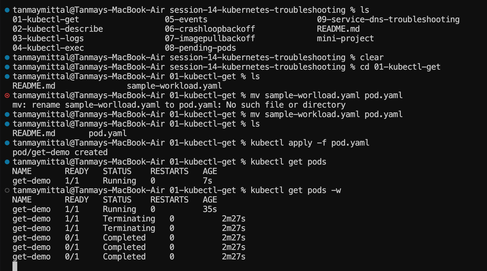
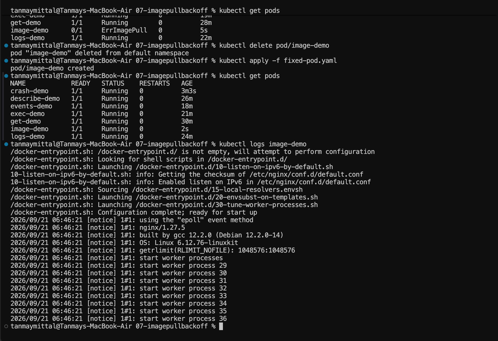
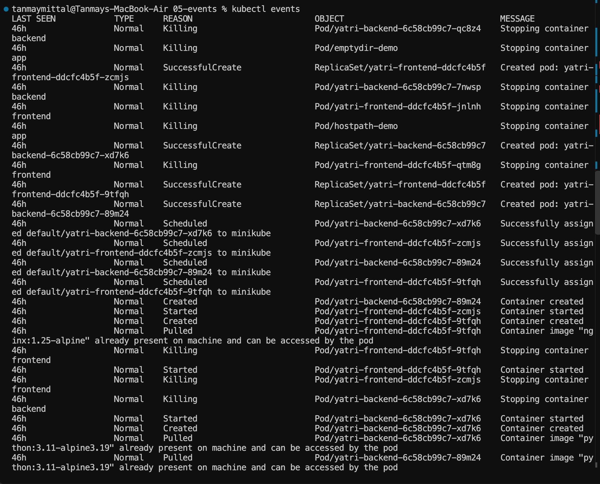
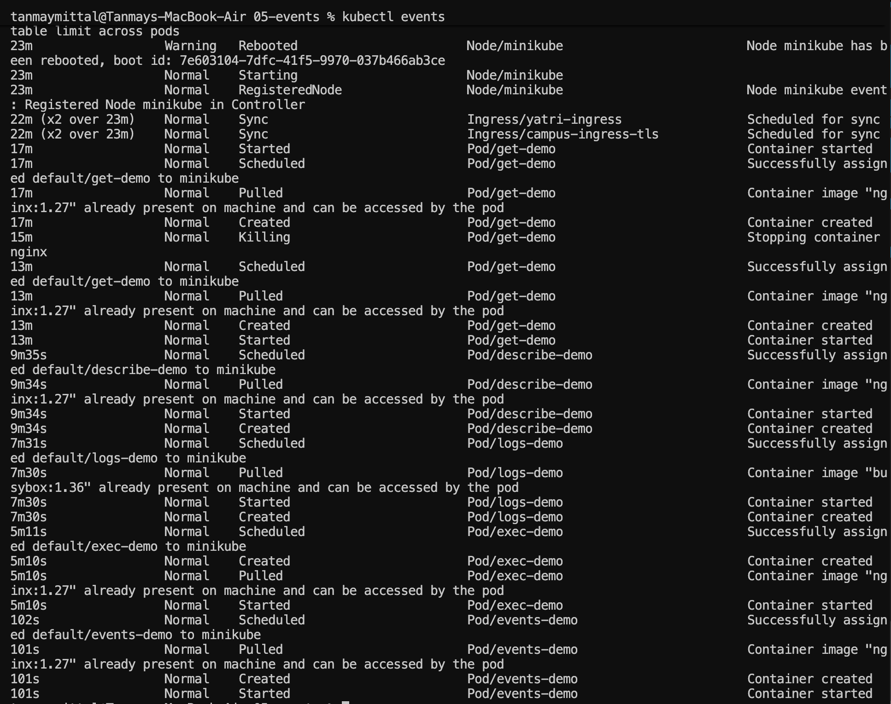
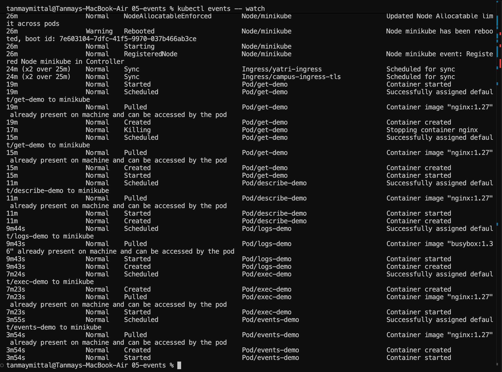
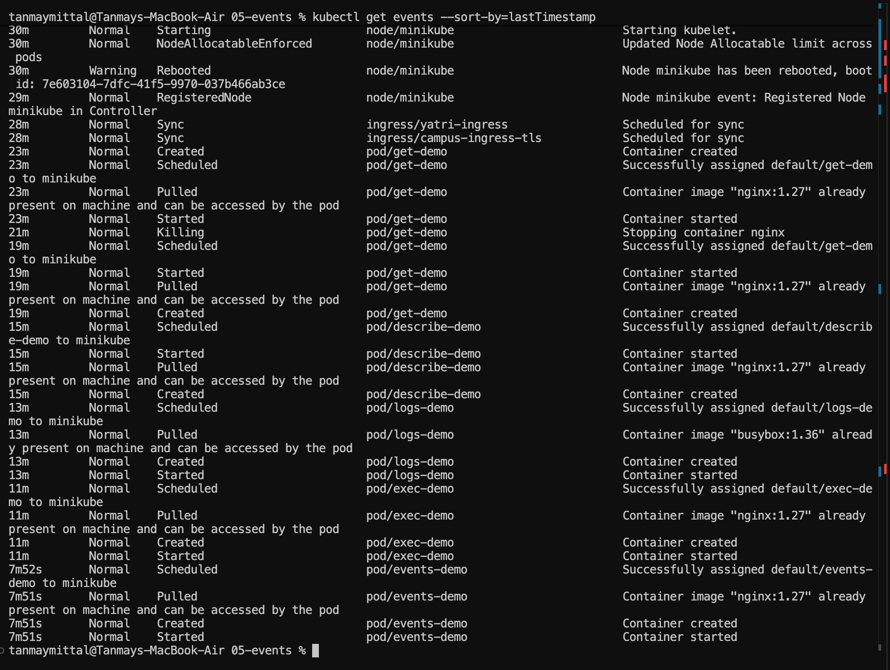

# Session 14 — Kubernetes Troubleshooting

This session focuses on using `kubectl` to inspect Kubernetes resources, understand Pod lifecycle information, inspect logs and events, execute commands inside Pods, and troubleshoot common workload problems.

## Session Structure

```text
01-kubectl-get
02-kubectl-describe
03-kubectl-logs
04-kubectl-exec
05-events
06-crashloopbackoff
07-imagepullbackoff
08-pending-pods
09-service-dns-troubleshooting
mini-project
```

---

# 1. `kubectl get`

`kubectl get` is used to view Kubernetes resources and their current state.

### Commands used

```bash
kubectl get pods
```

Shows Pods in the current namespace.

```bash
kubectl get pods -w
```

Watches Pod status changes continuously.

The `-w` / `--watch` option keeps the command running and updates the output when the resource changes.

### General syntax

```bash
kubectl get <resource-type>
kubectl get <resource-type> <resource-name>
```

Examples:

```bash
kubectl get pods
kubectl get pod get-demo
kubectl get pods -o wide
```

### Screenshot



---

# 2. `kubectl describe`

`kubectl describe` provides detailed information about a Kubernetes resource.

### Command

```bash
kubectl describe pod get-demo
```

The general syntax is:

```text
kubectl describe <resource-type> <resource-name>
```

Here:

- `pod` = resource type
- `get-demo` = resource name

The resource/name form also works:

```bash
kubectl describe pod/get-demo
```

The `/` is optional when using the separate resource and name form.

### What `describe` is useful for

`describe` gives information that is not normally shown by `kubectl get`, including:

- Pod metadata
- Labels and annotations
- Node assignment
- Container information
- Images
- Container state
- Conditions
- Volumes
- Events related to the resource

This makes `kubectl describe` especially useful when a Pod is not starting or is stuck in an unexpected state.

---

# 3. `kubectl logs`

`kubectl logs` displays output produced by a container.

### Commands

```bash
kubectl logs image-demo
```

It can also be written as:

```bash
kubectl logs pod/image-demo
```

For a specific container in a multi-container Pod:

```bash
kubectl logs <pod-name> -c <container-name>
```

### What logs are useful for

Logs help investigate what the application or container is doing at runtime.

They can reveal:

- Application messages
- Startup information
- Runtime errors
- Configuration problems
- Application crashes

For example, the `crash-demo` Pod produced:

```text
Application starting...
Something went wrong!
```

This showed that the container itself was exiting because of its command.

### Screenshot



---

# 4. `kubectl exec`

`kubectl exec` allows commands to be executed inside a running container.

### Command used

```bash
kubectl exec -it exec-demo -- ls
```

This listed the filesystem inside the `exec-demo` Pod.

The output included:

```text
bin
dev
docker-entrypoint.sh
etc
home
lib
opt
root
sbin
tmp
usr
var
```

The `--` separates kubectl arguments from the command that should run inside the container.

### Interactive vs non-interactive

The commonly used options are:

```text
-i  Keep standard input open
-t  Allocate a terminal
```

Therefore:

```bash
kubectl exec -it exec-demo -- sh
```

can be used to open an interactive shell when the container provides one.

---

# 5. `kubectl cp`

`kubectl cp` is used to copy files between a local machine and a Kubernetes container.

## Homework 1

Copy a file from the `exec-demo` Pod into the current repository.

### Command

```bash
kubectl cp exec-demo:/docker-entrypoint.sh ./docker-entrypoint.sh
```

This copies:

```text
Pod:
exec-demo:/docker-entrypoint.sh
```

to:

```text
Local repository:
./docker-entrypoint.sh
```

### General syntax

```bash
kubectl cp <pod-name>:<path-inside-pod> <local-path>
```

The direction can also be reversed to copy a local file into a Pod:

```bash
kubectl cp <local-path> <pod-name>:<path-inside-pod>
```

---

# 6. Kubernetes Events

Kubernetes Events are records of important activity involving resources in the cluster.

They can show things such as:

- Pod scheduling
- Container creation
- Container startup
- Image pulling
- Container termination
- Failed scheduling
- Warnings
- Resource lifecycle activity

### Command

```bash
kubectl events
```

An equivalent resource-based command is:

```bash
kubectl get events
```

Both are used to inspect Kubernetes Events, although their command interfaces are different.

The output contains fields such as:

```text
LAST SEEN
TYPE
REASON
OBJECT
MESSAGE
```

### Event types

Common event types include:

```text
Normal
Warning
```

`Normal` events describe expected activity such as scheduling, pulling an image, creating a container, or starting a container.

`Warning` events indicate a problem or condition that may require investigation.

### Example from the session

For `events-demo`, events showed:

```text
Scheduled
Pulled
Created
Started
```

This represents the Pod progressing through its normal startup lifecycle.

The session also showed warning events from earlier workloads, such as failed scheduling and metrics-related problems.

### Screenshots





---

# 7. Watching Events

Events can be watched continuously:

```bash
kubectl events --watch
```

This allows new events to appear as they happen.

> Note: `--watch` is one option. Writing `-- watch` with a space is different and should not be used as the option syntax.

### Screenshot



---

# 8. Sorting Events

Events can be sorted using the Kubernetes field selector:

```bash
kubectl get events --sort-by=.lastTimestamp
```

This helps organize events according to their timestamp.

The correct flag is:

```text
--sort-by
```

not:

```text
--sortby
```

The session demonstrated the error produced by the incorrect form and then the successful command using `--sort-by`.

### Screenshot



---

# 9. Events vs Logs

| Events | Logs |
|---|---|
| Describe Kubernetes-level activity | Show container/application output |
| Generated by Kubernetes | Produced by the application/container |
| Useful for resource lifecycle information | Useful for runtime/application debugging |
| Can show scheduling, creation, startup and termination | Can show application messages and errors |
| Command: `kubectl events` | Command: `kubectl logs <pod-name>` |

### Simple distinction

**Events tell us what happened to Kubernetes resources.**

**Logs tell us what the container/application produced while running.**

A useful troubleshooting combination is therefore:

```bash
kubectl describe pod <pod-name>
kubectl logs <pod-name>
kubectl events
```

`describe` gives resource details and related events, while `logs` gives the application's/container's output.

---

# 10. CrashLoopBackOff / Container Crash Troubleshooting

The `06-crashloopbackoff` exercise intentionally created a broken Pod.

### Create the broken Pod

```bash
kubectl apply -f broken-pod.yaml
```

Then inspect its state:

```bash
kubectl get pods
```

The Pod entered an error state and had a restart count.

### Inspect the logs

```bash
kubectl logs pod/crash-demo
```

Output:

```text
Application starting...
Something went wrong!
```

This showed that the container command exited with a failure.

### Attempting to apply the fixed Pod

```bash
kubectl apply -f fixed-pod.yaml
```

Kubernetes rejected the update because some Pod specification fields are immutable after creation.

The error indicated that fields other than a limited set of mutable fields could not be changed.

### Correct solution

Delete the old Pod:

```bash
kubectl delete pod/crash-demo
```

Then create it again from the fixed manifest:

```bash
kubectl apply -f fixed-pod.yaml
```

Finally verify:

```bash
kubectl get pods
```

The fixed `crash-demo` Pod reached:

```text
1/1 Running
```

### Key concept

For a standalone Pod, changing many fields of the Pod specification is not allowed after creation.

A common troubleshooting approach is:

```text
Broken Pod
    ↓
Check status
    ↓
Check logs
    ↓
Identify the problem
    ↓
Delete/recreate the Pod with corrected configuration
```

For production workloads, controllers such as Deployments are normally used so corrected Pod templates can be rolled out rather than manually managing individual Pods.

---

# 11. ImagePullBackOff / ErrImagePull Troubleshooting

The `07-imagepullbackoff` exercise created a Pod with an invalid/unavailable image.

### Create the broken Pod

```bash
kubectl apply -f broken-pod.yaml
```

Check the Pod:

```bash
kubectl get pods
```

The Pod showed:

```text
ErrImagePull
```

`ErrImagePull` indicates that Kubernetes could not pull the requested container image.

Repeated image-pull failures can lead to:

```text
ImagePullBackOff
```

where Kubernetes backs off before retrying the image pull.

### Fix

The broken Pod was deleted:

```bash
kubectl delete pod/image-demo
```

Then the corrected manifest was applied:

```bash
kubectl apply -f fixed-pod.yaml
```

Verify:

```bash
kubectl get pods
```

The corrected Pod reached:

```text
1/1 Running
```

Logs were then checked:

```bash
kubectl logs image-demo
```

The NGINX startup output confirmed that the container started successfully.

### Common causes of image-pull failures

Examples include:

- Incorrect image name
- Incorrect image tag
- Image does not exist in the registry
- Private registry authentication problems
- Registry/network access problems

---

# 12. Pending Pod Troubleshooting

The `08-pending-pods` exercise created a Pod that remained in:

```text
Pending
```

### Create the broken Pod

```bash
kubectl apply -f broken-pod.yaml
```

Check:

```bash
kubectl get pods
```

The Pod showed:

```text
pending-demo    0/1    Pending
```

A `Pending` Pod has not successfully reached the stage where its container is running.

Possible reasons include:

- No suitable node
- Insufficient resources
- Scheduling constraints
- Missing or unbound storage
- Taints/tolerations mismatch
- Other scheduling requirements

### Fix

The broken Pod was deleted:

```bash
kubectl delete pod/pending-demo
```

Then the corrected manifest was applied:

```bash
kubectl apply -f fixed-pod.yaml
```

Verify:

```bash
kubectl get pods
```

The Pod reached:

```text
1/1 Running
```

For deeper investigation of a Pending Pod, use:

```bash
kubectl describe pod pending-demo
```

and inspect the Events section.

---

# 13. Service and DNS Troubleshooting

The `09-service-dns-troubleshooting` exercise demonstrated how a Service connects clients to backend Pods.

### Create the application

```bash
kubectl apply -f deployment.yaml
kubectl apply -f service.yaml
kubectl apply -f dns-test-pod.yaml
```

Check the resources:

```bash
kubectl get pods
kubectl get all
```

The `web` Deployment created two Pods and the `web-service` Service was created as a ClusterIP Service.

### Inspect the Service

```bash
kubectl get svc
```

A Service provides a stable virtual IP and DNS name for accessing a group of Pods selected by its selector.

### Inspect endpoints

```bash
kubectl get endpoints web-service
```

The session showed:

```text
web-service   10.244.0.16:80,10.244.0.17:80
```

This means the Service had backend endpoints corresponding to the two running `web` Pods.

---

# 14. Broken Service and Empty Endpoints

A deliberately broken Service was created:

```bash
kubectl apply -f broken-service.yaml
```

Then:

```bash
kubectl get svc
```

and:

```bash
kubectl get endpoints broken-service
```

The result was:

```text
broken-service   <none>
```

### What does `<none>` mean?

It means the Service currently has no matching backend endpoints.

One common cause is a mismatch between:

```text
Service selector
```

and:

```text
Pod labels
```

If the Service selector does not match the labels on the Pods, Kubernetes cannot associate those Pods with the Service.

A useful troubleshooting sequence is:

```bash
kubectl get svc
kubectl get pods --show-labels
kubectl get endpoints <service-name>
kubectl describe svc <service-name>
```

The important relationship is:

```text
Service
   ↓
Selector
   ↓
Matching Pod labels
   ↓
Endpoints / EndpointSlices
   ↓
Backend Pods
```

---

# 15. Endpoints and EndpointSlice

The session produced this warning:

```text
Warning: v1 Endpoints is deprecated in v1.33+;
use discovery.k8s.io/v1 EndpointSlice
```

This means the older `Endpoints` API is deprecated in the Kubernetes version being used.

The Service networking model now uses **EndpointSlices** for scalable representation of backend endpoints.

For modern Kubernetes inspection, EndpointSlices can be viewed with:

```bash
kubectl get endpointslices
```

or for a specific Service, by inspecting its associated EndpointSlice resources.

The important troubleshooting idea remains the same:

```text
Service → selector → matching Pods → backend endpoints
```

---

# 16. Event and Log Troubleshooting Workflow

A useful troubleshooting flow is:

```text
1. Check Pod status
        ↓
2. Describe the Pod
        ↓
3. Check Pod logs
        ↓
4. Check Kubernetes events
        ↓
5. Investigate the specific failure
        ↓
6. Apply the appropriate fix
        ↓
7. Verify the resource is healthy
```

Typical commands:

```bash
kubectl get pods
kubectl describe pod <pod-name>
kubectl logs <pod-name>
kubectl events
```

For live event monitoring:

```bash
kubectl events --watch
```

For Service troubleshooting:

```bash
kubectl get svc
kubectl get endpoints <service-name>
kubectl get endpointslices
```

---

# 17. Homework

## Homework 1 — `kubectl cp`

From the `04-kubectl-exec` folder, copy a file from the running `exec-demo` Pod into the local repository.

### Command

```bash
kubectl cp exec-demo:/docker-entrypoint.sh ./docker-entrypoint.sh
```

The purpose is to practice copying data from a Kubernetes container to the local machine.

---

## Homework 2 — Events and Logs

Create documentation explaining:

1. What Kubernetes Events are.
2. What Kubernetes Logs are.
3. The commands used to view them.
4. The difference between Events and Logs.
5. Include screenshots showing the commands and their outputs.

### Events command

```bash
kubectl events
```

### Logs command

```bash
kubectl logs <pod-name>
```

### Difference

```text
Events → Kubernetes resource/activity information

Logs   → Container/application runtime output
```

The screenshots included in this session document the Events and Logs work.

---

# 18. Screenshot Reference

All screenshots are stored in the `images` folder.

```text
images/
├── kubectl-get.png
├── kubectl-events-1.png
├── kubectl-events-2.png
├── kubectl-events-watch.png
├── kubectl-events-sorted.png
└── kubectl-logs.png
```

---

# Key Commands

```bash
kubectl get pods
kubectl get pods -w

kubectl describe pod get-demo

kubectl logs image-demo

kubectl exec -it exec-demo -- ls

kubectl cp exec-demo:/docker-entrypoint.sh ./docker-entrypoint.sh

kubectl events
kubectl events --watch
kubectl get events --sort-by=.lastTimestamp

kubectl get all

kubectl get svc
kubectl get endpoints web-service
kubectl get endpoints broken-service
kubectl get endpointslices
```

---

# Summary

This session covered the main `kubectl` commands used for Kubernetes inspection and troubleshooting:

- `kubectl get` — inspect resource status
- `kubectl describe` — inspect detailed resource information
- `kubectl logs` — inspect container output
- `kubectl exec` — execute commands inside a container
- `kubectl cp` — copy files between a Pod and the local machine
- `kubectl events` — inspect Kubernetes resource events

It also covered practical troubleshooting of:

- Container crashes and restart behavior
- Immutable Pod specification fields
- `ErrImagePull` and `ImagePullBackOff`
- Pending Pods and scheduling
- Services and ClusterIP
- Service selectors and Pod labels
- Service endpoints
- Empty endpoints (`<none>`)
- EndpointSlice and the deprecated Endpoints API
- Using Events, Logs, and `describe` together during troubleshooting

The two homework tasks were also included: practicing `kubectl cp` and documenting the difference between Kubernetes Events and container Logs.

---

## Author

**Tanmay Mittal**  
Scaler School of Technology  
Roll no - 24BCS10491

---