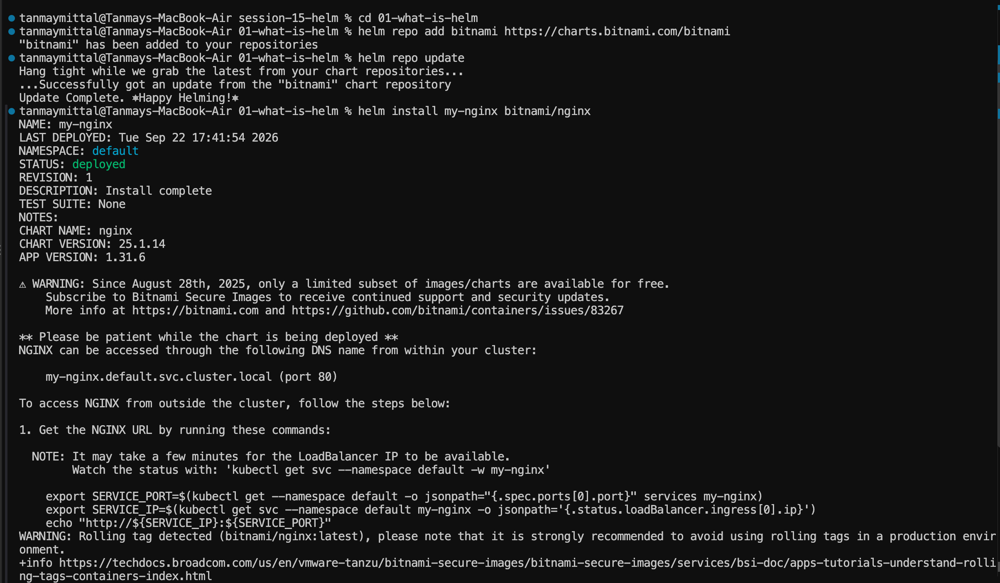
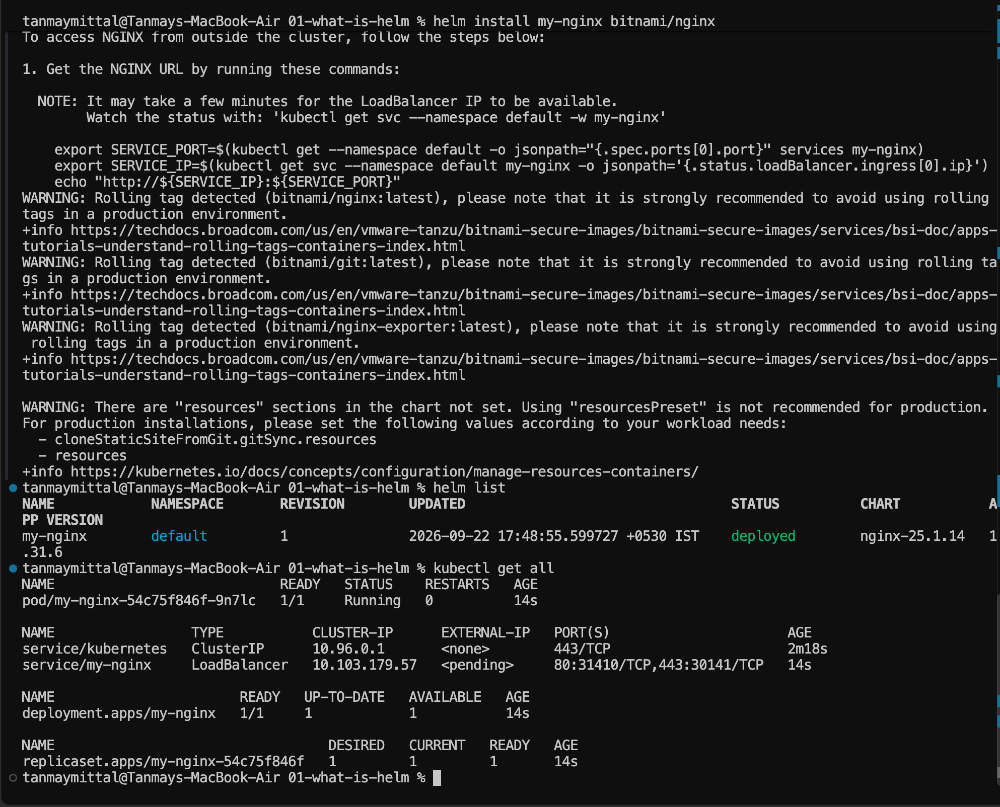
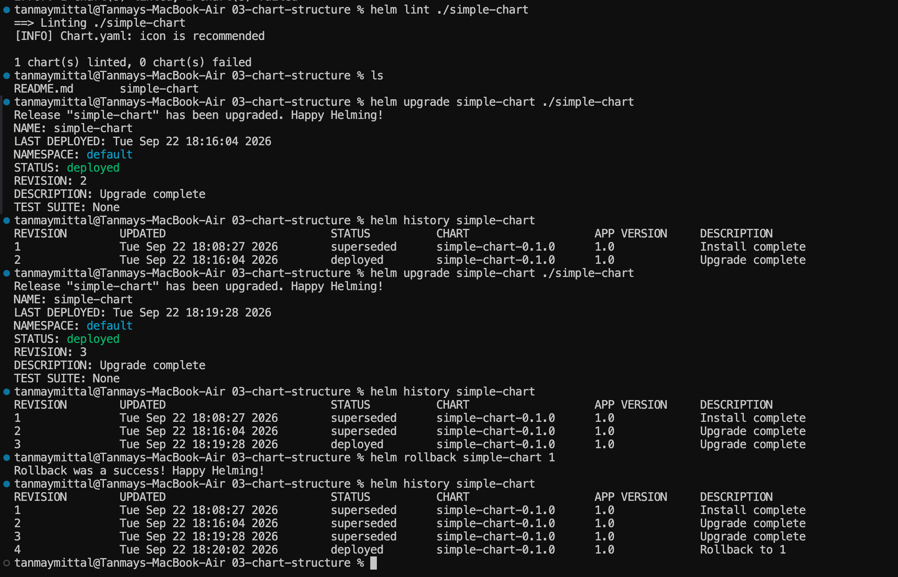
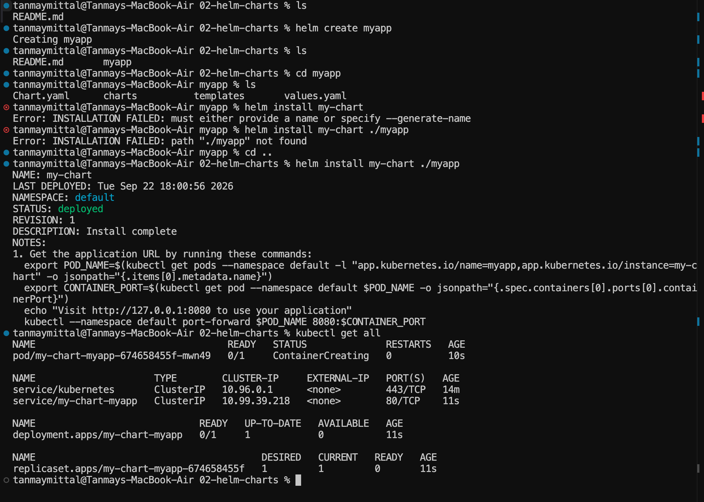

# Session 15 — Helm

A hands-on session covering **Helm**, the package manager for Kubernetes — charts, releases, values, upgrades, rollbacks, and a mini Notes application.


> This session covers **Helm**, the package manager for Kubernetes.

---

## Personal Execution Notes

This documentation reflects my actual execution environment and troubleshooting.

- Environment: macOS on Apple Silicon
- Machine: MacBook Air
- Kubernetes environment: Minikube
- Container runtime: Docker
- Helm version: `v4.3.0`
- Kubernetes client version: `v1.37`
- Helm charts tested using the local Minikube cluster
- Bitnami NGINX chart was tested using Helm
- Custom Helm charts were created and tested locally
- `helm upgrade --install` was tested for an existing custom release
- The Notes application was deployed using the `notes-chart` Helm chart
- Development configuration used `1` replica with `nginx:1.24`
- Production configuration used `3` replicas with `nginx:1.25`
- Helm release history was verified using `helm history`
- A failed upgrade was simulated using a non-existent image tag
- The failed upgrade resulted in `ImagePullBackOff`
- The application was successfully restored using Helm rollback to revision `2`

### Troubleshooting Notes

During the Helm exercises, deleting Kubernetes resources with `kubectl delete all --all` did not remove the corresponding Helm release.

Helm still retained the release, so attempting to reuse the same release name produced:

`cannot reuse a name that is still in use`

The Helm release must be removed separately using:

`helm uninstall <release-name>`

During the Notes application exercise, the failed upgrade produced:

`ImagePullBackOff`

The previous healthy release was restored using:

`helm rollback notes-dev 2`

## Notes

- All images are referenced from `./images/` — make sure that folder is committed to the repository, otherwise the image links will break on GitHub.
- The screenshots in this README use paths relative to `resultReadme.md`.
- Helm chart versions and command output may differ when executed on another system or with newer chart versions.
- Code fences, tables, headings, and image paths have been checked for valid GitHub Markdown rendering.

## Overview

Without Helm, Kubernetes applications are commonly deployed by applying individual YAML files:

```bash
kubectl apply -f deployment.yaml
kubectl apply -f service.yaml
kubectl apply -f configmap.yaml
```

Helm packages Kubernetes resources into reusable **Charts** and allows configuration through values.

### Key Concepts

```text
Chart   = Packaged Kubernetes templates
Release = Installed instance of a Chart
Values  = Configuration passed to the Chart
```

---

## 1. Helm Installation & Version

Helm was already installed on the system.

```bash
helm version
```

Version used during the session:

```text
Helm v4.3.0
Kubernetes v1.37
```

---

## 2. Helm Repository

Added the Bitnami repository:

```bash
helm repo add bitnami https://charts.bitnami.com/bitnami
helm repo update
```

Search for charts:

```bash
helm search repo nginx
```

---

## 3. Installing a Public Helm Chart

Installed the Bitnami NGINX chart:

```bash
helm install my-nginx bitnami/nginx
```

Check installed releases:

```bash
helm list
```

Check Kubernetes resources:

```bash
kubectl get all
```



### Removing a Release

```bash
helm uninstall my-nginx
```

### Important Difference

```text
kubectl delete ...
        ↓
Deletes Kubernetes resources

helm uninstall <release>
        ↓
Removes the Helm release and its managed resources
```

---

# 4. Creating a Helm Chart

Helm can generate the basic structure of a new chart:

```bash
helm create myapp
```

Generated structure:

```text
myapp/
├── Chart.yaml
├── values.yaml
├── charts/
└── templates/
```

Install the chart:

```bash
helm install my-chart ./myapp
```

If already inside the chart directory:

```bash
helm install my-chart .
```



---

# 5. Helm Chart Structure

A basic Helm chart contains:

```text
myapp/
├── Chart.yaml
├── values.yaml
├── charts/
└── templates/
```

### Chart.yaml

Contains chart metadata:

```yaml
apiVersion: v2
name: myapp
version: 0.1.0
```

### values.yaml

Contains configurable values:

```yaml
replicaCount: 1
```

### templates/

Contains Kubernetes manifests with Helm template expressions:

```yaml
replicas: {{ .Values.replicaCount }}
```

---

# 6. Helm Lint

`helm lint` checks a chart for possible problems.

```bash
helm lint ./simple-chart
```

Example result:

```text
1 chart(s) linted, 0 chart(s) failed
```

An informational warning about a recommended chart icon was displayed, but the chart passed linting.

---

# 7. Installing and Upgrading Releases

Install a chart:

```bash
helm install my-app ./my-app
```

Attempting to install another release with the same name results in:

```text
cannot reuse a name that is still in use
```

Use `upgrade --install` when you want one command that handles both cases:

```bash
helm upgrade --install my-app ./my-app --set replicaCount=5
```

```text
Release exists          → Upgrade
Release doesn't exist   → Install
```



---

# 8. Helm Release History

Helm keeps track of release revisions.

```bash
helm history simple-chart
```

Example:

```text
REVISION    STATUS
1           superseded
2           superseded
3           deployed
```

Each upgrade creates a new revision.

---

# 9. Helm Rollback

A release can be rolled back to an earlier revision:

```bash
helm rollback simple-chart 1
```

After rollback, Helm creates a new revision representing the rollback.

Example:

```text
Revision 1 → superseded
Revision 2 → superseded
Revision 3 → superseded
Revision 4 → deployed
```



---

# 10. Mini Project — Notes Application

## Objective

The mini-project packages and deploys a simple Notes application using Helm.

The application is represented by an NGINX container.

The chart structure is:

```text
notes-chart/
├── Chart.yaml
├── values.yaml
├── values-prod.yaml
└── templates/
    ├── deployment.yaml
    ├── service.yaml
    └── configmap.yaml
```

---

## 10.1 Chart.yaml

`Chart.yaml` contains chart metadata:

```yaml
apiVersion: v2
name: notes-chart
description: A simple Notes application Helm chart
type: application
version: 0.1.0
appVersion: "1.0"
```

---

## 10.2 values.yaml

Development configuration:

```yaml
replicaCount: 1

image:
  repository: nginx
  tag: "1.24"

service:
  port: 80
  nodePort: 30090

app:
  name: notes-app
  environment: development
```

Development configuration:

```text
Replicas: 1
Image: nginx:1.24
Environment: development
```

---

## 10.3 values-prod.yaml

Production configuration:

```yaml
replicaCount: 3

image:
  repository: nginx
  tag: "1.25"

service:
  port: 80
  nodePort: 30090

app:
  name: notes-app
  environment: production
```

Production configuration:

```text
Replicas: 3
Image: nginx:1.25
Environment: production
```

---

## 10.4 ConfigMap Template

The ConfigMap uses Helm variables:

```yaml
apiVersion: v1
kind: ConfigMap
metadata:
  name: {{ .Release.Name }}-config
data:
  APP_NAME: {{ .Values.app.name | quote }}
  ENVIRONMENT: {{ .Values.app.environment | quote }}
```

Helm substitutes the release name and values when rendering the chart.

---

## 10.5 Deployment Template

The Deployment uses the configured replica count:

```yaml
spec:
  replicas: {{ .Values.replicaCount }}
```

The container image is configurable:

```yaml
image: "{{ .Values.image.repository }}:{{ .Values.image.tag }}"
```

The ConfigMap is loaded using:

```yaml
envFrom:
  - configMapRef:
      name: {{ .Release.Name }}-config
```

---

## 10.6 Service Template

The application uses a NodePort Service:

```yaml
spec:
  type: NodePort
```

The port values come from Helm values:

```yaml
port: {{ .Values.service.port }}
targetPort: {{ .Values.service.port }}
nodePort: {{ .Values.service.nodePort }}
```

---

# 11. Lint the Notes Chart

```bash
helm lint notes-chart
```

Result:

```text
1 chart(s) linted, 0 chart(s) failed
```

---

# 12. Render the Chart Locally

Before deploying, the templates were rendered locally:

```bash
helm template notes-dev notes-chart
```

This converts Helm templates such as:

```yaml
{{ .Values.replicaCount }}
```

into normal Kubernetes YAML.

The development values were rendered as:

```yaml
replicas: 1
```

and:

```yaml
image: "nginx:1.24"
```

---

# 13. Install the Development Release

Installed the chart:

```bash
helm install notes-dev notes-chart
```

Verify the resources:

```bash
kubectl get pods
kubectl get services
kubectl get configmaps
```

The development deployment starts with **1 replica**.

---

# 14. Upgrade Using Production Values

The release was upgraded using the production values file:

```bash
helm upgrade notes-dev notes-chart -f notes-chart/values-prod.yaml
```

This changes the configuration from:

```text
Development
1 replica
nginx:1.24
```

to:

```text
Production
3 replicas
nginx:1.25
```

Verify the pods:

```bash
kubectl get pods
```

The deployment runs **3 replicas** after the upgrade.

---

# 15. Check Release History

```bash
helm history notes-dev
```

The release history showed:

```text
REVISION  STATUS
1         superseded
2         deployed
```

Revision 1 was the initial installation.

Revision 2 was the production-value upgrade.

---

# 16. Simulate a Bad Upgrade

A deliberately invalid image tag was used:

```bash
helm upgrade notes-dev notes-chart --set image.tag=broken-tag-does-not-exist
```

Check the pods:

```bash
kubectl get pods
```

The new pods entered:

```text
ImagePullBackOff
```

This demonstrated how a bad Helm upgrade can result in unhealthy Kubernetes workloads.

---

# 17. Rollback to a Healthy Revision

The release was rolled back to revision 2:

```bash
helm rollback notes-dev 2
```

Verify:

```bash
kubectl get pods
```

The application returned to the healthy production configuration with **3 running replicas**.

---

# 18. Helm Commands Used

| Command | Purpose |
|---|---|
| `helm version` | Check Helm version |
| `helm repo add` | Add a chart repository |
| `helm repo update` | Update repository information |
| `helm search repo` | Search charts |
| `helm create` | Create a new chart |
| `helm lint` | Validate a chart |
| `helm template` | Render templates locally |
| `helm install` | Install a chart |
| `helm upgrade` | Upgrade a release |
| `helm upgrade --install` | Install or upgrade a release |
| `helm list` | List releases |
| `helm history` | View release revisions |
| `helm rollback` | Roll back to an earlier revision |
| `helm uninstall` | Remove a release |

---

# 19. Key Takeaways

```text
Chart
  ↓
values.yaml + templates
  ↓
helm install
  ↓
Release
  ↓
Kubernetes resources
```

### Important Concepts

- **Chart** = reusable package of Kubernetes templates.
- **Release** = installed instance of a chart.
- **Values** = configuration supplied to the chart.
- `helm template` renders templates without deploying them.
- `helm lint` checks chart validity.
- `helm upgrade` creates a new release revision.
- `helm history` shows previous revisions.
- `helm rollback` restores an earlier revision.
- `helm upgrade --install` performs an install when the release does not exist and an upgrade when it does.
- Production-specific configuration can be supplied using a separate values file.

---

## Session Workflow

```text
Create Chart
     ↓
Configure values.yaml
     ↓
Write Templates
     ↓
helm lint
     ↓
helm template
     ↓
helm install
     ↓
helm upgrade
     ↓
helm history
     ↓
Bad Upgrade
     ↓
helm rollback
     ↓
helm uninstall
```

## Reference

- [Helm Documentation](https://helm.sh/docs/)
- [Helm CLI Reference](https://helm.sh/docs/helm/)
- [Helm Chart Best Practices](https://helm.sh/docs/chart_best_practices/)

---

## Notes

- All images are referenced from `./images/` — make sure that folder is committed to the repository, otherwise the image links will break on GitHub.
- Code fences, tables, and headings have been checked for valid GitHub Markdown rendering.

---

## Author

**Tanmay Mittal**

Roll No.: **24BCS10491**