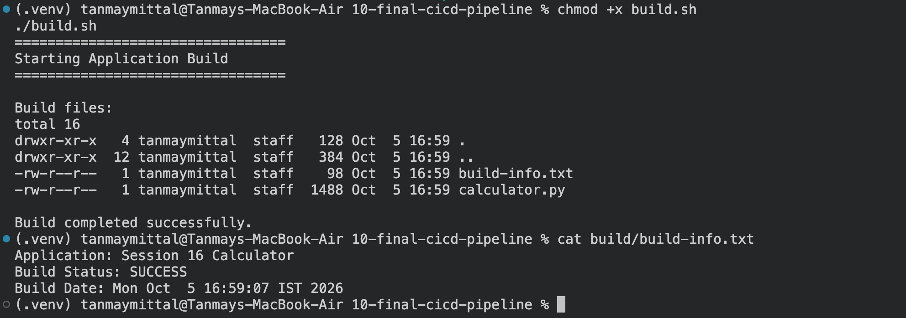
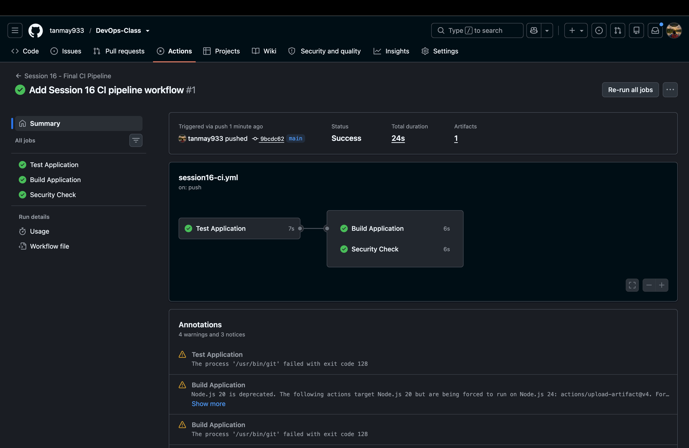

# Session 16 — CI/CD & GitHub Actions

A hands-on session covering Continuous Integration and Continuous Delivery/Deployment (CI/CD) using GitHub Actions, demonstrated through an automated Python calculator pipeline.


> A hands-on session covering Continuous Integration and Continuous Delivery/Deployment (CI/CD) using GitHub Actions.

---

## Overview

This session focused on Continuous Integration and Continuous Delivery/Deployment (CI/CD) and how GitHub Actions can automate the software development lifecycle.

The final demo project is a Python calculator application with an automated GitHub Actions pipeline for:

- Testing
- Building
- Security checking
- Artifact generation
- Pipeline execution

The project also covers the core concepts required to understand CI/CD pipelines.

---

## 1. CI vs CD

### Continuous Integration (CI)

Continuous Integration is the practice of automatically building and testing code whenever developers push changes or create pull requests.

The goal is to detect bugs early and ensure that new changes do not break the existing application.

Typical CI flow:

```text
Developer pushes code
        ↓
Checkout source code
        ↓
Install dependencies
        ↓
Run tests
        ↓
Build application
        ↓
Security checks
        ↓
Create artifact
```

### Continuous Delivery

Continuous Delivery extends CI by ensuring that successfully tested and built software is always ready to be deployed.

The deployment is normally triggered through an approval or release process.

### Continuous Deployment

Continuous Deployment goes one step further. After the automated checks pass, the application is automatically deployed to the target environment.

```text
CI
 ↓
Build + Test + Security
 ↓
Continuous Delivery
 ↓
Ready for deployment
 ↓
Continuous Deployment
 ↓
Production
```

This Session 16 demo primarily demonstrates the **CI portion** of the complete CI/CD lifecycle. Deployment concepts are covered as part of the theory.

---

# 2. CI/CD Pipeline

A CI/CD pipeline is an automated sequence of operations that takes source code through different stages.

The pipeline created in this session follows:

```text
Git Push
   ↓
Test Application
   ↓
 ┌───────────────┐
 │               │
Build Application   Security Check
 │
 ↓
Build Artifact
```

The build job depends on the successful completion of the test job.

This dependency is implemented using GitHub Actions:

```yaml
needs: test
```

---

# 3. GitHub Actions

GitHub Actions is GitHub's automation and CI/CD platform.

It allows workflows to automatically execute when events occur in a repository.

For this project, the workflow is stored at:

```text
.github/workflows/session16-ci.yml
```

The workflow is triggered by:

```yaml
on:
  push:
    branches:
      - main
  pull_request:
    branches:
      - main
  workflow_dispatch:
```

Therefore, the pipeline can execute automatically after pushes and pull requests, or manually through GitHub.

---

# 4. Workflow

A workflow is a YAML file that defines an automated process.

The Session 16 workflow is:

```text
session16-ci.yml
```

It contains three jobs:

```text
Test Application
       ↓
Build Application

Test Application
       ↓
Security Check
```

The test job must complete successfully before the build and security jobs continue.

---

# 5. Jobs

A job is a collection of related steps executed by GitHub Actions.

This project contains three jobs.

### Test Application

Responsible for:

- Checking out the source code
- Setting up Python
- Installing dependencies
- Running pytest

### Build Application

Responsible for:

- Checking out the source code
- Setting up Python
- Running the build script
- Displaying build information
- Uploading the build directory as an artifact

### Security Check

Responsible for checking the repository for common sensitive files such as:

```text
.env
*.pem
*.key
```

---

# 6. Steps

A step is an individual operation inside a job.

Examples from the workflow include:

```yaml
- name: Checkout source code
  uses: actions/checkout@v6
```

and:

```yaml
- name: Run tests
  run: pytest -v
```

There are two common ways to define an Action step.

### `uses`

`uses` calls a reusable GitHub Action.

Example:

```yaml
uses: actions/checkout@v6
```

### `run`

`run` executes shell commands directly on the runner.

Example:

```yaml
run: pytest -v
```

---

# 7. Runners

A runner is the machine that executes a GitHub Actions job.

This project uses GitHub-hosted Ubuntu runners:

```yaml
runs-on: ubuntu-latest
```

Each job runs inside a fresh runner environment.

The runner performs operations such as:

```text
Checkout code
Install Python
Install dependencies
Run tests
Build application
Run security checks
Upload artifacts
```

---

# 8. Secrets

Secrets are sensitive values that should not be stored directly inside source code or workflow files.

Examples include:

- API keys
- Passwords
- Cloud credentials
- Access tokens
- Deployment credentials

GitHub repository secrets can be stored under:

```text
Repository
→ Settings
→ Secrets and variables
→ Actions
```

A secret can then be referenced inside a workflow using:

```yaml
${{ secrets.SECRET_NAME }}
```

Secrets should never be hard-coded into workflow files or printed into workflow logs.

---

# 9. Artifacts

Artifacts are files generated during a workflow that can be stored and downloaded after the workflow completes.

This project creates a build directory containing:

```text
build/
├── build-info.txt
└── calculator.py
```

The workflow uploads this directory using:

```yaml
- name: Upload build artifact
  uses: actions/upload-artifact@v4
  with:
    name: calculator-build
    path: session-16-github-actions/session-16-github-actions/10-final-cicd-pipeline/build/
```

The artifact is named:

```text
calculator-build
```

This allows the generated build output to be retained by GitHub Actions.

---

# 10. Application Build

The application contains a simple Python calculator.

The build process is handled by:

```text
build.sh
```

The build script generates the `build/` directory and creates build metadata.

Example output:

```text
Application: Session 16 Calculator
Build Status: SUCCESS
Build Date: Mon Oct  5 16:59:07 IST 2026
```

The build was also verified locally.



---

# 11. Testing

The project uses `pytest` for automated testing.

The tests are located at:

```text
tests/test_calculator.py
```

The test suite covers calculator operations including:

- Addition
- Subtraction
- Multiplication
- Division
- Division by zero

The same testing concept is executed automatically inside the GitHub Actions runner.

The pipeline will not allow the build stage to continue if the test job fails.

---

# 12. Security Check

The pipeline also performs a basic security check.

It searches the repository for common sensitive file types:

```text
.env
*.pem
*.key
```

If one of these files is detected, the security job fails.

This demonstrates the concept of adding automated security checks into a CI pipeline.

---

# 13. Pipeline Execution

The final workflow was pushed to the `main` branch and executed successfully using GitHub Actions.

The successful execution shows:

- Test Application — successful
- Build Application — successful
- Security Check — successful
- Artifact generated — 1



The pipeline execution demonstrates how GitHub Actions connects individual jobs into an automated workflow.

---

# 14. Project Structure

```text
10-final-cicd-pipeline/
│
├── app/
│   ├── __init__.py
│   └── calculator.py
│
├── tests/
│   └── test_calculator.py
│
├── .github/
│   └── workflows/
│       └── ci.yml
│
├── requirements.txt
├── build.sh
├── .gitignore
└── README.md
```

The repository-level workflow used for the final execution is:

```text
.github/workflows/session16-ci.yml
```

The project-level workflow inside `10-final-cicd-pipeline/` is `ci.yml`, while the repository-level workflow that actually executes on GitHub is `session16-ci.yml`.

---

# 15. Important GitHub Actions Concepts

| Concept | Meaning |
|---|---|
| Workflow | YAML definition of an automated process |
| Job | Group of related steps |
| Step | Individual command or reusable action |
| Runner | Machine that executes a job |
| `uses` | Executes a reusable GitHub Action |
| `run` | Executes shell commands |
| `needs` | Defines job dependencies |
| Artifact | Stored output generated by a workflow |
| Secret | Secure value stored by GitHub |
| Trigger | Event that starts a workflow |

---

# 16. Final Pipeline

The completed Session 16 pipeline can be summarized as:

```text
                    Git Push
                       │
                       ▼
               ┌───────────────┐
               │ Test Application │
               └───────┬───────┘
                       │
              ┌────────┴────────┐
              ▼                 ▼
      ┌───────────────┐ ┌───────────────┐
      │ Build          │ │ Security Check│
      │ Application    │ │               │
      └───────┬───────┘ └───────────────┘
              │
              ▼
       Build Artifact
              │
              ▼
       GitHub Artifacts
```

---

# 17. Conclusion

Session 16 demonstrated the fundamentals of CI/CD and GitHub Actions through a working Python application.

The implementation covered:

- CI vs CD
- CI/CD pipeline concepts
- GitHub Actions
- Workflows
- Jobs
- Steps
- Runners
- Secrets
- Artifacts
- Automated testing
- Application builds
- Security checks
- Successful pipeline execution

The final pipeline successfully automated testing, building, security validation, and artifact creation whenever changes were pushed to the `main` branch.

---

## Notes

- All images are referenced from `./images/` — make sure that folder is committed to the repository, otherwise the image links will break on GitHub.
- Both workflow paths are documented: the project-level `ci.yml` inside `10-final-cicd-pipeline/` and the repository-level `session16-ci.yml` that actually runs on GitHub.
- Code fences, tables, and headings have been checked for valid GitHub Markdown rendering.

---

## Author

**Tanmay Mittal**

Roll No.: **24BCS10491**