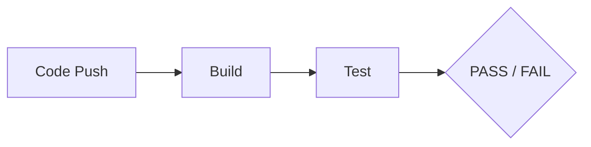
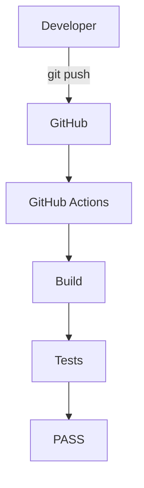

# 01 - CI vs CD

### Objective
Understand the difference between:
* **Continuous Integration (CI)**
* **Continuous Delivery (CD)**
* **Continuous Deployment (CD)**

---

## 1. What is CI?
**CI means Continuous Integration.**

Developers frequently push their code to a shared repository.
Every change can automatically trigger a pipeline:



### Example



---

## 2. What is CD?
**CD means Continuous Delivery or Continuous Deployment.**

After the code passes CI, the application can move toward release or deployment.


---

## 3. CI vs CD

| **CI** | **CD** |
|:---|:---|
| Integrates code | Delivers/deploys code |
| Builds application | Releases application |
| Runs tests | Runs deployment process |
| Finds problems early | Automates release |
| Developer-focused validation | Release/deployment-focused |

---

## 4. CI Example


---

## 5. CD Example


---

## 6. Real-World Example

A developer changes an application.

```bash
git add .
git commit -m "Update application"
git push
```

The CI system automatically:
**Checkout** → **Build** → **Test**

If everything passes:
**Build** → **Test** → **Deploy**

---

### 💡 Key Takeaway

> **CI** = Build + Test + Validate
> **CD** = Deliver / Deploy

* CI makes sure the code is healthy.
* CD automates getting that healthy code toward users.