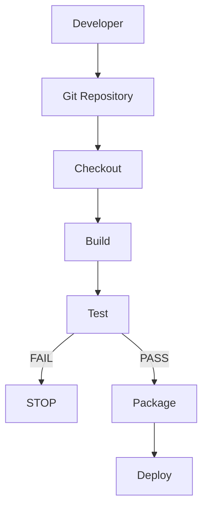
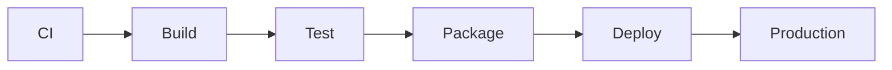

# 02 - CI/CD Pipeline

## 1. What is a Pipeline?

A pipeline is a sequence of automated steps.

### Example:


---

## 2. Typical CI/CD Pipeline



---

## 3. Pipeline Stages

### Stage 1: Checkout
Get source code from Git.

```bash
git checkout
```

In GitHub Actions:
```yaml
uses: actions/checkout@v6
```

---

### Stage 2: Build
Convert source code into a buildable application.

```bash
./build.sh
```

---

### Stage 3: Test
Run automated tests.

```bash
pytest
```

---

### Stage 4: Package
Create a deployable package.

```text
build/
├── calculator.py
└── build-info.txt
```

---

### Stage 5: Deploy
Send the application to an environment.



---

## 4. Why Do We Need CI/CD?

### Without automation:
**Developer** → **Manual Build** → **Manual Test** → **Manual Package** → **Manual Deployment**

### With CI/CD:
**Developer** → **git push** → **Automation** → **Build** → **Test** → **Package** → **Deploy**

---

### 💡 Key Takeaway
A CI/CD pipeline automates the journey:
> **Code** → **Build** → **Test** → **Package** → **Deploy**
