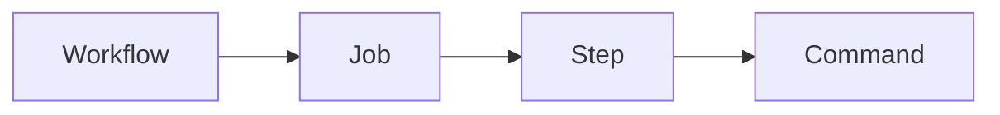

# 04 - Workflows


## 1. What is a Workflow?

A workflow is an automated process defined using YAML.

Workflow files are stored inside:
```text
.github/workflows/
```

**Example Directory Structure:**
```text
.github/
└── workflows/
    └── workflow-demo.yml
```

---

## 2. Basic Workflow Structure

```yaml
name: Workflow Demo
on:
  workflow_dispatch:
jobs:
  workflow-demo:
    runs-on: ubuntu-latest
    steps:
      - name: Step 1
        run: echo "Hello"
```

---

## 3. Workflow Name

```yaml
name: Workflow Demo
```
This is the name displayed in GitHub Actions.

---

## 4. Trigger

```yaml
on:
  workflow_dispatch:
```
Allows manual execution.

Other common triggers include:
```yaml
on:
  push:
```
and:
```yaml
on:
  pull_request:
```

---

## 5. Workflow Execution



---

## 6. Expected Output

```text
Workflow started
Running application task
Running tests
Workflow completed
```

---

### 💡 Key Takeaway
A workflow defines:

> **WHEN** + **WHAT**

* **WHEN** = trigger
* **WHAT** = jobs and steps
