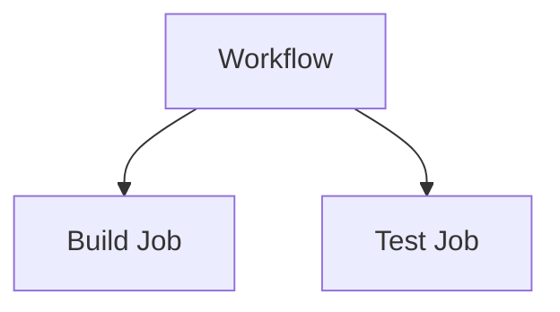
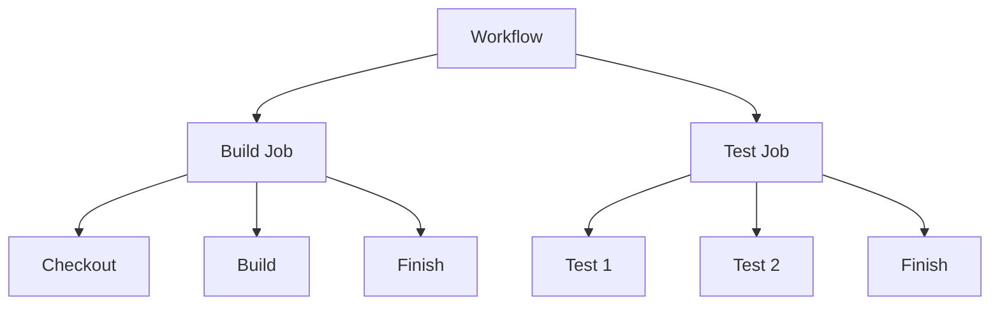
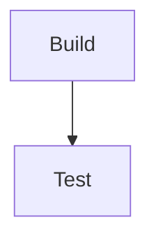

# 05 - Jobs and Steps

## 1. Jobs

A workflow can contain multiple jobs.

**Example:**
```yaml
jobs:
  build:
    ...
  test:
    ...
```

Our workflow has:



---

## 2. Steps

Each job contains multiple steps.

**Example:**
```yaml
steps:
  - name: Build
    run: echo "Building..."
  - name: Test
    run: echo "Testing..."
```

---

## 3. Job vs Step

| **Job** | **Step** |
|:---|:---|
| Larger unit | Smaller unit |
| Contains steps | Executes one task |
| Has its own runner | Runs inside job |
| Can depend on another job | Executes in order |

---

## 4. Our Pipeline



---

## 5. Expected Output

**Build:**
```text
Building application...
Build successful!
```

**Test:**
```text
Running test 1
Running test 2
All tests passed!
```

---

## 6. Important Point

Steps inside one job execute **sequentially**.

Jobs can run independently unless dependencies are defined.

To make one job wait for another:
```yaml
needs: build
```

**Example:**
```yaml
test:
  needs: build
```

**Then:**


---

### 💡 Key Takeaway

> **Workflow** → **Jobs** → **Steps**
