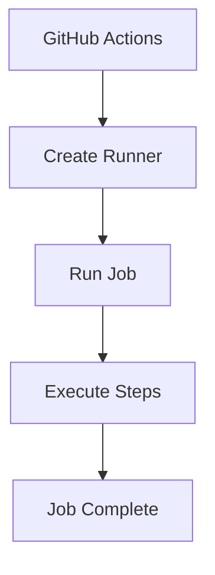

# 06 - Runners

## 1. What is a Runner?

A runner is the machine that executes your GitHub Actions job.

**Example:**
```yaml
runs-on: ubuntu-latest
```

GitHub provides an Ubuntu environment to execute the job.

---

## 2. Runner Flow



---

## 3. Our Runner

We use:
```yaml
runs-on: ubuntu-latest
```

---

## 4. Check Runner

The workflow runs:
```bash
hostname
uname -a
pwd
ls -la
python --version
```

---

## 5. Expected Output

**Example:**
```text
runner-xxxx
Linux runner-xxxx ...
/home/runner/work/...
```

**Python:**
```text
Python 3.x.x
```

*(Exact values can differ between runs.)*

---

## 6. Why Do We Need Runners?

GitHub Actions needs a machine to execute:
* Shell commands
* Python
* Node.js
* Docker
* Tests
* Builds
* Deployment commands

The runner provides that execution environment.

---

### 💡 Key Takeaway

> **Workflow** → **Job** → **Runner** → **Steps execute**
