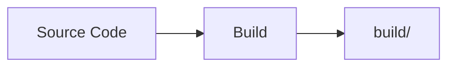
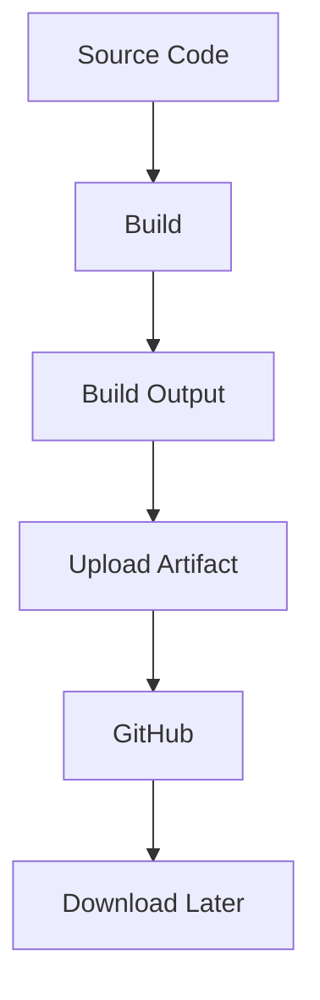

# 08 - Artifacts

## 1. What is an Artifact?

An artifact is a file or collection of files produced during a workflow run that we want to store and access after the job completes.

**Example:**



```text
build/
├── app.txt
├── version.txt
└── build-info.txt
```

The `build/` directory becomes an artifact.

---

## 2. Build Locally

Run:
```bash
chmod +x build.sh
./build.sh
```

**Expected:**
```text
Starting build...
Build completed successfully.
```

Check:
```bash
ls -la build
```

**Expected:**
```text
app.txt
version.txt
build-info.txt
```

---

## 3. Upload Artifact

The workflow uses:
```yaml
uses: actions/upload-artifact@v4
```

**Configuration:**
```yaml
with:
  name: session16-build
  path: build/
```

---

## 4. Run Workflow

Go to:
**GitHub** → **Actions** → **Artifact Demo** → **Run workflow**

---

## 5. Expected Output

```text
Build output:
app.txt
version.txt
build-info.txt
```

The workflow should finish with:
`✓ Upload artifact`

---

## 6. Download Artifact

1. Open the successful workflow run.
2. Go to: **Summary** → **Artifacts** → **session16-build**
3. Download it.

---

## 7. Artifact Flow



---

### 💡 Key Takeaway
> **Git** stores source code.
> **Artifacts** store important output generated by a workflow.
