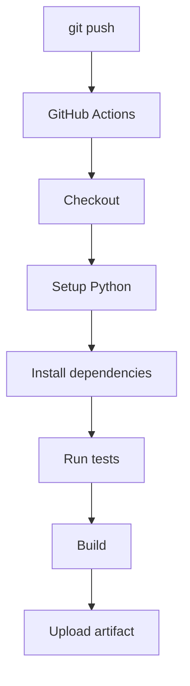

# 09 - Build & Test Pipeline

## 1. Project Structure

```text
09-build-and-test/
│
├── app/
│   ├── __init__.py
│   └── calculator.py
│
├── tests/
│   └── test_calculator.py
│
├── requirements.txt
├── build.sh
│
└── .github/
    └── workflows/
        └── ci.yml
```

---

## 2. Run Application

```bash
python3 app/calculator.py
```

**Expected:**
```text
Calculator Application
----------------------
10 + 5 = 15
10 - 5 = 5
10 * 5 = 50
10 / 5 = 2.0
```

---

## 3. Install Dependencies

```bash
python3 -m pip install -r requirements.txt
```

---

## 4. Run Tests

```bash
pytest -v
```

**Expected:**
```text
tests/test_calculator.py::test_add PASSED
tests/test_calculator.py::test_subtract PASSED
tests/test_calculator.py::test_multiply PASSED
tests/test_calculator.py::test_divide PASSED
tests/test_calculator.py::test_divide_by_zero PASSED
5 passed
```

---

## 5. Run Build

```bash
chmod +x build.sh
./build.sh
```

**Expected:**
```text
Starting build...
Build completed successfully.
```

---

## 6. GitHub Actions

The workflow automatically runs when code is pushed to `main`.



---

## 7. Expected GitHub Output

```text
✓ Checkout source code
✓ Setup Python
✓ Show Python version
✓ Install dependencies
✓ Run tests
✓ Build application
✓ Show build output
✓ Upload artifact
```

---

## 8. Failure Test

Change:
```python
def add(a, b):
    return a + b
```
to:
```python
def add(a, b):
    return a + b + 1
```

Run:
```bash
pytest
```

**Expected:**
```text
FAILED tests/test_calculator.py::test_add
```

Push:
```bash
git add .
git commit -m "Test pipeline failure"
git push
```

GitHub Actions should show:
```text
✓ Checkout
✓ Setup Python
✓ Install dependencies
✗ Run tests
```
*The pipeline stops because the test failed.*

---

## 9. Fix the Code

Change it back:
```python
def add(a, b):
    return a + b
```

Then:
```bash
git add .
git commit -m "Fix calculator"
git push
```

**Expected:**
```text
✓ Run tests
✓ Build application
✓ Upload artifact
```

---

### 💡 Key Takeaway
A CI pipeline automatically validates code before it moves forward.

> **Code** → **Build** → **Test** → **Artifact**
