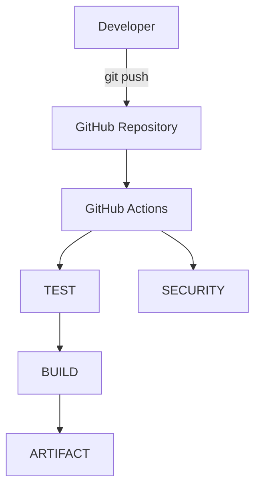

# 10 - Final CI/CD Pipeline

## 1. Architecture



---

## 2. Jobs
The workflow contains three jobs:
1. `test`
2. `build`
3. `security-check`

---

## 3. Test Job
The test job:
**Checkout** → **Setup Python** → **Install dependencies** → **Run pytest**

---

## 4. Build Job
The build job runs **only** after tests pass.
```yaml
needs: test
```

**Flow:**
Test → PASS → Build → Artifact

**If tests fail:**
Test → FAIL → Build does not run

---

## 5. Security Check
The security job checks for common sensitive files:
* `.env`
* `*.pem`
* `*.key`

*(This is only a basic classroom demonstration. It is not a complete security scanner.)*

---

## 6. Runner
All jobs use:
```yaml
runs-on: ubuntu-latest
```
GitHub provides the runner environment.

---

## 7. Artifact
The build generates:
```text
build/
├── calculator.py
└── build-info.txt
```
The workflow uploads it as:
`calculator-build`

---

## 8. Run Locally

**Install dependencies:**
```bash
python3 -m pip install -r requirements.txt
```

**Run application:**
```bash
python3 app/calculator.py
```

**Run tests:**
```bash
pytest -v
```

**Build:**
```bash
chmod +x build.sh
./build.sh
```

---

## 9. Git Commands
```bash
git init
git add .
git commit -m "Add final CI/CD pipeline"
git branch -M main
git remote add origin https://github.com/YOUR_USERNAME/session16-cicd-github-actions.git
git push -u origin main
```

---

## 10. Expected Pipeline
GitHub Actions should show:

```text
Final CI Pipeline
│
├── ✓ Test Application
│
├── ✓ Security Check
│
└── ✓ Build Application
      │
      └── ✓ Upload build artifact
```

---

## 11. Failure Scenario
Break the application intentionally:
```python
def add(a, b):
    return a + b + 1
```

Run:
```bash
pytest
```
The test fails. Push the change.

**Expected:**
```text
✗ Test Application
```

Because `build` `needs: test`, the build does not proceed.

---

## 12. Fix
Restore:
```python
def add(a, b):
    return a + b
```

Commit:
```bash
git add .
git commit -m "Fix application"
git push
```

**Expected:**
```text
✓ Test Application
✓ Security Check
✓ Build Application
✓ Upload build artifact
```

---

## 13. Complete Concept Map

```text
CI/CD
│
├── CI
│   ├── Build
│   └── Test
│
├── CD
│   └── Deliver / Deploy
│
└── GitHub Actions
    │
    ├── Workflow
    │
    ├── Jobs
    │   ├── Test
    │   ├── Security
    │   └── Build
    │
    ├── Steps
    │
    ├── Runner
    │
    ├── Secrets
    │
    └── Artifacts
```

---

### 💡 Final Takeaway

> **git push** → **GitHub Actions** → **Test** → **Security Check** → **Build** → **Artifact** → **Ready for CD / Deployment**

The next step after this session is to connect the pipeline to a deployment target such as Docker, Kubernetes, AWS, or Azure.
