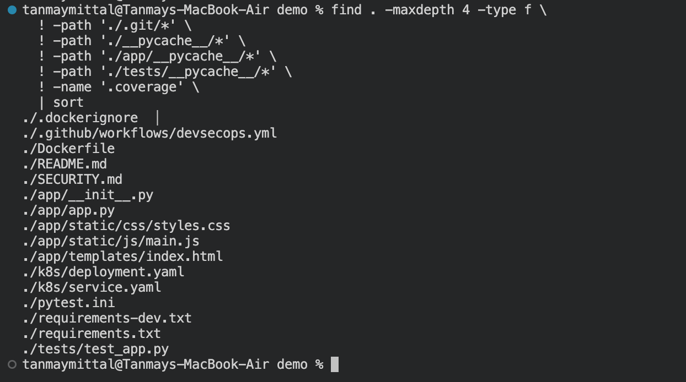
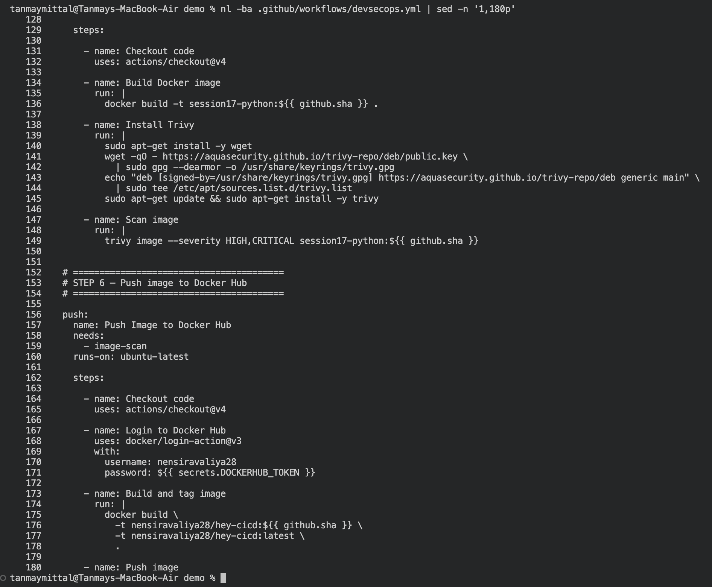
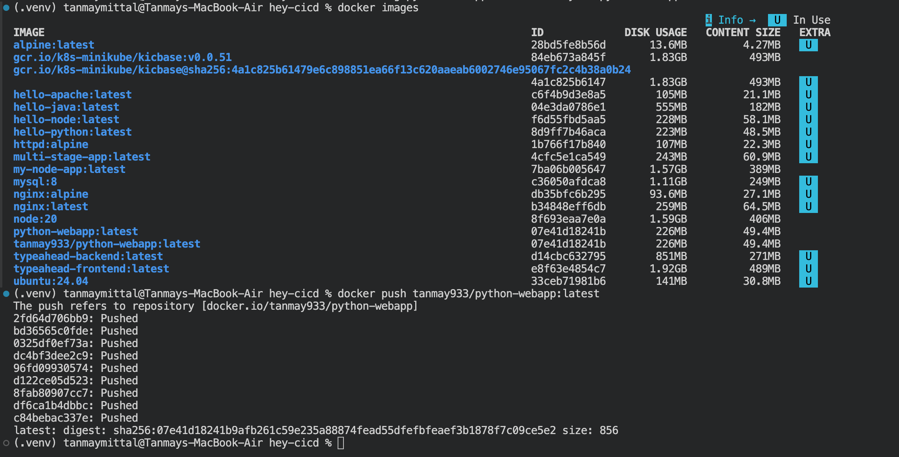
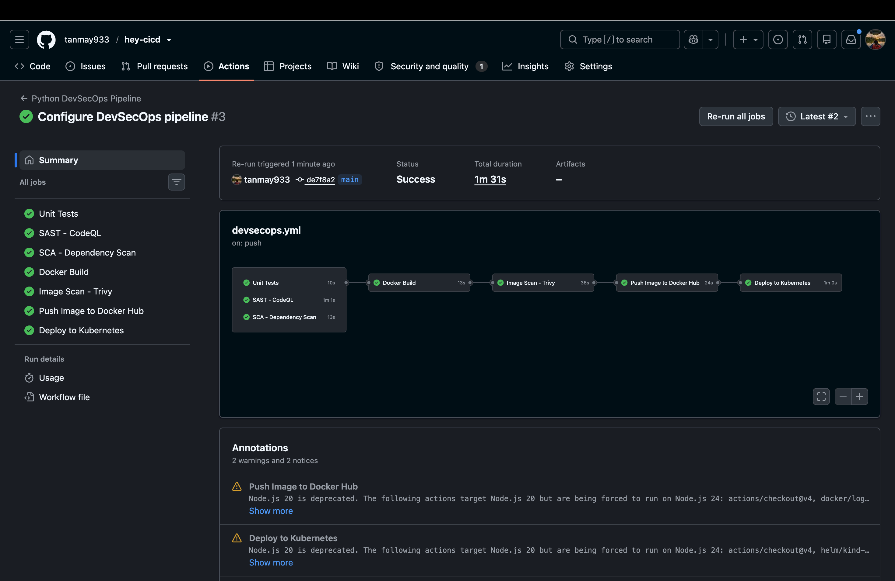

# Session 17 — Complete CI/CD & DevSecOps

A complete CI/CD and DevSecOps workflow for a Python Flask application — testing, security scanning, containerization, registry publishing, and Kubernetes deployment.


> A complete CI/CD and DevSecOps workflow for a Python Flask application.

---

## Objective

The objective of Session 17 was to build and understand a complete **CI/CD and DevSecOps workflow** for a Python Flask application.

The session covered:

- Application development and testing
- Docker image creation
- Container registry
- Kubernetes deployment
- SAST
- SCA
- Secret scanning
- Container image scanning
- Security gates
- GitHub Actions CI/CD automation

The final project demonstrates how application code can move from development to testing, security validation, containerization, registry publishing, and Kubernetes deployment through an automated pipeline.

---

# 1. DevSecOps Overview

**DevSecOps** means integrating security into the software development and delivery lifecycle instead of treating security as a separate step at the end.

Traditional flow:

```text
Code
  ↓
Build
  ↓
Test
  ↓
Deploy
  ↓
Security checks
```

DevSecOps moves security checks earlier into the pipeline:

```text
Code
  ↓
Build
  ↓
Unit Test
  ↓
SAST
  ↓
SCA
  ↓
Secret Scan
  ↓
Docker Build
  ↓
Container Image Scan
  ↓
Security Gates
  ↓
Push Image
  ↓
Deploy to Kubernetes
```

The goal is to identify security and quality problems before an application reaches production.

---

# 2. Session 17 Project Structure

The Session 17 work is organized into separate sections covering the individual DevSecOps concepts, along with a complete demo application.

```text
session-17-devsecops/
│
├── 02-container-registry/
├── 03-kubernetes-deployment/
├── 04-sast/
├── 05-sca/
├── 06-secret-scanning/
├── 07-container-image-scanning/
├── 08-security-gates/
│
├── demo/
│   ├── app/
│   ├── tests/
│   ├── k8s/
│   ├── .github/
│   │   └── workflows/
│   │       └── devsecops.yml
│   ├── Dockerfile
│   ├── requirements.txt
│   └── requirements-dev.txt
│
├── images/
│   ├── 01-project-structure.png
│   ├── 02-devsecops-workflow.png
│   ├── 03-pipeline-success.png
│   └── 04-kubernetes-manifests.png
│
└── resultReadme.md
```

### Project Structure Evidence



The project contains the application, tests, Docker configuration, Kubernetes manifests, GitHub Actions workflow, and separate security exercises.

---

# 3. Application

The demo application is a **Python Flask web application**.

The application contains:

- Flask backend
- HTML dashboard
- CSS styling
- JavaScript
- REST API endpoints
- Unit tests

Important API endpoints include:

| Method | Endpoint | Purpose |
|---|---|---|
| GET | `/` | Dashboard UI |
| GET | `/health` | Health check |
| GET | `/api/status` | Application status |
| GET | `/api/greet/<name>` | Greeting API |
| POST | `/api/add` | Addition API |
| POST | `/api/calculate` | Calculator API |
| POST | `/api/pipeline/run` | Pipeline simulation |

The application is tested before the Docker image is built.

---

# 4. Unit Testing

Unit testing verifies that individual parts of the application behave as expected.

The project uses **pytest** for testing.

The pipeline installs the development dependencies and runs:

```bash
pytest --cov=app --cov-report=term-missing
```

The tests cover functionality such as:

- Home page
- Health endpoint
- Greeting endpoint
- Addition
- Missing input handling
- Calculator operations
- Division by zero handling
- Application status

The successful GitHub Actions pipeline shows the Unit Tests job completing successfully.

---

# 5. Docker

Docker packages the application and its dependencies into a portable container image.

The project contains:

```text
Dockerfile
```

The Docker image allows the same application environment to be used consistently across development, CI/CD, and Kubernetes.

Example local build:

```bash
docker build -t python-webapp .
```

Example local run:

```bash
docker run -p 5001:5001 python-webapp
```

The CI/CD pipeline also builds the Docker image automatically after the required tests and security checks pass.

---

# 6. Container Registry

A **container registry** is a service used to store and distribute Docker/OCI container images.

The project uses **Docker Hub** for the container registry.

The pipeline:

```text
Docker Build
     ↓
Docker Image
     ↓
Docker Hub
     ↓
Kubernetes
```

The image is tagged using both the Git commit SHA and the `latest` tag.

Example:

```text
nensiravaliya28/hey-cicd:<commit-sha>
nensiravaliya28/hey-cicd:latest
```

Using the commit SHA provides a unique and traceable version for each pipeline execution.

---

# 7. SAST — Static Application Security Testing

**SAST (Static Application Security Testing)** analyzes source code for potential security weaknesses without requiring the application to be running.

For this session, **GitHub CodeQL** was used.

The CodeQL workflow performs:

```text
Source Code
    ↓
CodeQL Analysis
    ↓
Security Findings
```

The pipeline contains a dedicated:

```text
SAST - CodeQL
```

job.

CodeQL is useful because security issues can be identified during development and CI rather than after deployment.

### SAST vs Other Security Checks

| Security Check | What It Checks |
|---|---|
| SAST | Application source code |
| SCA | Third-party dependencies |
| Secret Scanning | Credentials and sensitive values |
| Image Scanning | Container image and installed components |

---

# 8. SCA — Software Composition Analysis

**SCA (Software Composition Analysis)** checks third-party libraries and dependencies for known vulnerabilities.

Python applications depend on packages such as Flask and testing libraries. A vulnerability in one of these dependencies can introduce risk even if the application's own source code is secure.

The project uses:

```text
pip-audit
```

The pipeline installs the application dependencies and runs:

```bash
pip-audit
```

The SCA stage therefore follows:

```text
Python Dependencies
        ↓
    pip-audit
        ↓
Known Vulnerabilities
```

The successful pipeline shows:

```text
SCA - Dependency Scan
```

passing before the Docker image build stage.

---

# 9. Secret Scanning

**Secret scanning** is used to detect credentials and other sensitive information that may accidentally be committed to source control.

Examples of secrets include:

- API keys
- Passwords
- Access tokens
- Private keys
- Cloud credentials
- Database credentials

A real credential should never be hard-coded into application source code.

Bad practice:

```python
API_KEY = "real-secret-value"
```

Better approach:

```python
import os

api_key = os.getenv("API_KEY")
```

For GitHub Actions, secrets can be supplied through GitHub's secret store:

```yaml
${{ secrets.API_KEY }}
```

The Session 17 secret-scanning work was practiced separately through the dedicated secret-scanning exercise/repository. It is part of the DevSecOps security workflow covered in this session.

If a real credential is ever exposed, simply deleting the line is not enough. The credential should be revoked or rotated and its possible misuse should be checked.

---

# 10. Container Image Scanning

Even when source code and dependencies are checked, the final Docker image can still contain vulnerable components.

A container image may contain:

- Operating system packages
- System libraries
- Python packages
- Other installed components

Therefore, the final image should also be scanned.

The project uses **Trivy** for container image scanning.

The pipeline performs a scan for HIGH and CRITICAL vulnerabilities:

```bash
trivy image \
  --severity HIGH,CRITICAL \
  session17-python:${{ github.sha }}
```

The flow is:

```text
Docker Build
     ↓
Trivy Image Scan
     ↓
Security Result
```

The successful GitHub Actions run shows the:

```text
Image Scan - Trivy
```

stage completing successfully.

---

# 11. Security Gates

A security scan only detects a problem. A **security gate** determines whether the pipeline is allowed to continue.

For example:

```text
Security Check
      ↓
   ┌──┴──┐
 PASS   FAIL
  ↓       ↓
Continue STOP
```

The GitHub Actions workflow implements pipeline gating through job dependencies using `needs`.

For example:

```yaml
docker-build:
  needs:
    - test
    - sast
    - sca
```

This means the Docker build does not start until:

- Unit tests pass
- SAST passes
- SCA passes

The next stages are also dependent on earlier stages:

```text
Unit Tests
     │
SAST ─┤
     │
SCA ──┘
     ↓
Docker Build
     ↓
Trivy Image Scan
     ↓
Docker Hub Push
     ↓
Kubernetes Deployment
```

Therefore, a failure in an earlier required stage prevents later stages from proceeding.

This is the practical implementation of a **security gate** in the pipeline.

---

# 12. GitHub Actions CI/CD Workflow

The complete CI/CD workflow is stored at:

```text
demo/.github/workflows/devsecops.yml
```

The workflow runs for:

```yaml
push:
  branches:
    - main

pull_request:
  branches:
    - main
```

The workflow contains the following major jobs:

```text
Unit Tests
     ↓
SAST - CodeQL
     ↓
SCA - Dependency Scan
     ↓
Docker Build
     ↓
Image Scan - Trivy
     ↓
Push Image to Docker Hub
     ↓
Deploy to Kubernetes
```

### Workflow Evidence



The workflow file demonstrates how the individual CI/CD and security stages are connected using GitHub Actions.

---

# 13. Complete Pipeline

The final pipeline combines application quality, security, containerization, registry publishing, and Kubernetes deployment.

The implemented flow is:

```text
Code Push
    ↓
Unit Tests
    ↓
SAST - CodeQL
    ↓
SCA - pip-audit
    ↓
Docker Build
    ↓
Container Image Scan - Trivy
    ↓
Docker Hub Push
    ↓
Kubernetes Deployment
    ↓
Rollout Verification
    ↓
Application Verification
```

The Kubernetes deployment is performed using a **Kind cluster** created inside the GitHub Actions runner.

The workflow:

1. Creates a Kind Kubernetes cluster.
2. Updates the Kubernetes manifest with the current Git commit SHA.
3. Applies the Deployment.
4. Applies the Service.
5. Checks the rollout status.
6. Uses port forwarding.
7. Tests the running application using `curl`.

---

# 14. Kubernetes Deployment

Kubernetes is responsible for running the containerized application.

The project contains:

```text
k8s/
├── deployment.yaml
└── service.yaml
```

The Deployment defines the application Pods and uses two replicas:

```yaml
replicas: 2
```

The image is dynamically updated with the Git commit SHA during the CI/CD pipeline.

The workflow then executes:

```bash
kubectl apply -f k8s/deployment.yaml
kubectl apply -f k8s/service.yaml
```

After deployment, the pipeline verifies the rollout:

```bash
kubectl rollout status deployment/session17-python --timeout=60s
```

The application is then tested through the Kubernetes Service.

### Kubernetes Manifest Evidence



The manifests define the Kubernetes Deployment and Service required to run and expose the application.

---

# 15. Successful Pipeline Result

The complete GitHub Actions workflow completed successfully.

The following stages are shown as successful:

- Unit Tests
- SAST - CodeQL
- SCA - Dependency Scan
- Docker Build
- Image Scan - Trivy
- Push Image to Docker Hub
- Deploy to Kubernetes

### Successful Pipeline



This screenshot provides the final evidence that the complete automated pipeline executed successfully from testing through Kubernetes deployment.

---

# 16. Pipeline Security and Delivery Model

The main security principle demonstrated in this session is that security checks should happen **before the application is published or deployed**.

The pipeline follows:

```text
                ┌───────────────┐
                │    Git Push   │
                └───────┬───────┘
                        ↓
                ┌───────────────┐
                │  Unit Tests   │
                └───────┬───────┘
                        ↓
             ┌──────────┴──────────┐
             ↓                     ↓
       ┌───────────┐        ┌───────────┐
       │   SAST    │        │    SCA    │
       │  CodeQL   │        │pip-audit  │
       └─────┬─────┘        └─────┬─────┘
             └──────────┬──────────┘
                        ↓
                ┌───────────────┐
                │ Docker Build  │
                └───────┬───────┘
                        ↓
                ┌───────────────┐
                │ Trivy Scan    │
                └───────┬───────┘
                        ↓
                ┌───────────────┐
                │ Docker Hub    │
                │     Push      │
                └───────┬───────┘
                        ↓
                ┌───────────────┐
                │  Kubernetes   │
                │   Deploy      │
                └───────┬───────┘
                        ↓
                ┌───────────────┐
                │   Verify      │
                │   Rollout     │
                └───────────────┘
```

Secret scanning was also covered as a separate security exercise within the session.

---

# 17. Important Concepts Learned

### CI — Continuous Integration

CI automatically builds and tests code whenever changes are pushed to the repository.

### CD — Continuous Delivery / Deployment

CD automates the process of moving validated application changes toward an environment where they can be deployed.

### DevSecOps

DevSecOps integrates security into CI/CD instead of waiting until the end of development.

### SAST

Analyzes application source code for security weaknesses.

### SCA

Analyzes third-party dependencies for known vulnerabilities.

### Secret Scanning

Detects accidentally exposed credentials, tokens, keys, and other sensitive information.

### Container Image Scanning

Analyzes the final Docker image for known vulnerabilities in packages and system components.

### Security Gate

Uses security and quality results to decide whether the pipeline is allowed to continue.

### Container Registry

Stores and distributes container images so they can be pulled by deployment environments.

### Kubernetes Deployment

Runs and manages the containerized application using Kubernetes resources such as Deployments and Services.

---

# 18. Final Deliverables

| Deliverable | Status |
|---|---|
| Application | ✅ Completed |
| Dockerfile | ✅ Completed |
| GitHub Actions workflow | ✅ Completed |
| Unit testing | ✅ Completed |
| SAST | ✅ CodeQL |
| SCA | ✅ pip-audit |
| Secret scanning | ✅ Completed separately |
| Container image scanning | ✅ Trivy |
| Security gates | ✅ Implemented using pipeline dependencies |
| Container registry | ✅ Docker Hub |
| Kubernetes manifests | ✅ Completed |
| Kubernetes deployment | ✅ Successful |
| Successful pipeline output | ✅ Successful |
| Screenshots | ✅ Included |
| Complete README | ✅ Completed |

---

# 19. Final Result

Session 17 demonstrated a complete DevSecOps workflow where application code is tested, analyzed for security issues, packaged into a Docker image, scanned for container vulnerabilities, published to a container registry, and deployed to Kubernetes.

The main takeaway is that CI/CD is not only about automating deployment. A proper DevSecOps pipeline also makes **testing and security part of the delivery process**, with gates preventing later stages from running when required checks fail.

---

## Author

**Tanmay Mittal**

Roll No.: **24BCS10491**