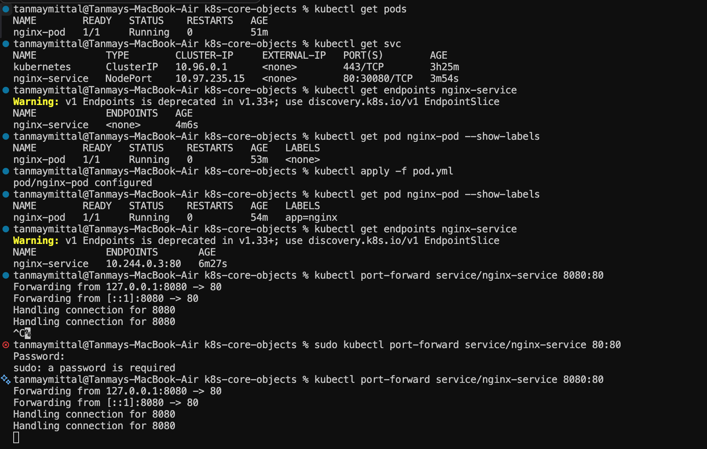
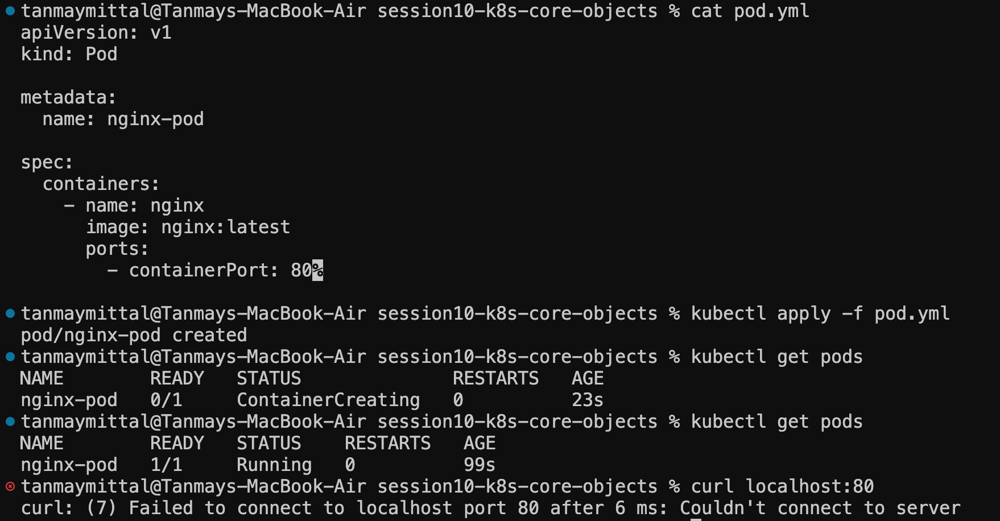

# Kubernetes Core Objects — Session 10

Today I worked with Kubernetes Core Objects and learned how Pods and Services work together.

## What I Learned

- Kubernetes API Objects
- Pods
- Pod metadata
- Labels
- Selectors
- Services
- NodePort
- Port mapping
- Port forwarding
- Basic `kubectl` commands
- Debugging a Service that was not connected to a Pod

---

# 1. Kubernetes Pod

A **Pod** is the smallest deployable unit in Kubernetes.

I created an Nginx Pod using the following configuration:

```yaml
apiVersion: v1
kind: Pod

metadata:
  name: nginx-pod
  labels:
    app: nginx

spec:
  containers:
    - name: nginx
      image: nginx:latest
      ports:
        - containerPort: 80
```

## Important Parts

### `apiVersion`

```yaml
apiVersion: v1
```

Specifies the Kubernetes API version being used.

### `kind`

```yaml
kind: Pod
```

Specifies that the Kubernetes object is a Pod.

### `metadata`

```yaml
metadata:
  name: nginx-pod
```

Contains information used to identify the object.

### Labels

```yaml
labels:
  app: nginx
```

Labels are key-value pairs attached to Kubernetes objects.

They can be used by other Kubernetes objects to find and work with specific Pods.

### Container

```yaml
containers:
  - name: nginx
    image: nginx:latest
```

The Pod runs an Nginx container using the `nginx:latest` image.

### Container Port

```yaml
ports:
  - containerPort: 80
```

The Nginx container listens on port `80`.

---

# 2. Creating and Checking the Pod

I created the Pod using:

```bash
kubectl apply -f pod.yml
```

Then I checked the Pods:

```bash
kubectl get pods
```

The Pod was running successfully:

```text
NAME        READY   STATUS    RESTARTS
nginx-pod   1/1     Running   0
```

I also checked the labels using:

```bash
kubectl get pod nginx-pod --show-labels
```

---

# 3. Kubernetes Service

A **Service** provides a stable way to access Pods.

I created a NodePort Service for the Nginx Pod:

```yaml
apiVersion: v1
kind: Service

metadata:
  name: nginx-service

spec:
  type: NodePort

  selector:
    app: nginx

  ports:
    - port: 80
      targetPort: 80
      nodePort: 30080
```

## Important Parts

### Service Name

```yaml
name: nginx-service
```

This is the name of the Service.

### Service Type

```yaml
type: NodePort
```

`NodePort` exposes the Service through a port on the Kubernetes node.

### Selector

```yaml
selector:
  app: nginx
```

The selector tells the Service which Pods it should send traffic to.

The Service looks for Pods with:

```yaml
app: nginx
```

Therefore, the Pod needs:

```yaml
labels:
  app: nginx
```

The connection looks like this:

```text
Service
   |
   | selector: app=nginx
   ↓
Pod
   |
   | label: app=nginx
   ↓
nginx-pod
```

---

# 4. Problem I Encountered

Initially, my Pod did **not** have a label.

My Pod had:

```yaml
metadata:
  name: nginx-pod
```

But my Service had:

```yaml
selector:
  app: nginx
```

Since the Pod did not have the `app=nginx` label, the Service could not find it.

I checked the Service endpoints using:

```bash
kubectl get endpoints nginx-service
```

The result was:

```text
NAME            ENDPOINTS
nginx-service   <none>
```

This meant the Service had no Pod endpoints.

The problem was:

```text
Service
   |
   | selector: app=nginx
   ↓
No Pod with app=nginx
   |
   ↓
ENDPOINTS: <none>
```

---

# 5. Fixing the Label Problem

I added the required label to `pod.yml`:

```yaml
metadata:
  name: nginx-pod
  labels:
    app: nginx
```

Then I applied the updated configuration:

```bash
kubectl apply -f pod.yml
```

I verified the label:

```bash
kubectl get pod nginx-pod --show-labels
```

The output showed:

```text
nginx-pod   1/1   Running   0   ...   app=nginx
```

Then I checked the Service endpoints again:

```bash
kubectl get endpoints nginx-service
```

This time an endpoint was available:

```text
nginx-service   10.244.0.3:80
```

This confirmed that the Service successfully found the Pod.

> **Key lesson:** A Service uses its selector to find Pods. The Service selector and Pod labels must match.

---

# 6. Checking Services

I used:

```bash
kubectl get svc
```

`svc` is shorthand for `service`.

My Service appeared as:

```text
NAME            TYPE       CLUSTER-IP      EXTERNAL-IP   PORT(S)
nginx-service   NodePort   10.97.235.15    <none>        80:30080/TCP
```

Useful commands:

```bash
kubectl get pods
```

Shows Pods.

```bash
kubectl get svc
```

Shows Services.

```bash
kubectl get endpoints nginx-service
```

Shows the endpoints that the Service is connected to.

---

# 7. Port Forwarding

I also learned how to forward a local port to a Kubernetes Service.

I used:

```bash
kubectl port-forward service/nginx-service 8080:80
```

This creates a connection:

```text
localhost:8080
       ↓
kubectl port-forward
       ↓
nginx-service:80
       ↓
nginx-pod:80
       ↓
Nginx
```

The terminal showed:

```text
Forwarding from 127.0.0.1:8080 -> 80
Forwarding from [::1]:8080 -> 80
```

The port-forward command remains running because it is maintaining the connection.

To stop it:

```text
Ctrl + C
```

---

# 8. Understanding Port Mapping

The Service configuration contained:

```yaml
ports:
  - port: 80
    targetPort: 80
    nodePort: 30080
```

The basic flow is:

```text
NodePort: 30080
       ↓
Service Port: 80
       ↓
Pod Port: 80
       ↓
Nginx Container
```

### `port`

```yaml
port: 80
```

The port exposed by the Service.

### `targetPort`

```yaml
targetPort: 80
```

The port on the Pod/container that receives the traffic.

### `nodePort`

```yaml
nodePort: 30080
```

The port exposed on the Kubernetes node.

---

# 9. Commands Practiced

### Create or update a Kubernetes object

```bash
kubectl apply -f pod.yml
```

### Get Pods

```bash
kubectl get pods
```

### Get Pods with labels

```bash
kubectl get pods --show-labels
```

### Get Services

```bash
kubectl get svc
```

### Get Service endpoints

```bash
kubectl get endpoints nginx-service
```

### Port forward a Service

```bash
kubectl port-forward service/nginx-service 8080:80
```

### Stop port forwarding

```text
Ctrl + C
```

---

# 10. Screenshots

## Pod and Service



## Debugging and Port Forwarding



---

# Key Takeaways

The most important things I learned today:

1. **A Pod is the smallest deployable unit in Kubernetes.**
2. **A Pod can contain one or more containers.**
3. **Labels are key-value pairs attached to Kubernetes objects.**
4. **A Service uses selectors to find Pods.**
5. **The Service selector and Pod labels must match.**
6. **If a Service shows `<none>` for its endpoints, it is not finding a matching Pod.**
7. **`kubectl get svc` is used to view Services.**
8. **NodePort exposes a Service through a port on the Kubernetes node.**
9. **`kubectl port-forward` creates a temporary connection from the local machine to a Kubernetes resource.**
10. **`port`, `targetPort`, and `nodePort` have different purposes.**

---

# Mental Model

```text
                 Kubernetes
                     |
                     ↓
              nginx-service
                     |
              selector: app=nginx
                     |
                     ↓
                 nginx-pod
                label: app=nginx
                     |
                     ↓
              nginx container
                     |
                     ↓
                   Port 80
```

The main concept I learned today is that Kubernetes objects can work together through **labels and selectors**.

The Service does not automatically know which Pod to use; it finds the correct Pod through the matching label.