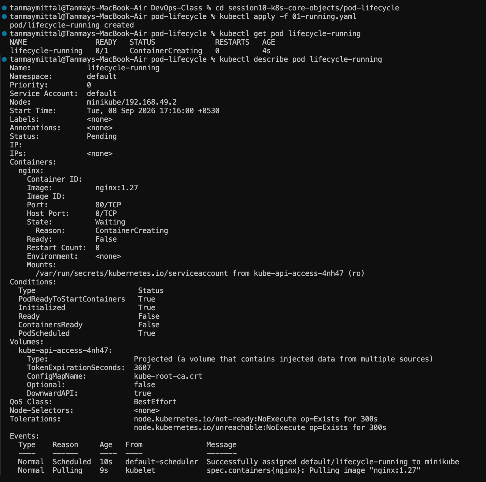
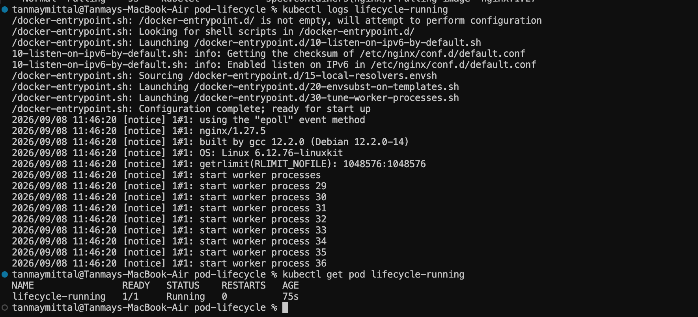
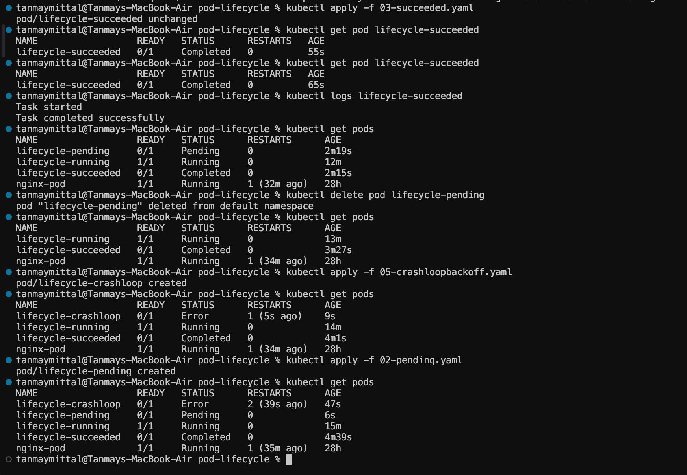
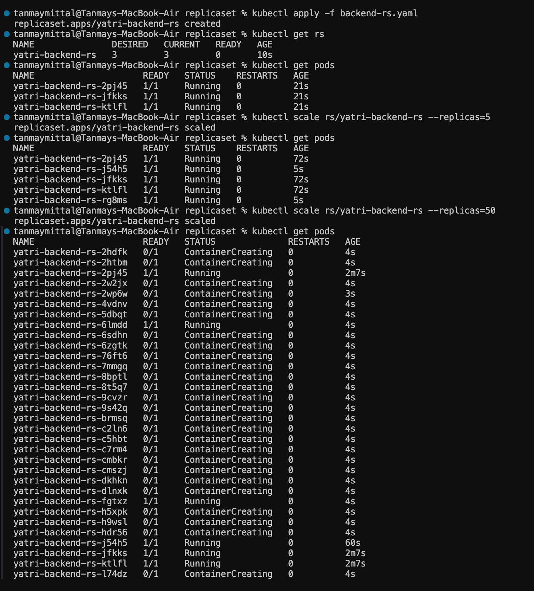
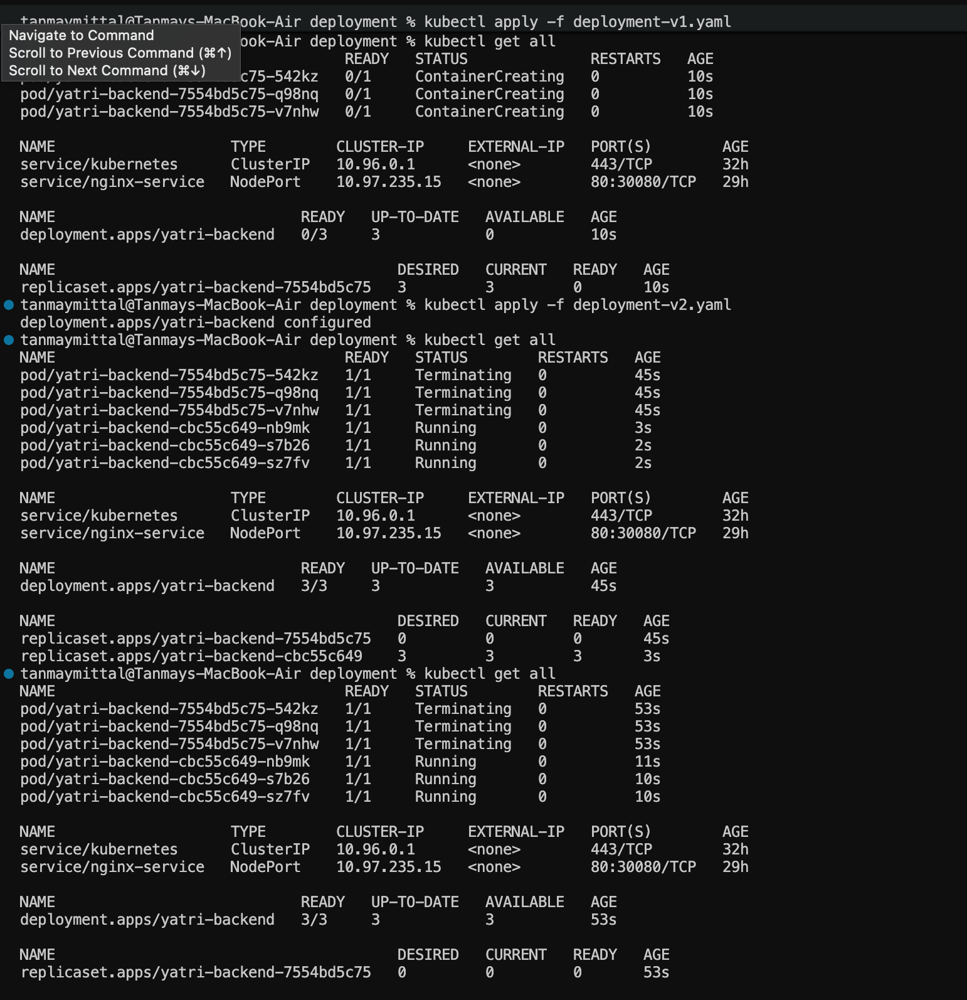
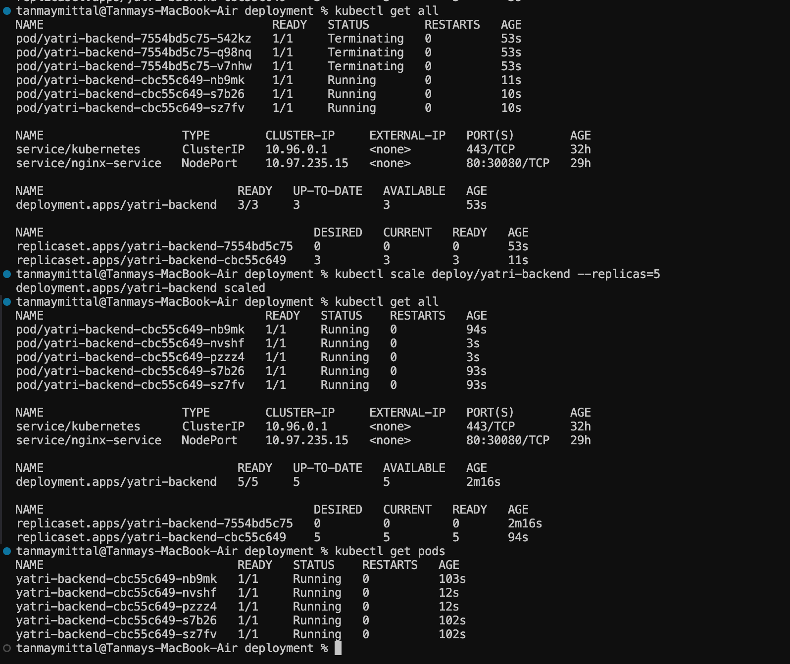
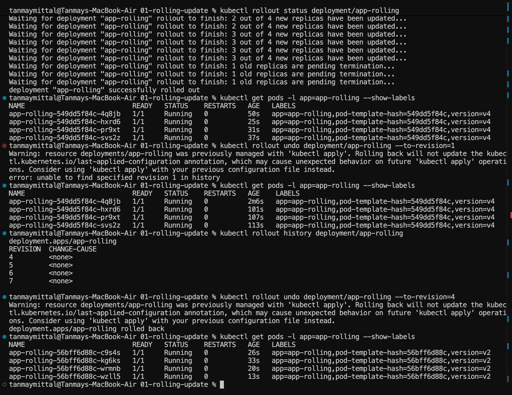
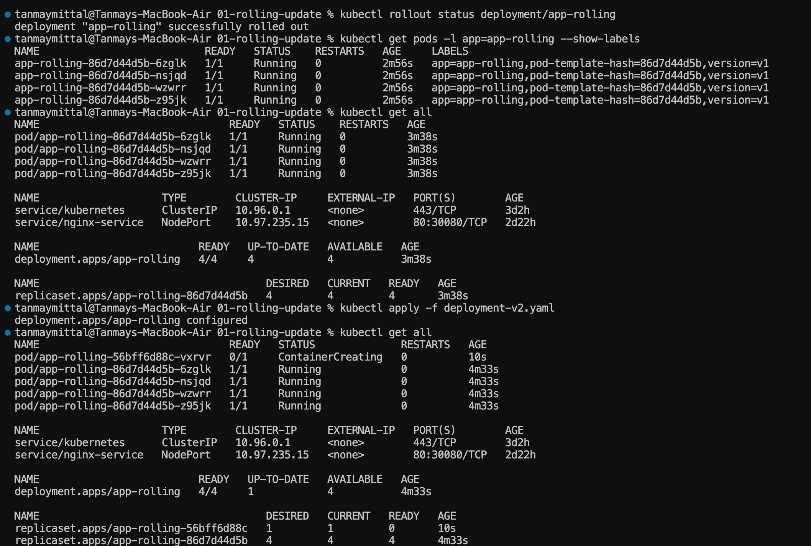
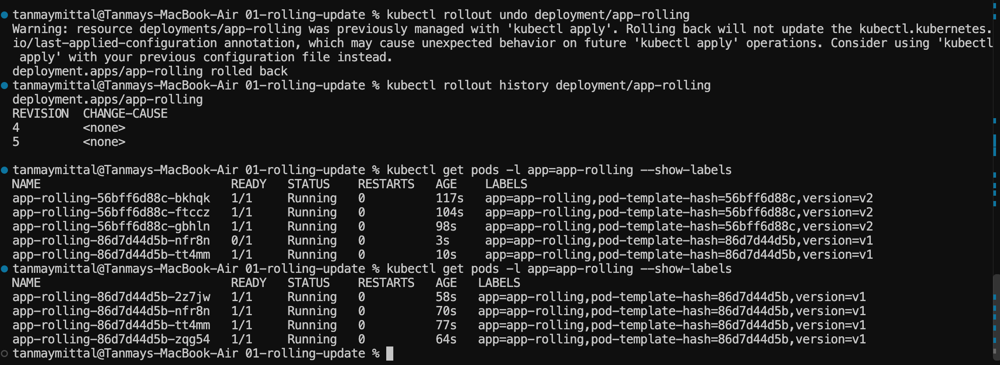
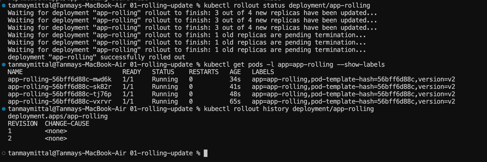

# Kubernetes Core Objects — Session 10 Practical

This practical covered Kubernetes Pod lifecycle, ReplicaSets, and Deployments using Minikube and `kubectl`.

The main goal was to understand how Kubernetes creates, manages, replaces, scales, and monitors Pods.

---

# 1. Pod Lifecycle

A Pod is the smallest deployable unit in Kubernetes.

A Pod can go through different lifecycle situations depending on what happens to its containers and whether Kubernetes can schedule and run them.

The practical used separate YAML files to demonstrate different lifecycle situations:

```text
01-running.yaml
02-pending.yaml
03-succeeded.yaml
04-failed.yaml
05-crashloopbackoff.yaml
06-imagepullbackoff.yaml
07-readiness.yaml
08-liveness.yaml
09-startup.yaml
10-init-container.yaml
11-multi-container.yaml
12-termination.yaml
```

## 1.1 Running Pod

A Running Pod has its container successfully started and running.

### Commands

```bash
kubectl apply -f 01-running.yaml
kubectl get pod lifecycle-running
```

Expected output:

```text
NAME                READY   STATUS    RESTARTS
lifecycle-running   1/1     Running   0
```

The Pod was successfully scheduled, the `nginx:1.27` image was pulled, and the Nginx container started.

### Inspecting the Pod

```bash
kubectl describe pod lifecycle-running
```

`kubectl describe` provides detailed information about:

- Pod status
- Node assignment
- Container state
- Image
- Conditions
- Events
- Scheduling information

The Events section showed that the Pod was successfully assigned to the Minikube node and that the Nginx image was being pulled.

### Viewing Logs

```bash
kubectl logs lifecycle-running
```

The logs showed the Nginx entrypoint configuration followed by Nginx starting its worker processes.





---

# 2. Pending Pod

A Pod can remain in the `Pending` state when Kubernetes cannot schedule it onto a node.

The practical intentionally requested impossible resource requirements.

### Commands

```bash
kubectl apply -f 02-pending.yaml
kubectl get pod lifecycle-pending
kubectl describe pod lifecycle-pending
```

The Pod showed:

```text
NAME                READY   STATUS    RESTARTS
lifecycle-pending   0/1     Pending   0
```

The resource requests were intentionally too large:

```text
Requests:
  cpu:     1k
  memory:  999Gi
```

The scheduler reported:

```text
0/1 nodes are available:
1 Insufficient cpu,
1 Insufficient memory.
```

The important point is that the Pod was **not scheduled**, so its container never started.

The pending Pod was deleted after the demonstration so that it would not continue requesting resources.

---

# 3. Succeeded / Completed Pod

A Pod can successfully finish when its container performs a task and exits successfully.

### Commands

```bash
kubectl apply -f 03-succeeded.yaml
kubectl get pod lifecycle-succeeded
```

The Pod showed:

```text
NAME                  READY   STATUS
lifecycle-succeeded   0/1     Completed
```

The Pod phase is:

```text
Succeeded
```

The container is no longer running because its task has completed successfully.

### View the logs

```bash
kubectl logs lifecycle-succeeded
```

Output:

```text
Task started
Task completed successfully
```

The lifecycle is:

```text
Running
   ↓
Container finishes successfully
   ↓
Succeeded / Completed
```

A `Completed` Pod is not an error. It means the workload finished successfully.



---

# 4. Failed Pod

A Pod can enter the `Failed` phase when its container terminates unsuccessfully.

### Commands

```bash
kubectl apply -f 04-failed.yaml
kubectl get pod lifecycle-failed
kubectl logs lifecycle-failed
```

The container exits with a failure status, causing the Pod to reach the `Failed` phase.

This is different from `Succeeded` because the task did not complete successfully.

---

# 5. CrashLoopBackOff

`CrashLoopBackOff` occurs when a container repeatedly starts, crashes, and gets restarted by Kubernetes.

### Commands

```bash
kubectl apply -f 05-crashloopbackoff.yaml
kubectl get pod lifecycle-crashloop -w
```

The Pod can show:

```text
CrashLoopBackOff
```

Useful debugging commands:

```bash
kubectl describe pod lifecycle-crashloop
kubectl logs lifecycle-crashloop
kubectl logs lifecycle-crashloop --previous
```

The `--previous` option is useful for viewing logs from the previous crashed container instance.

The general sequence is:

```text
Container starts
      ↓
Container crashes
      ↓
Kubernetes restarts it
      ↓
Container crashes again
      ↓
Repeated failures
      ↓
CrashLoopBackOff
```

---

# 6. ImagePullBackOff

`ImagePullBackOff` occurs when Kubernetes cannot pull the required container image.

The practical intentionally used an image/tag that does not exist.

### Commands

```bash
kubectl apply -f 06-imagepullbackoff.yaml
kubectl get pod lifecycle-image-error
kubectl describe pod lifecycle-image-error
```

The Pod cannot start because the required image cannot be obtained.

`kubectl describe` can be used to inspect the Events section and find the exact image-pull error.

---

# 7. Readiness Probe

A readiness probe determines whether a container is ready to receive traffic.

### Commands

```bash
kubectl apply -f 07-readiness.yaml
kubectl get pod lifecycle-readiness -w
```

Important concept:

```text
Running != Ready
```

A container can be running while still not being ready to receive traffic.

Readiness answers:

> Should this Pod receive traffic?

This becomes especially important when Pods are behind a Kubernetes Service.

---

# 8. Liveness Probe

A liveness probe checks whether the application is still healthy.

### Commands

```bash
kubectl apply -f 08-liveness.yaml
kubectl get pod lifecycle-liveness -w
```

In this practical, the health file is removed after a period of time.

The liveness probe then fails, causing Kubernetes to restart the container.

The restart can be observed using:

```bash
kubectl get pod lifecycle-liveness -w
```

The important thing to observe is the `RESTARTS` column.

The sequence is:

```text
Application healthy
      ↓
Liveness probe succeeds
      ↓
Health condition changes
      ↓
Liveness probe fails
      ↓
Kubernetes restarts container
```

---

# 9. Startup Probe

A startup probe is useful for applications that take a long time to start.

### Commands

```bash
kubectl apply -f 09-startup.yaml
kubectl get pod lifecycle-startup -w
```

The application intentionally takes time to start.

The startup probe gives the application time to initialize before normal health checking takes over.

Conceptually:

```text
Container starts
      ↓
Startup probe checks startup
      ↓
Application finishes starting
      ↓
Normal liveness/readiness management
```

---

# 10. Init Container

An init container runs before the main application container.

### Commands

```bash
kubectl apply -f 10-init-container.yaml
kubectl get pod lifecycle-init -w
```

Inspect the Pod:

```bash
kubectl describe pod lifecycle-init
```

View init-container logs:

```bash
kubectl logs lifecycle-init -c setup
```

The execution order is:

```text
Init container
      ↓
Init container completes
      ↓
Main container starts
```

Init containers are useful for setup tasks that must happen before the main application starts.

---

# 11. Multi-Container Pod

A Pod can contain multiple containers.

### Commands

```bash
kubectl apply -f 11-multi-container.yaml
kubectl get pod lifecycle-multi-container
```

Expected:

```text
2/2
```

The Pod contains:

```text
One Pod
 ├── app container
 └── sidecar container
```

Individual container logs can be viewed using:

```bash
kubectl logs lifecycle-multi-container -c app
kubectl logs lifecycle-multi-container -c sidecar
```

The important concept is that containers inside the same Pod work together as a unit and share the Pod's networking environment.

---

# 12. Graceful Termination

Kubernetes supports graceful termination when a Pod is deleted.

### Commands

```bash
kubectl apply -f 12-termination.yaml
kubectl get pod lifecycle-termination
```

Then:

```bash
kubectl delete pod lifecycle-termination
```

Watch the Pod:

```bash
kubectl get pod lifecycle-termination -w
```

The application can receive `SIGTERM`, perform cleanup, and then exit.

Conceptually:

```text
Delete Pod
    ↓
SIGTERM
    ↓
Application performs cleanup
    ↓
Container exits
    ↓
Pod terminates
```

---

# 13. ReplicaSets

A ReplicaSet ensures that a specified number of identical Pod replicas are running.

The practical used:

```text
yatri-backend-rs
```

### Create the ReplicaSet

```bash
kubectl apply -f backend-rs.yaml
```

### Check the ReplicaSet

```bash
kubectl get rs
```

### Check the Pods

```bash
kubectl get pods
```

Initially, the ReplicaSet was configured for 3 replicas:

```text
DESIRED   CURRENT   READY
3         3         3
```

This means Kubernetes maintains three matching Pods.

---

# 14. ReplicaSet Scaling

A ReplicaSet can be scaled without modifying its YAML file.

Scale from 3 to 5:

```bash
kubectl scale rs/yatri-backend-rs --replicas=5
```

Then:

```bash
kubectl get pods
```

Five Pods should be running.

The ReplicaSet now maintains:

```text
DESIRED   CURRENT   READY
5         5         5
```

This demonstrates the ReplicaSet's core responsibility:

```text
Desired number of Pods
        ↓
ReplicaSet controller
        ↓
Creates/removes Pods
        ↓
Maintains desired count
```

The ReplicaSet continuously tries to maintain the configured number of replicas.



---

# 15. Deployments

A Deployment provides a higher-level way to manage application Pods.

A Deployment manages ReplicaSets, which in turn manage Pods.

The relationship is:

```text
Deployment
     ↓
ReplicaSet
     ↓
Pods
```

The practical first applied Deployment version:

```bash
kubectl apply -f deployment-v1.yaml
```

Then:

```bash
kubectl get all
```

The Deployment created a ReplicaSet and three Pods.

---

# 16. Deployment Rolling Update

The Deployment was then updated using:

```bash
kubectl apply -f deployment-v2.yaml
```

Kubernetes created a new ReplicaSet for the new version while gradually terminating Pods belonging to the old ReplicaSet.

The output showed the transition:

```text
Old ReplicaSet
      ↓
Old Pods terminating

New ReplicaSet
      ↓
New Pods running
```

For example:

```text
replicaset.apps/yatri-backend-7554bd5c75
DESIRED: 0
CURRENT: 0
READY: 0

replicaset.apps/yatri-backend-cbc55c649
DESIRED: 3
CURRENT: 3
READY: 3
```

This demonstrates a rolling update.

The Deployment does not simply delete all old Pods and create all new Pods at once. It manages the transition between versions.



---

# 17. Deployment Scaling

A Deployment can also be scaled directly.

The Deployment was scaled from 3 replicas to 5:

```bash
kubectl scale deploy/yatri-backend --replicas=5
```

Then:

```bash
kubectl get all
```

The Deployment showed:

```text
READY   UP-TO-DATE   AVAILABLE
5/5     5            5
```

Five Pods were running.

The relationship is:

```text
Deployment
     ↓
ReplicaSet
     ↓
5 Pods
```



---

# 18. Useful Kubernetes Commands

## View Pods

```bash
kubectl get pods
```

## View detailed Pod information

```bash
kubectl describe pod <pod-name>
```

## View Pod logs

```bash
kubectl logs <pod-name>
```

## View logs from a previous crashed container

```bash
kubectl logs <pod-name> --previous
```

## View ReplicaSets

```bash
kubectl get rs
```

## View Deployments

```bash
kubectl get deployments
```

## View major resources

```bash
kubectl get all
```

## Scale a ReplicaSet

```bash
kubectl scale rs/<name> --replicas=<number>
```

## Scale a Deployment

```bash
kubectl scale deploy/<name> --replicas=<number>
```

## Delete a Pod

```bash
kubectl delete pod <pod-name>
```

---

# 19. Important Concepts

## Pod

The smallest deployable unit in Kubernetes.

## Pod Phases

The official Pod phases are:

```text
Pending
Running
Succeeded
Failed
Unknown
```

Values such as:

```text
CrashLoopBackOff
ImagePullBackOff
ContainerCreating
```

are not official Pod phases. They are statuses/reasons commonly displayed by `kubectl` that describe what is happening with the Pod or its containers.

## Container States

Containers can be:

```text
Waiting
Running
Terminated
```

## ReplicaSet

A ReplicaSet maintains a desired number of identical Pod replicas.

## Deployment

A Deployment manages ReplicaSets and provides features such as rolling updates and scaling.

## Scaling

Scaling changes the desired number of application replicas.

## Probes

```text
Readiness → Should the Pod receive traffic?

Liveness  → Is the application still healthy?

Startup   → Has the application finished starting?
```

---

# 20. Overall Architecture

The main Kubernetes relationships practiced in this session were:

```text
                    Deployment
                         │
                         ▼
                    ReplicaSet
                         │
              ┌──────────┼──────────┐
              ▼          ▼          ▼
            Pod        Pod        Pod
              │
              ▼
          Container
```

For lifecycle-based standalone Pods:

```text
Pod
 │
 └── Container
       │
       ├── Running
       ├── Terminated successfully → Succeeded
       ├── Terminated unsuccessfully → Failed
       ├── Repeated crashes → CrashLoopBackOff
       └── Image unavailable → ImagePullBackOff
```

---

# 21. Cleanup

After completing the practical, the resources can be removed.

## Delete individual Pods

```bash
kubectl delete pod <pod-name>
```

## Delete the ReplicaSet

```bash
kubectl delete rs yatri-backend-rs
```

## Delete the Deployment

```bash
kubectl delete deployment yatri-backend
```

Then verify:

```bash
kubectl get pods
kubectl get rs
kubectl get deployments
```

> Note: Deleting Pods managed by a ReplicaSet or Deployment does not permanently stop the workload. The controller will create replacement Pods to maintain the desired replica count. To actually stop the workload, delete or scale down the controller.

---

# Conclusion

This practical demonstrated how Kubernetes manages workloads at different levels:

```text
Pod Lifecycle
     ↓
Individual container execution and health

ReplicaSet
     ↓
Maintains the desired number of Pods

Deployment
     ↓
Manages ReplicaSets, rolling updates, and scaling
```

The practical also covered the core commands used to create, observe, debug, scale, and manage Kubernetes workloads:

```bash
kubectl get
kubectl describe
kubectl logs
kubectl apply
kubectl scale
kubectl delete
```

These commands form the basic workflow for working with Kubernetes workloads.

# Rolling Update, Rollout History, and Rollback

Practice notes on Kubernetes Deployment rolling updates, rollout status tracking, revision history, and rollback mechanics using the `app-rolling` Deployment.

## 1. Triggering a Rolling Update

The Deployment was initially running version `v1`. 

Update the Deployment:

```bash
kubectl apply -f deployment-v2.yaml
```

Kubernetes gradually creates Pods running the new version while terminating old Pods. Verify Pod labels during transition:

```bash
kubectl get pods -l app=app-rolling --show-labels
```

During the update, both versions temporarily coexist:

```text
version=v1
version=v2
```



## 2. Checking Rollout Status

Monitor the progress of the rolling update:

```bash
kubectl rollout status deployment/app-rolling
```

Expected output upon successful completion:

```text
deployment "app-rolling" successfully rolled out
```

Verify that all active Pods run the new version:

```bash
kubectl get pods -l app=app-rolling --show-labels
```

Output:

```text
version=v2
```



## 3. Checking Rollout History

Kubernetes maintains a revision history for Deployments:

```bash
kubectl rollout history deployment/app-rolling
```

Output displaying available revisions:

```text
REVISION   CHANGE-CAUSE
1          <none>
2          <none>
```

Subsequent updates generate additional revision indices:

```text
REVISION   CHANGE-CAUSE
4          <none>
5          <none>
6          <none>
7          <none>
```



## 4. Rolling Back a Deployment

Attempting to roll back to a purged revision (`1`):

```bash
kubectl rollout undo deployment/app-rolling --to-revision=1
```

Fails if the revision is no longer stored in the history cache:

```text
error: unable to find specified revision 1 in history
```

Roll back to an active available revision (`4`):

```bash
kubectl rollout undo deployment/app-rolling --to-revision=4
```

Confirmation:

```text
deployment.apps/app-rolling rolled back
```

Verify the active Pod labels post-rollback:

```bash
kubectl get pods -l app=app-rolling --show-labels
```

Output:

```text
version=v2
```



## 5. Key Observation

A **Deployment revision number does not automatically equal the application version tag**. 

In this exercise:
* **Revision 4** -> `version=v2`

Do not assume Revision 1 matches `v1` or Revision 2 matches `v2`. Always inspect active revisions with `kubectl rollout history` before targeting a rollback index.

## Command Reference

| Action | Command |
| :--- | :--- |
| **Check Progress** | `kubectl rollout status deployment/app-rolling` |
| **View History** | `kubectl rollout history deployment/app-rolling` |
| **Undo (Previous)** | `kubectl rollout undo deployment/app-rolling` |
| **Undo (Targeted)** | `kubectl rollout undo deployment/app-rolling --to-revision=4` |
| **Verify Pods** | `kubectl get pods -l app=app-rolling --show-labels` |