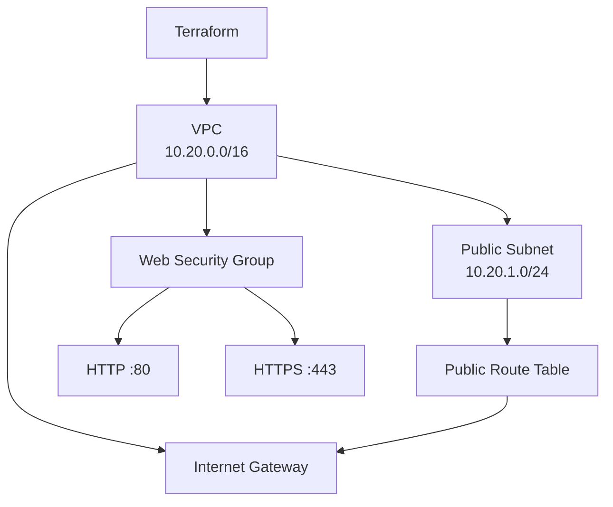

# Session 19 — Cloud & Terraform in Action

A hands-on session covering cloud infrastructure fundamentals and Terraform Infrastructure as Code (IaC) for defining AWS networking and storage resources.


> A hands-on session covering cloud infrastructure fundamentals and Terraform Infrastructure as Code for AWS resources.

---

## 1. Objective

The objective of this session was to understand cloud infrastructure concepts and use **Terraform Infrastructure as Code (IaC)** to define AWS infrastructure.

The session focused on:

- Cloud service models
- AWS Regions and Availability Zones
- VPCs and Subnets
- Route Tables and Internet Gateways
- Security Groups
- Terraform Providers
- Terraform Variables
- Terraform Resources
- Terraform Outputs
- Resource Dependencies
- Terraform State
- Terraform workflow
- `terraform init`
- `terraform fmt`
- `terraform validate`
- `terraform plan`
- `terraform apply`
- `terraform output`
- `terraform state`
- `terraform destroy`

> **Execution Note:** AWS resources were not deployed during this session because AWS account access was unavailable. Therefore, AWS deployment commands and their outputs are documented as **expected behavior** rather than as results of an actual AWS deployment.

---

# 2. Cloud Computing Fundamentals

## 2.1 Cloud Service Models

Cloud computing can be divided into three major service models.

### Infrastructure as a Service (IaaS)

IaaS provides virtualized infrastructure such as:

- Virtual machines
- Networking
- Storage
- Virtual networks
- Firewalls

Examples include AWS EC2, VPC, and S3.

The customer is responsible for configuring the operating system, applications, networking rules, and other infrastructure-level components.

### Platform as a Service (PaaS)

PaaS provides a managed platform for deploying applications without requiring the user to manage the underlying infrastructure directly.

Examples include:

- AWS Elastic Beanstalk
- Google App Engine
- Heroku

### Software as a Service (SaaS)

SaaS provides complete applications through the internet.

Examples include:

- Gmail
- Google Docs
- Microsoft 365

The user mainly interacts with the application rather than managing the infrastructure behind it.

---

# 3. AWS Regions and Availability Zones

An **AWS Region** is a geographical area containing multiple isolated data centers.

Examples:

```text
us-east-1
ap-south-1
eu-west-1
```

An **Availability Zone (AZ)** is an isolated location inside an AWS Region.

For example:

```text
AWS Region
   |
   +-- Availability Zone A
   |
   +-- Availability Zone B
   |
   +-- Availability Zone C
```

Using multiple Availability Zones improves availability and fault tolerance.

In the Terraform project, the Availability Zone is derived from the selected AWS region:

```hcl
availability_zone = "${var.aws_region}a"
```

---

# 4. VPC and Subnets

## 4.1 VPC

A **Virtual Private Cloud (VPC)** is an isolated virtual network inside AWS.

The Session 19 mini-project creates:

```text
VPC
CIDR: 10.20.0.0/16
```

The VPC provides the network boundary for the infrastructure.

It has DNS support and DNS hostnames enabled:

```hcl
enable_dns_support   = true
enable_dns_hostnames = true
```

## 4.2 Public Subnet

The mini-project creates a public subnet:

```text
CIDR: 10.20.1.0/24
```

The subnet belongs to the VPC:

```hcl
vpc_id = aws_vpc.main.id
```

It also enables public IP assignment for resources launched in the subnet:

```hcl
map_public_ip_on_launch = true
```

---

# 5. Internet Gateway

An **Internet Gateway (IGW)** allows communication between a VPC and the public internet.

The project creates an Internet Gateway and attaches it to the VPC:

```hcl
resource "aws_internet_gateway" "main" {
  vpc_id = aws_vpc.main.id
}
```

The Internet Gateway becomes the target for the public route:

```text
Public Subnet
      |
      v
Route Table
      |
      v
0.0.0.0/0
      |
      v
Internet Gateway
      |
      v
Internet
```

---

# 6. Route Tables

A route table determines where network traffic should be sent.

The public route table contains:

```text
Destination: 0.0.0.0/0
Target: Internet Gateway
```

This means traffic destined for any IPv4 address can be sent through the Internet Gateway.

The public subnet is associated with the public route table using:

```hcl
resource "aws_route_table_association" "public" {
  subnet_id      = aws_subnet.public.id
  route_table_id = aws_route_table.public.id
}
```

---

# 7. Security Groups

A **Security Group** acts as a virtual firewall for AWS resources.

The Session 19 mini-project creates a web security group allowing:

### Inbound HTTP

```text
TCP
Port: 80
Source: 0.0.0.0/0
```

### Inbound HTTPS

```text
TCP
Port: 443
Source: 0.0.0.0/0
```

### Outbound traffic

Outbound IPv4 traffic is allowed.

The security group is associated with the VPC:

```hcl
vpc_id = aws_vpc.main.id
```

> In a production environment, allowing HTTP/HTTPS from `0.0.0.0/0` should be evaluated carefully and restricted where appropriate.

---

# 8. Terraform

Terraform is an Infrastructure as Code tool that allows infrastructure to be defined using configuration files.

Instead of manually creating every AWS resource through the AWS Console, infrastructure can be described declaratively:

```text
Terraform Configuration
        |
        v
Terraform
        |
        v
AWS Provider
        |
        v
AWS Infrastructure
```

Terraform determines what infrastructure should exist and calculates the changes required to reach that desired state.

---

# 9. Terraform Project Structure

The Session 19 mini-project contains:

```text
08-mini-project/
|
|-- README.md
|-- versions.tf
|-- variables.tf
|-- main.tf
|-- outputs.tf
|-- terraform.tfvars.example
|-- .gitignore
```

### `versions.tf`

Defines:

- Terraform version requirement
- AWS provider
- AWS provider version
- AWS region configuration

### `variables.tf`

Defines configurable Terraform variables.

### `main.tf`

Contains the AWS infrastructure resources.

### `outputs.tf`

Defines values that Terraform should expose after deployment.

### `terraform.tfvars.example`

Provides an example value for the AWS region.

---

# 10. Terraform Provider

A Terraform provider allows Terraform to communicate with an external platform or service.

The project uses the AWS provider:

```hcl
required_providers {
  aws = {
    source  = "hashicorp/aws"
    version = "~> 6.0"
  }
}
```

The provider is configured using the selected AWS region:

```hcl
provider "aws" {
  region = var.aws_region
}
```

The default region in the mini-project is:

```text
us-east-1
```

---

# 11. Terraform Variables

Variables make Terraform configurations reusable.

The project defines:

```hcl
variable "aws_region" {
  description = "AWS region for the Session 19 mini project."
  type        = string
  default     = "us-east-1"
}
```

Instead of hardcoding the region throughout the configuration, resources can reference:

```hcl
var.aws_region
```

This makes it possible to change the deployment region without modifying every resource.

---

# 12. Terraform Resources

Terraform resources represent infrastructure objects.

The mini-project defines the following resources:

```text
aws_vpc
aws_subnet
aws_internet_gateway
aws_route_table
aws_route_table_association
aws_security_group
```

The resulting architecture is:

```text
                    Internet
                        |
                        v
              +-------------------+
              | Internet Gateway  |
              +---------+---------+
                        |
              +---------v---------+
              |       VPC         |
              |   10.20.0.0/16    |
              |                   |
              |  +-------------+  |
              |  |Public Subnet|  |
              |  |10.20.1.0/24|  |
              |  +------+------|  |
              |         |         |
              |  Route Table      |
              |         |         |
              | Security Group    |
              +-------------------+
```

---

# 13. Terraform Dependencies

Terraform automatically determines dependencies between resources.

For example:

```hcl
resource "aws_subnet" "public" {
  vpc_id = aws_vpc.main.id
}
```

The subnet references:

```text
aws_vpc.main.id
```

Therefore Terraform knows:

```text
VPC
 |
 v
Subnet
```

The Internet Gateway also depends on the VPC:

```hcl
vpc_id = aws_vpc.main.id
```

The route table depends on the VPC and Internet Gateway because its route references:

```hcl
gateway_id = aws_internet_gateway.main.id
```

The route table association depends on both:

```text
Subnet
   +
Route Table
   |
   v
Association
```

This is called an **implicit dependency**.

Terraform creates resources in an order that satisfies these dependencies.

---

# 14. Terraform Outputs

Outputs expose useful information after Terraform creates infrastructure.

The mini-project defines:

```text
vpc_id
vpc_cidr
subnet_id
security_group_id
```

For example:

```hcl
output "vpc_id" {
  value = aws_vpc.main.id
}
```

After a successful deployment, running:

```bash
terraform output
```

would return values similar to:

```text
security_group_id = "sg-xxxxxxxx"
subnet_id         = "subnet-xxxxxxxx"
vpc_cidr          = "10.20.0.0/16"
vpc_id             = "vpc-xxxxxxxx"
```

The actual AWS IDs would be generated by AWS and would be different for each deployment.

---

# 15. Terraform State

Terraform maintains a state file to keep track of infrastructure it manages.

The state allows Terraform to understand:

```text
Configuration
      +
Current State
      |
      v
Required Changes
```

The state contains information about resources managed by Terraform.

For example:

```bash
terraform state list
```

For the mini-project, the expected resources are:

```text
aws_internet_gateway.main
aws_route_table.public
aws_route_table_association.public
aws_security_group.web
aws_subnet.public
aws_vpc.main
```

Terraform uses this information during future `plan`, `apply`, and `destroy` operations.

> Terraform state can contain sensitive infrastructure information, so it should not be committed to Git repositories.

---

# 16. Terraform Workflow

The standard Terraform workflow used in this session is:

```text
                 Terraform Files
                       |
                       v
                terraform init
                       |
                       v
                 terraform fmt
                       |
                       v
              terraform validate
                       |
                       v
                terraform plan
                       |
                       v
                terraform apply
                       |
                       v
              Infrastructure
                       |
                       v
               terraform state
                       |
                       v
               terraform destroy
```

---

# 17. `terraform init`

Command:

```bash
terraform init
```

Purpose:

- Initializes the Terraform working directory.
- Downloads required providers.
- Creates Terraform's working files.
- Prepares the project for other Terraform commands.

Expected behavior:

```text
Initializing provider plugins...
Installing hashicorp/aws...
Terraform has been successfully initialized!
```

The exact provider version depends on the allowed provider version range.

---

# 18. `terraform fmt`

Command:

```bash
terraform fmt
```

Purpose:

- Formats Terraform configuration files.
- Applies Terraform's standard formatting style.
- Makes configuration easier to read and maintain.

If files require formatting, Terraform may display their filenames.

If everything is already formatted, there may be no output.

---

# 19. `terraform validate`

Command:

```bash
terraform validate
```

Purpose:

Checks whether the Terraform configuration is syntactically and structurally valid.

Expected result:

```text
Success! The configuration is valid.
```

This does not deploy anything to AWS.

---

# 20. `terraform plan`

Command:

```bash
terraform plan
```

Purpose:

Creates an execution plan showing what Terraform intends to do.

Terraform may show actions such as:

```text
+ create
~ update
- destroy
-/+ replace
```

For the Session 19 mini-project, the expected plan is approximately:

```text
Plan: 6 to add, 0 to change, 0 to destroy.
```

The exact result can depend on the configuration and Terraform/provider versions.

Important:

> `terraform plan` does not create the infrastructure.

It only previews the changes.

---

# 21. `terraform apply`

Command:

```bash
terraform apply
```

Purpose:

Actually applies the Terraform configuration and creates or modifies the required infrastructure.

Terraform normally asks for confirmation:

```text
Do you want to perform these actions?

Only 'yes' will be accepted to approve.

Enter a value:
```

The user must enter:

```text
yes
```

If valid AWS credentials and access were available, Terraform would create the resources defined in the configuration.

Expected result would have the general form:

```text
Apply complete! Resources: 6 added, 0 changed, 0 destroyed.
```

Terraform would then store the resulting infrastructure information in its state.

> This command was **not executed during this session** because AWS access was unavailable.

---

# 22. `terraform output`

Command:

```bash
terraform output
```

Purpose:

Displays values defined using Terraform `output` blocks.

Expected output after a successful deployment:

```text
security_group_id = "sg-..."
subnet_id         = "subnet-..."
vpc_cidr          = "10.20.0.0/16"
vpc_id            = "vpc-..."
```

The IDs shown above are placeholders representing values that AWS would generate.

---

# 23. `terraform state list`

Command:

```bash
terraform state list
```

Purpose:

Displays the resources currently tracked by Terraform state.

Expected output for the mini-project:

```text
aws_internet_gateway.main
aws_route_table.public
aws_route_table_association.public
aws_security_group.web
aws_subnet.public
aws_vpc.main
```

This demonstrates how Terraform maintains a record of the infrastructure it manages.

---

# 24. `terraform destroy`

Command:

```bash
terraform destroy
```

Purpose:

Removes infrastructure managed by the current Terraform configuration.

Terraform first displays the resources that will be destroyed and asks for confirmation.

Expected interaction:

```text
Do you really want to destroy all resources?

Enter a value:
```

Enter:

```text
yes
```

After a successful deployment, Terraform would remove the AWS resources and update the state accordingly.

A safer preview can be performed with:

```bash
terraform plan -destroy
```

> `terraform destroy` was not executed because the infrastructure was not deployed during this session.

---

# 25. S3 Terraform Workflow Demonstration

The session also contains a separate Terraform workflow exercise demonstrating AWS S3.

The workflow project defines an S3 bucket:

```hcl
resource "aws_s3_bucket" "workflow_demo" {
  bucket_prefix = "session19-workflow-"
}
```

This demonstrates that Terraform can manage AWS storage resources in addition to networking resources.

The expected lifecycle is:

```text
terraform init
      |
      v
terraform fmt
      |
      v
terraform validate
      |
      v
terraform plan
      |
      v
terraform apply
      |
      v
S3 Bucket
      |
      v
terraform state
      |
      v
terraform destroy
```

Again, this represents the expected workflow; the S3 resource was not actually deployed during this session.

---

# 26. Complete Session 19 Architecture

The networking mini-project can be represented as:



The broader session covers AWS infrastructure concepts including:

```text
Terraform
   |
   +-- VPC
   |    |
   |    +-- Public Subnet
   |    +-- Route Table
   |    +-- Internet Gateway
   |    +-- Security Group
   |
   +-- S3 Workflow Demonstration
```

The suggested assignment architecture also mentions EC2:

```text
Terraform
   |
   +-- VPC
   |
   +-- Subnet
   |
   +-- Security Group
   |
   +-- EC2
   |
   +-- S3
```

However, **EC2 is not part of the implemented Session 19 mini-project**, so it is not represented as a deployed resource in this report.

---

# 27. Screenshots and Evidence

No AWS deployment screenshots are included because no AWS resources were actually created during this session.

No screenshots of Terraform source files are required because the Terraform configuration itself is already part of the project.

The documentation therefore focuses on:

- The actual Terraform configuration
- Infrastructure architecture
- Terraform concepts
- Terraform command workflow
- Expected command behavior
- Expected AWS resources
- Terraform state and dependencies

This avoids presenting simulated output as actual execution evidence.

---

# 28. Key Learnings

Through this session, I learned:

1. **Cloud computing** provides infrastructure and services through scalable cloud platforms.
2. **AWS Regions and Availability Zones** provide geographical distribution and isolation.
3. **VPCs** provide isolated virtual networks in AWS.
4. **Subnets** divide a VPC into smaller network segments.
5. **Route Tables** control how network traffic is routed.
6. **Internet Gateways** provide internet connectivity for public VPC resources.
7. **Security Groups** control inbound and outbound traffic.
8. **Terraform Providers** allow Terraform to interact with platforms such as AWS.
9. **Variables** make Terraform configurations reusable and configurable.
10. **Resources** represent actual infrastructure objects.
11. **Outputs** expose useful infrastructure information.
12. **Dependencies** determine the correct resource creation order.
13. **Terraform State** tracks infrastructure managed by Terraform.
14. `terraform plan` previews infrastructure changes without applying them.
15. `terraform apply` applies the planned infrastructure changes.
16. `terraform destroy` removes infrastructure managed by Terraform.
17. Infrastructure as Code makes infrastructure reproducible, reviewable, and easier to manage.

---

# 29. Conclusion

Session 19 combined cloud infrastructure fundamentals with Terraform-based Infrastructure as Code.

The practical project defines an AWS networking environment consisting of a VPC, public subnet, Internet Gateway, public route table, route table association, and web security group. A separate workflow exercise demonstrates Terraform management of an S3 bucket.

Although AWS resources were not deployed because AWS account access was unavailable, the Terraform configurations and expected workflow demonstrate how the infrastructure would be initialized, validated, planned, applied, inspected through Terraform state and outputs, and eventually destroyed.

The session provides the foundation for extending the infrastructure with services such as EC2, additional subnets, private networking, load balancers, databases, and other AWS services in future projects.

---

## Notes

- Terraform state files (`.terraform/`, `terraform.tfstate`, `terraform.tfstate.backup`, `.terraform.lock.hcl`) are local generated artifacts and should not be committed to the repository.
- AWS deployment commands are documented as expected behavior, not as executed results.
- Code fences, tables, and headings have been checked for valid GitHub Markdown rendering.

---

## Author

**Tanmay Mittal**
Roll No.: **24BCS10491**