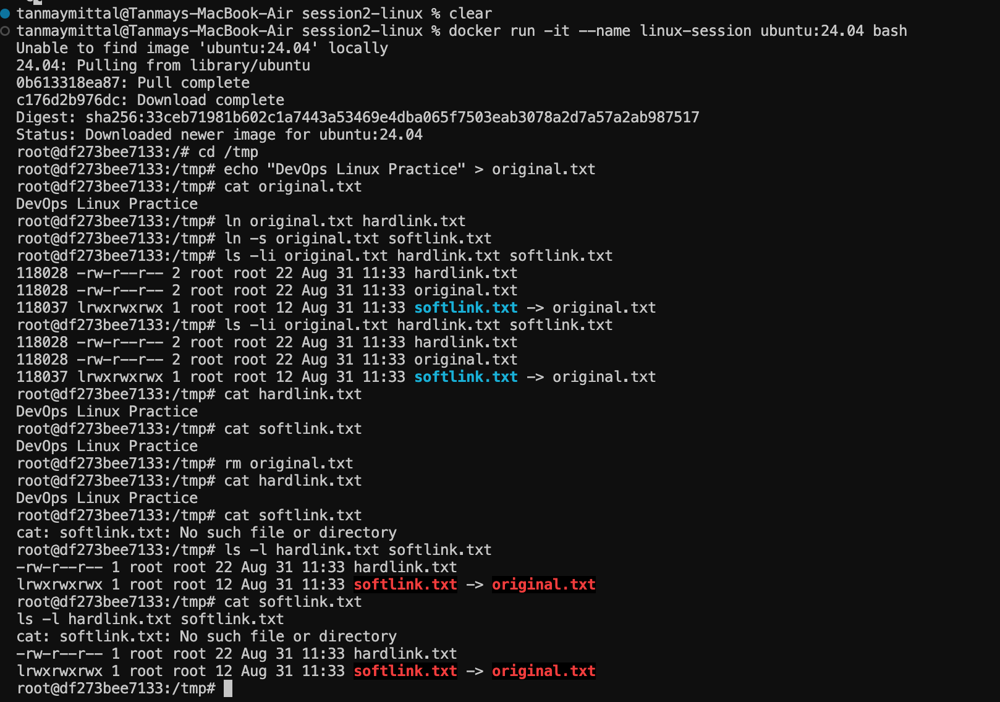
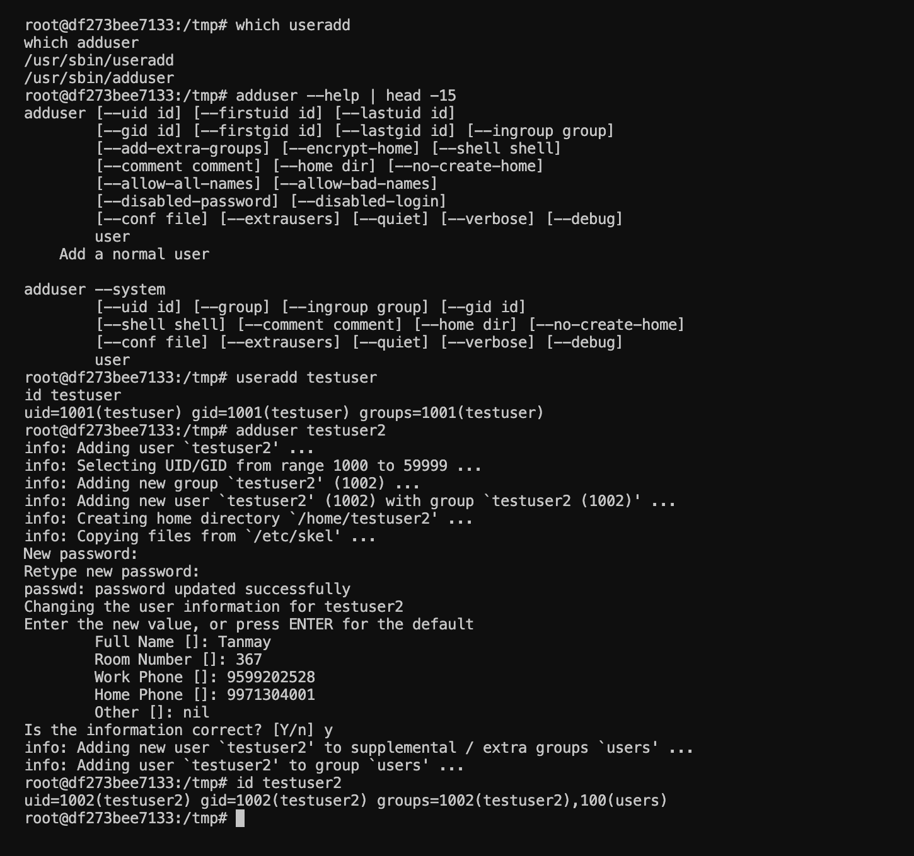
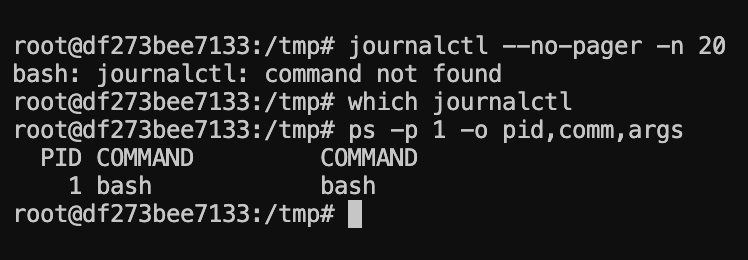

# Session 2 — Linux

## Overview

This session focused on fundamental Linux concepts and commands useful for system administration, DevOps, and technical interviews.

The practical work covered:

1. Hard Links vs Soft Links
2. `useradd` vs `adduser`
3. `journalctl`
4. Basic Linux Commands

All practical exercises were performed inside an Ubuntu 24.04 Docker container.

---

## 1. Hard Links vs Soft Links

Linux supports two common types of links: **hard links** and **symbolic (soft) links**.

### Creating the Links

A file was created first:

```bash
echo "DevOps Linux Practice" > original.txt
```

A hard link was created using:

```bash
ln original.txt hardlink.txt
```

A soft link was created using:

```bash
ln -s original.txt softlink.txt
```

### Verifying Inodes

The links were inspected using:

```bash
ls -li original.txt hardlink.txt softlink.txt
```

The original file and hard link had the **same inode number**, while the soft link had a **different inode** and pointed to the original filename.



### Testing the Difference

After deleting the original file:

```bash
rm original.txt
```

the hard link continued to work:

```bash
cat hardlink.txt
```

while the soft link became broken:

```bash
cat softlink.txt
```

This demonstrates the main difference between the two types of links.

### Hard Link vs Soft Link

| Hard Link | Soft Link |
|---|---|
| Points to the same inode | Points to a file path |
| Shares the underlying file data | Stores the target path |
| Same inode as the original file | Has a different inode |
| Continues working after the original filename is removed | Becomes broken when the target is removed |

---

## 2. `useradd` vs `adduser`

Linux provides both `useradd` and `adduser` for creating users, but they operate at different levels.

### `useradd`

`useradd` is a lower-level Linux utility used to create user accounts.

Example:

```bash
useradd testuser
```

The user was verified using:

```bash
id testuser
```

### `adduser`

`adduser` provides a more interactive and user-friendly interface for creating a normal user.

Example:

```bash
adduser testuser2
```

The command interactively asked for information such as a password and user details.

The user was then verified using:

```bash
id testuser2
```



### Comparison

| `useradd` | `adduser` |
|---|---|
| Lower-level utility | Higher-level interactive utility |
| More direct and configurable | More user-friendly |
| Useful for scripting and automation | Convenient for manual user creation |
| Requires more configuration when creating users | Guides the administrator through the setup |

On Debian/Ubuntu systems, `adduser` is generally convenient for interactive user creation, while `useradd` is useful when more direct control or scripting is required.

---

## 3. `journalctl`

`journalctl` is a Linux command used to view and query logs collected by the **systemd journal**.

The following command was attempted:

```bash
journalctl --no-pager -n 20
```

However, the Ubuntu Docker container did not have `journalctl` available.

The init process was also checked:

```bash
ps -p 1 -o pid,comm,args
```

The output showed that `bash` was running as PID 1 rather than `systemd`.



### Why `journalctl` Was Not Available

A normal Ubuntu Docker container does not usually run `systemd` as its init process. Therefore, the standard systemd journal environment is not available in this container.

This practical demonstrated an important difference between a normal Linux system and a lightweight Docker container.

### Common `journalctl` Commands

On a Linux system using systemd, commonly used commands include:

```bash
journalctl
journalctl -n 20
journalctl -b
journalctl -p err
```

These commands can be used to inspect system logs, recent boot logs, and higher-priority errors.

---

## 4. Basic Linux Commands

Several fundamental Linux commands were practiced inside the Ubuntu environment.

Examples include:

```bash
pwd
ls -la
mkdir demo
cd demo
touch file.txt
echo "Hello Linux" > file.txt
cat file.txt
cp file.txt copy.txt
mv copy.txt renamed.txt
```

These commands were used to navigate directories, create files and directories, write and read file contents, copy files, and rename files.


### Commands Practiced

| Command | Purpose |
|---|---|
| `pwd` | Displays the current working directory |
| `ls` | Lists files and directories |
| `cd` | Changes the current directory |
| `mkdir` | Creates a directory |
| `touch` | Creates an empty file |
| `cat` | Displays file contents |
| `echo` | Prints or writes text |
| `cp` | Copies files |
| `mv` | Moves or renames files |
| `rm` | Removes files |

---

## Key Takeaways

- Hard links reference the same inode, while soft links reference a file path.
- A hard link can continue working after the original filename is removed, while a soft link can become broken.
- `useradd` is a lower-level utility, while `adduser` provides a more interactive interface for user creation.
- `journalctl` is used to query logs maintained by the systemd journal.
- Docker containers commonly use a lightweight process instead of systemd as PID 1.
- Basic Linux commands are fundamental for working with servers, containers, and DevOps environments.

---

## Author

**Tanmay Mittal**  
**Roll No.: 24BCS10491**