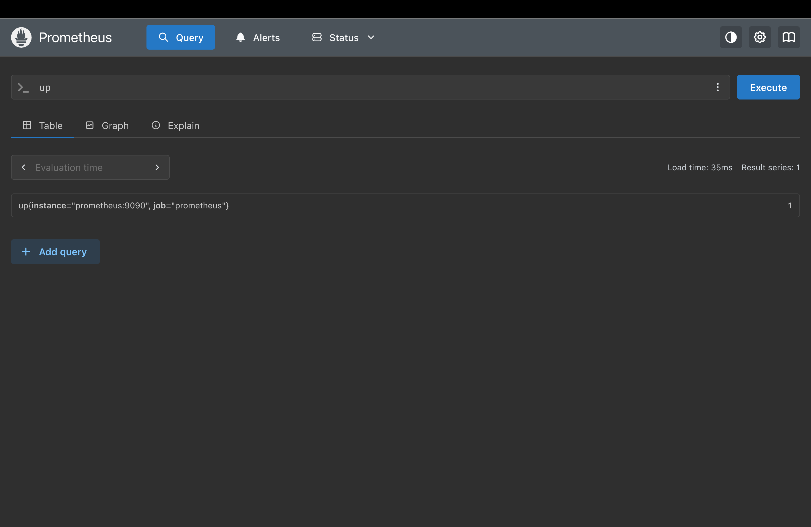
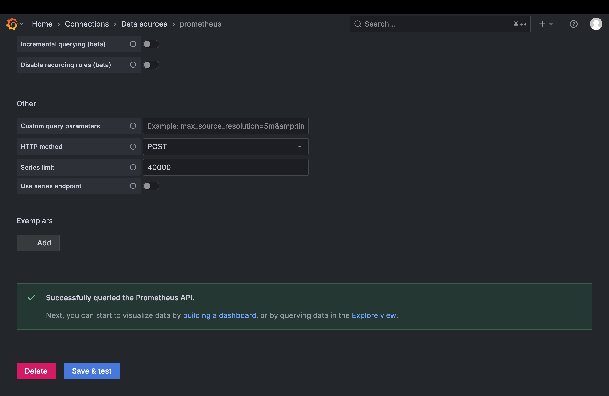
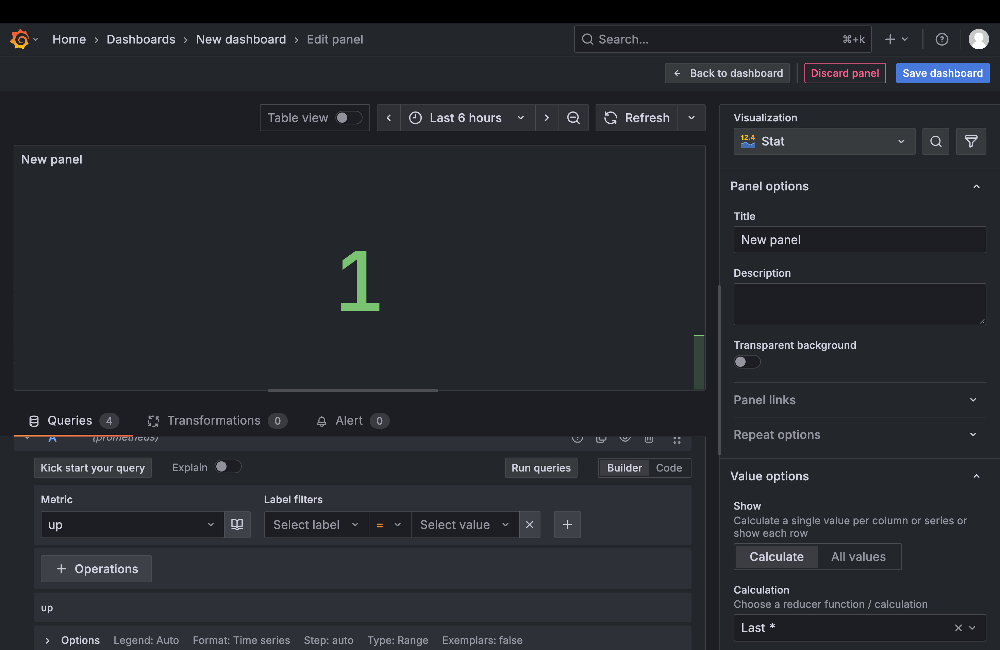
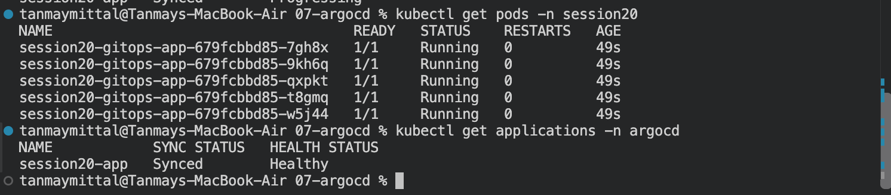
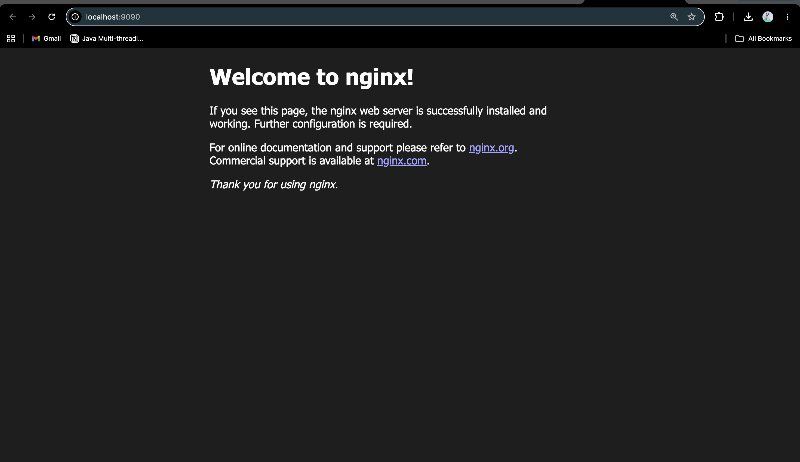

# Session 20 — Monitoring, Observability & GitOps

A hands-on session covering monitoring and observability with Prometheus and Grafana, and GitOps-based continuous delivery using Git and Argo CD on Kubernetes.


> A hands-on session covering monitoring and observability with Prometheus and Grafana, and GitOps-based continuous delivery using Git and Argo CD on Kubernetes.

---

## Overview

Session 20 covered monitoring, observability, and GitOps using Prometheus, Grafana, Kubernetes, Git, and Argo CD.

- **Monitoring** — collecting and checking system/application metrics.
- **Observability** — understanding system behavior through metrics, logs, and traces.
- **GitOps** — using Git as the desired-state source and reconciling Kubernetes toward that state.

---

# 1. Monitoring

Monitoring focuses on measuring the health and performance of systems.

Common monitoring signals include:

- CPU utilization
- Memory utilization
- Application health
- Request counts
- Error counts
- Latency

The goal is to detect problems and understand whether a system is operating normally.

---

# 2. Observability

Observability is built around three main pillars:

| Pillar | Meaning |
|---|---|
| Metrics | Numerical measurements describing system behavior |
| Logs | Events and messages produced by applications and systems |
| Traces | The journey of a request through different components |

### Metrics

Metrics are numerical values collected over time, such as CPU usage, memory usage, request counts, and errors.

### Logs

Logs provide event-level information about what happened inside an application or system.

For Kubernetes:

```bash
kubectl logs <pod>
```

### Traces

Traces follow a request as it moves through different services and components.

Together, metrics, logs, and traces provide a more complete view of system behavior.

---

# 3. Prometheus

Prometheus is a metrics monitoring and observability tool.

The demo architecture was:

```text
Application
     |
     | /metrics
     v
Prometheus
     |
     v
Time-series data
```

## Prometheus Demo

The demo was started with:

```bash
docker compose up -d
docker compose ps
```

Prometheus was available at:

```text
http://localhost:9090
```

The metrics endpoint was:

```text
http://localhost:9090/metrics
```

The `up` query was used to check target health:

```text
up{instance="prometheus:9090",job="prometheus"} 1
```

A value of `1` means the target is up.

Other PromQL queries explored were:

```text
up
prometheus_http_requests_total
process_cpu_seconds_total
```

Prometheus primarily focuses on metrics rather than logs.



---

# 4. Grafana

Grafana visualizes metrics and builds dashboards.

```text
Application
     |
     v
Prometheus
     |
  Metrics
     |
     v
Grafana
     |
     v
Dashboard
```

Grafana was started with the Prometheus demo using Docker Compose and accessed at:

```text
http://localhost:3000
```

The Prometheus data source was configured using:

```text
http://prometheus:9090
```

The Docker Compose service name allows Grafana to communicate with the Prometheus container through the Compose network.

The connection was tested successfully.

### Prometheus Data Source



### Grafana Dashboard

A Stat visualization was created using:

```text
up
```

The panel displayed:

```text
1
```

which represents an up/healthy Prometheus target.



---

# 5. GitOps

GitOps is a way of managing infrastructure and application deployment using Git.

The central idea is:

> Git describes the desired state of the system.

The basic flow is:

```text
Developer
    |
    v
   Git
    |
    v
 Argo CD
    |
    v
Kubernetes
```

The developer changes Git. Argo CD detects the desired state and synchronizes the cluster.

## Why Git?

Git provides:

- Version history
- Review
- Diffs
- Rollback/reference points
- Collaboration
- Auditability

For example:

```text
Monday:
replicas = 2

Tuesday:
replicas = 5

Wednesday:
replicas = 2
```

Git records these changes.

---

# 6. Git as Source of Truth

Git stores what we want the system to look like.

For example:

```text
Git says:
replicas = 3

Kubernetes currently has:
replicas = 2
```

A GitOps controller compares:

```text
Desired state = 3
Actual state  = 2
```

and works toward:

```text
Actual state = 3
```

The practical Git exercise demonstrated this using two commits.

Initial manifests were committed with:

```bash
git add .
git commit -m "Add session 20 application manifests"
```

The desired replica count was then changed from:

```yaml
replicas: 2
```

to:

```yaml
replicas: 3
```

The change was inspected using:

```bash
git diff
```

and committed with:

```bash
git add .
git commit -m "Scale application to three replicas"
```

The important distinction is:

```text
Git
 |
 +-- Desired state
 |
 v
Argo CD
 |
 v
Kubernetes
 |
 +-- Actual state
```

---

# 7. Argo CD

Argo CD is a GitOps continuous delivery tool for Kubernetes.

Its role is to watch a Git repository and keep Kubernetes synchronized with the desired state stored there.

```text
Git repository
      |
      v
   Argo CD
      |
      v
 Kubernetes
      |
      v
 Application
```

## Local Kubernetes Cluster

A local kind cluster was created:

```bash
kind create cluster --name session20
```

It was verified with:

```bash
kubectl cluster-info
kubectl get nodes
```

The control-plane node reached:

```text
session20-control-plane   Ready   control-plane
```

## Installing Argo CD

The Argo CD namespace was created:

```bash
kubectl create namespace argocd
```

Argo CD was installed with:

```bash
kubectl apply -n argocd --server-side --force-conflicts \
  -f https://raw.githubusercontent.com/argoproj/argo-cd/stable/manifests/install.yaml
```

The Argo CD pods were checked until they reached the `Running` state.

## Argo CD UI

The server was exposed locally with:

```bash
kubectl port-forward svc/argocd-server -n argocd 8080:443
```

The UI was accessed at:

```text
https://localhost:8080
```

The initial administrator password was retrieved with:

```bash
kubectl -n argocd get secret argocd-initial-admin-secret \
  -o jsonpath="{.data.password}" | base64 -d && echo
```

---

# 8. Argo CD Application

The Argo CD Application was registered with:

```bash
kubectl apply -f app/argocd-application.yaml
```

The deployed application was verified with:

```bash
kubectl get pods -n session20
kubectl get deployment session20-gitops-app -n session20
kubectl get applications -n argocd
```

The observed final state was:

```text
session20-app   Synced   Healthy
```

All five nginx pods reached:

```text
1/1   Running
```



---

# 9. GitOps Application

The nginx service was exposed locally with:

```bash
kubectl port-forward svc/session20-gitops-app -n session20 9090:80
```

The application was opened at:

```text
http://localhost:9090
```

The nginx welcome page confirmed the application was running inside Kubernetes.



---

# 10. Session 20 Mini Project

The mini project combines:

```text
Kubernetes
+
Git
+
GitOps
+
Argo CD
```

The intended architecture is:

```text
Developer
    |
    v
 Git Repository
    |
    | desired state
    v
 Argo CD
    |
    | automatic synchronization
    v
 Kubernetes
    |
    v
 Application
```

The application consists of:

```text
Namespace
Deployment
Service
Argo CD Application
```

The Git workload repository contains:

```text
app/
├── namespace.yaml
├── deployment.yaml
└── service.yaml
```

The Argo CD Application object is kept outside the Git workload path and tells Argo CD which repository and path to watch.

## GitOps Change Flow

The intended GitOps change is:

```yaml
replicas: 2
```

changed in Git to:

```yaml
replicas: 3
```

Then:

```bash
git add .
git commit -m "Scale application to three replicas"
git push
```

Argo CD detects the desired-state change and reconciles Kubernetes toward:

```text
READY   3/3
```

The flow is:

```text
Git
 |
 v
Argo CD
 |
 v
Kubernetes
```

## Self-Healing

If Kubernetes is manually changed:

```bash
kubectl scale deployment session20-mini \
  -n session20 \
  --replicas=1
```

while Git still declares:

```text
replicas: 3
```

Argo CD can detect the difference and reconcile the cluster back toward the desired state.

```text
Git = desired state
Kubernetes = actual state
Argo CD = reconciler
```

---

# 11. Observing the System

Useful Kubernetes commands include:

### Application logs

```bash
kubectl logs deployment/session20-mini -n session20
```

### Pod status

```bash
kubectl get pods -n session20
```

### Deployment status

```bash
kubectl get deployment session20-mini -n session20
```

### Argo CD application status

```bash
kubectl get application session20-mini -n argocd
```

---

# 12. Monitoring vs Observability

| Monitoring | Observability |
|---|---|
| Focuses on known health/performance signals | Helps understand system behavior |
| Uses metrics and alerts heavily | Uses metrics, logs, and traces |
| Answers whether something is wrong | Helps investigate why it is wrong |
| Commonly used for dashboards and alerts | Provides deeper system visibility |

Monitoring and observability complement each other.

---

# 13. Metrics vs Logs vs Traces

```text
METRICS  -> numbers
LOGS     -> events
TRACES   -> request journey
```

- **Metrics** — numerical measurements collected over time.
- **Logs** — individual events and messages generated by applications and infrastructure.
- **Traces** — the path of a request through services and components.

---

# 14. Tool Summary

| Tool | Purpose |
|---|---|
| Prometheus | Metrics collection, storage, and PromQL querying |
| Grafana | Metrics visualization and dashboards |
| Kubernetes | Container orchestration and application runtime |
| Git | Version control and desired-state storage |
| Argo CD | GitOps synchronization and reconciliation |
| kind | Local Kubernetes cluster for the lab |

---

# 15. Final Mental Model

```text
METRICS -> numbers
LOGS    -> events
TRACES  -> request journey

PROMETHEUS -> metrics
GRAFANA    -> dashboards

GIT        -> desired state
ARGO CD    -> reconciliation
KUBERNETES -> actual state
```

The core GitOps loop is:

```text
       +------------------+
       |       Git        |
       |  Desired State   |
       +--------+---------+
                |
                v
             Argo CD
                |
                v
          Kubernetes
          Actual State
                |
                |
                +-------> Compare
                             |
                             v
                         Reconcile
                             |
                             +----> back to desired state
```

The central idea is simple:

**Git defines what the system should look like. Argo CD continuously works to make the Kubernetes cluster match that desired state.**

---

## Notes

- All images are referenced from `./images/` — make sure that folder is committed to the repository, otherwise the image links will break on GitHub.
- Code fences, tables, and headings have been checked for valid GitHub Markdown rendering.

---

## Author

**Tanmay Mittal**

Roll No.: **24BCS10491**