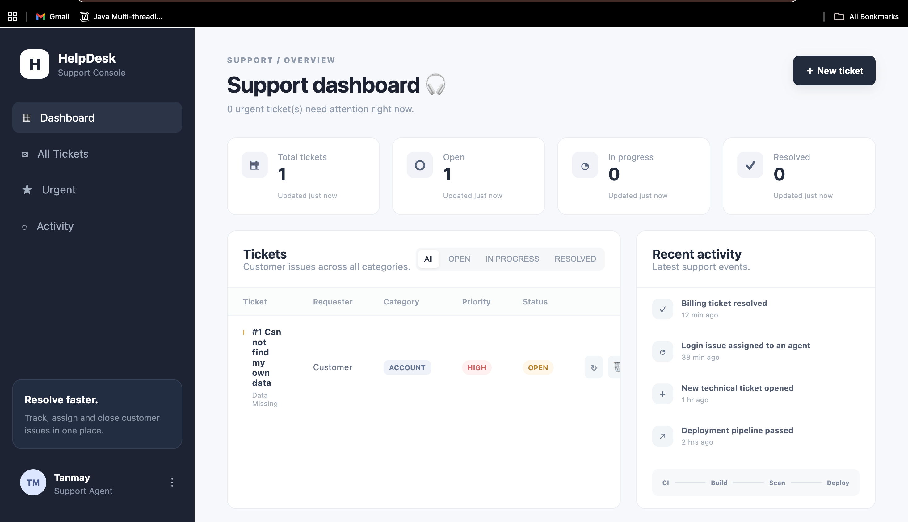
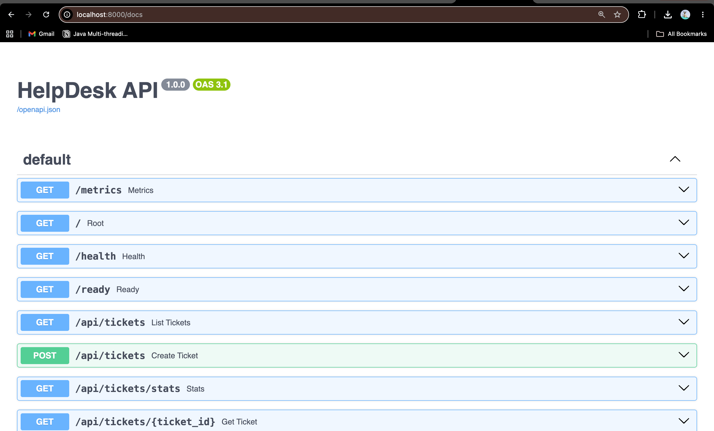
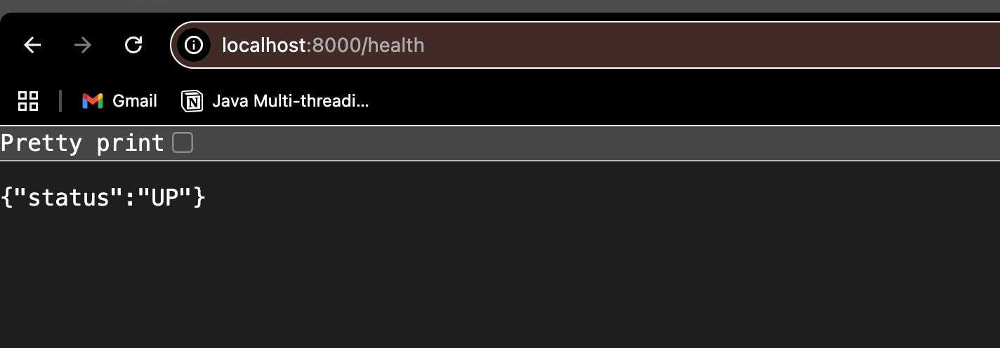
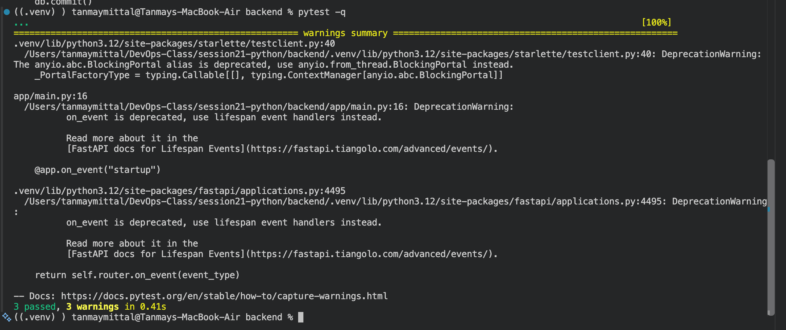
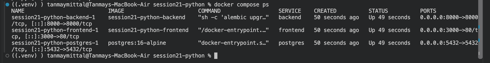

# Session 21 — TaskBoard DevOps Capstone

TaskBoard is a SaaS-style project management application built to demonstrate an end-to-end DevOps workflow.


> TaskBoard is a SaaS-style project management application built to demonstrate an end-to-end DevOps workflow.

The project combines a React frontend, FastAPI backend, PostgreSQL database, Docker, automated testing, CI/CD, security scanning, Terraform, Kubernetes, Helm, monitoring, and troubleshooting.

---

## 1. Project Overview

TaskBoard provides a project-management dashboard where users can view and manage tasks.

The application consists of:

- React + Vite frontend
- FastAPI Python backend
- PostgreSQL database
- SQLAlchemy ORM
- Alembic database migrations
- REST APIs
- Pytest automated tests
- Docker and Docker Compose
- GitHub Actions CI/CD
- Trivy container security scanning
- GitHub Container Registry
- Terraform AWS infrastructure
- Kubernetes
- Helm
- Ingress
- HPA
- Prometheus
- Grafana
- Health and readiness endpoints
- Troubleshooting exercises

The objective is to demonstrate how an application moves from development to a containerized and monitored deployment environment.

---

## 2. Architecture

```text
                    Developer
                        |
                        v
                   Git / GitHub
                        |
                        v
                 GitHub Actions
                  /    |     \
             Pytest   Build   Security
                        |
                        v
                 Docker Images
                        |
                        v
                      GHCR
                        |
                        v
                    Terraform
                        |
                        v
                  AWS VPC + EKS
                        |
                        v
                      Helm
                        |
              +---------+---------+
              |                   |
          Frontend              Backend
        React + Nginx           FastAPI
              |                   |
              +--------+----------+
                       |
                   PostgreSQL
                       |
                Prometheus
                       |
                    Grafana
```

---

## 3. Repository Structure

```text
session21-python/
│
├── backend/
│   ├── app/
│   │   ├── config.py
│   │   ├── db.py
│   │   ├── main.py
│   │   ├── models.py
│   │   └── schemas.py
│   ├── alembic/
│   ├── tests/
│   │   └── test_api.py
│   ├── Dockerfile
│   ├── requirements.txt
│   └── alembic.ini
│
├── frontend/
│
├── helm/
│   └── taskboard/
│
├── k8s/
│
├── monitoring/
│
├── terraform/
│
├── troubleshooting/
│
├── scripts/
│
├── images/
│   ├── 01-taskboard-ui.png
│   ├── 02-swagger-api.png
│   ├── 03-health-endpoint.png
│   ├── 04-pytest-pass.png
│   └── 05-docker-compose.png
│
├── docker-compose.yml
├── .github/
│   └── workflows/
├── .gitignore
└── README.md
```

---

## 4. Technologies Used

| Category | Technology |
|---|---|
| Frontend | React, Vite, CSS |
| Backend | FastAPI, Python |
| Database | PostgreSQL |
| ORM | SQLAlchemy |
| Migrations | Alembic |
| Testing | Pytest |
| Containers | Docker |
| Local orchestration | Docker Compose |
| CI/CD | GitHub Actions |
| Security | Trivy |
| Registry | GitHub Container Registry |
| Infrastructure | Terraform |
| Cloud | AWS |
| Container orchestration | Kubernetes |
| Packaging | Helm |
| Monitoring | Prometheus |
| Visualization | Grafana |

---

## 5. Application

### Frontend

The frontend provides a responsive project-management dashboard containing:

- Sidebar navigation
- Dashboard header
- KPI cards
- Task table
- Status filters
- Priority indicators
- Activity feed
- Task creation interface
- Loading states
- Backend error handling

The frontend communicates with the backend through REST APIs.

### Backend

The FastAPI backend provides:

```text
GET    /
GET    /health
GET    /ready
GET    /metrics

GET    /api/tasks
GET    /api/tasks/{id}
POST   /api/tasks
PUT    /api/tasks/{id}
DELETE /api/tasks/{id}
GET    /api/tasks/stats
```

Swagger API documentation is available at:

```text
http://localhost:8000/docs
```

---

## 6. Health and Readiness

The application exposes separate health and readiness endpoints.

### Health

```text
GET /health
```

Used as a lightweight liveness check.

Example:

```json
{
  "status": "UP"
}
```

### Readiness

```text
GET /ready
```

The readiness endpoint verifies database connectivity before reporting that the application is ready to serve traffic.

---

## 7. Prometheus Metrics

The backend exposes:

```text
GET /metrics
```

The endpoint provides Prometheus-compatible application metrics.

These metrics can be collected by Prometheus and visualized using Grafana.

---

## 8. Running Locally with Docker Compose

Requirements:

- Docker Desktop
- Docker Compose

Start the complete local stack:

```bash
docker compose up --build
```

The stack contains:

```text
Frontend
Backend
PostgreSQL
```

Check the running services:

```bash
docker compose ps
```

Open the frontend:

```text
http://localhost:3000
```

Open the FastAPI Swagger interface:

```text
http://localhost:8000/docs
```

Health endpoint:

```text
http://localhost:8000/health
```

Metrics endpoint:

```text
http://localhost:8000/metrics
```

Stop the stack:

```bash
docker compose down
```

Remove the database volume as well:

```bash
docker compose down -v
```

---

## 9. Local Application Evidence

### TaskBoard UI



The TaskBoard frontend successfully renders the project-management dashboard.

### FastAPI Swagger



The FastAPI Swagger interface exposes the application's REST endpoints.

### Health Endpoint



The backend health endpoint returns:

```json
{
  "status": "UP"
}
```

---

## 10. Testing

The backend uses Pytest for automated API testing.

Run:

```bash
cd backend
pytest -q
```

The current test suite passes:

```text
3 passed
```

The tests use a separate SQLite test database rather than the production PostgreSQL database.



### Test environment

Python 3.12 was used for the local backend test environment because the pinned project dependencies are compatible with that environment.

---

## 11. Docker

The project contains separate Dockerfiles for the backend and frontend.

### Backend

The backend Docker image:

1. Uses Python
2. Installs dependencies
3. Copies Alembic configuration
4. Copies the application
5. Creates a non-root user
6. Runs database migrations
7. Starts Uvicorn

Build:

```bash
docker build -t taskboard-backend:local ./backend
```

### Frontend

The frontend uses a multi-stage Docker build:

```text
Node
  |
  | npm build
  v
dist/
  |
  v
Nginx
```

Build:

```bash
docker build -t taskboard-frontend:local ./frontend
```

### Docker Compose Evidence

The complete Compose stack can be checked with:

```bash
docker compose ps
```



---

## 12. Git and GitHub

Git is used for version control and GitHub is used as the remote repository.

The project uses meaningful commits and a `.gitignore` that excludes development artifacts such as:

```text
.venv/
__pycache__/
*.pyc
*.db
node_modules/
.terraform/
*.tfstate
.env
```

Example workflow:

```bash
git add .
git commit -m "fix test database setup"
git push
```

---

## 13. CI/CD

GitHub Actions is used to automate the development pipeline.

The intended pipeline is:

```text
Push to GitHub
      |
      v
Run Tests
      |
      v
Build Frontend
      |
      v
Build Docker Images
      |
      v
Trivy Security Scan
      |
      v
Push Images to GHCR
      |
      v
Deploy to Kubernetes
```

The image tag is based on the Git commit SHA to provide traceability between source code and deployed containers.

---

## 14. DevSecOps

Security is incorporated into the CI/CD pipeline through multiple layers.

### SAST

Static analysis checks source code for potential security issues.

### SCA

Software Composition Analysis checks project dependencies for known vulnerabilities.

### Secret Scanning

Secret scanning helps prevent credentials and sensitive information from being committed to Git.

### Container Scanning

Trivy scans the backend and frontend container images.

The intended security gate is:

```text
HIGH / CRITICAL vulnerability
          |
          v
      Pipeline fails
```

A security scanner is one layer of defense and does not by itself guarantee application security.

---

## 15. GitHub Container Registry

Container images are intended to be published to GitHub Container Registry.

Expected images:

```text
ghcr.io/<github-user>/taskboard-backend:<commit-sha>
ghcr.io/<github-user>/taskboard-frontend:<commit-sha>
```

Using commit SHA tags provides image traceability:

```text
Commit A → Image A
Commit B → Image B
Commit C → Image C
```

---

## 16. Terraform

Terraform is used to provision AWS infrastructure.

The intended infrastructure is:

```text
AWS
 |
 +-- VPC
 |    |
 |    +-- Public Subnets
 |    +-- Private Subnets
 |    +-- NAT Gateway
 |
 +-- EKS
      |
      +-- Managed Worker Nodes
```

Terraform workflow:

```bash
cd terraform

terraform init
terraform plan
terraform apply
```

The configured AWS region is:

```text
ap-south-1
```

After the infrastructure is no longer required:

```bash
terraform destroy
```

AWS credentials must never be committed to GitHub.

---

## 17. Kubernetes

Kubernetes is used to run the application workloads.

The project includes:

- Namespace
- Deployments
- Services
- ConfigMaps
- Secrets
- Persistent storage
- Ingress
- HPA
- Health probes

Create the namespace:

```bash
kubectl apply -f k8s/namespace.yaml
```

Inspect workloads:

```bash
kubectl get pods -n taskboard
kubectl get svc -n taskboard
```

---

## 18. Helm

The Kubernetes application is packaged as a Helm chart.

Install or upgrade:

```bash
helm upgrade --install taskboard ./helm/taskboard \
  --namespace taskboard \
  --create-namespace
```

Check the release:

```bash
helm list -n taskboard
```

Helm provides reusable configuration through:

- Chart.yaml
- values.yaml
- Templates
- Releases
- Upgrades
- Rollbacks

---

## 19. Ingress

Ingress provides external routing for the application.

The intended routes are:

```text
/taskboard.local/
        |
        v
Frontend

/taskboard.local/api
        |
        v
Backend
```

The Ingress resource requires an Ingress Controller to actually process the routes.

---

## 20. Horizontal Pod Autoscaler

The backend can be horizontally scaled using Kubernetes HPA.

Inspect:

```bash
kubectl get hpa -n taskboard
```

The HPA uses CPU utilization and requires:

- Resource requests
- Metrics Server or another metrics provider

A controlled load generator can be used to demonstrate scaling behavior.

---

## 21. Monitoring

The backend exposes Prometheus metrics through:

```text
/metrics
```

Prometheus is responsible for collecting application metrics.

Grafana provides visualization.

Useful monitoring questions include:

- How many HTTP requests are arriving?
- Which endpoint is slow?
- Are errors increasing?
- Is CPU increasing?
- Is the application receiving traffic?
- Is HPA scaling?

---

## 22. Troubleshooting

The project includes deliberately broken Kubernetes resources.

### Broken Image

Apply:

```bash
kubectl apply -f troubleshooting/broken-image.yaml
```

Investigate:

```bash
kubectl get pods
kubectl describe pod <pod-name>
kubectl get events --sort-by=.lastTimestamp
```

Expected investigation:

```text
ImagePullBackOff
      |
      v
Describe Pod
      |
      v
Wrong image/tag
      |
      v
Fix deployment
      |
      v
Verify Pod
```

### Broken Service

Apply:

```bash
kubectl apply -f troubleshooting/broken-service.yaml
```

Investigate:

```bash
kubectl get svc
kubectl get endpoints
kubectl get pods --show-labels
```

The key Kubernetes concept demonstrated here is Service label selection.

```text
Service
   |
   v
Selector
   |
   v
Matching Pod labels
   |
   v
Endpoints
```

No matching labels result in no endpoints and therefore no application traffic.

---

## 23. Lessons Learned

This project demonstrates how the individual DevOps tools connect into one engineering workflow.

Key lessons:

1. Automated tests act as an early quality gate.
2. Docker provides consistent application packaging.
3. GitHub Actions automates build and deployment workflows.
4. Security scanning should happen before images are promoted.
5. Terraform makes cloud infrastructure reproducible.
6. Kubernetes manages application workloads and networking.
7. Helm makes Kubernetes deployments reusable and configurable.
8. Health and readiness probes are important for reliable deployments.
9. Prometheus and Grafana provide operational visibility.
10. Troubleshooting requires investigating resources, events, logs, and configuration rather than guessing.

---

## 24. Current Verification Status

| Component | Status |
|---|---|
| React frontend | Verified |
| FastAPI backend | Verified |
| PostgreSQL | Verified through local Compose stack |
| REST APIs | Implemented |
| Health endpoint | Verified |
| Swagger | Verified |
| Pytest | Verified |
| Docker Compose | Verified |
| Git/GitHub | Configured |
| GitHub Actions | Project configuration present |
| Trivy | Project configuration present |
| GHCR | Configuration present |
| Terraform | Project configuration present |
| Kubernetes | Project configuration present |
| Helm | Project configuration present |
| Ingress | Project configuration present |
| HPA | Project configuration present |
| Prometheus | Project configuration present |
| Grafana | Project configuration present |
| Troubleshooting manifests | Present |

Cloud deployment, Kubernetes runtime, monitoring dashboards, and the complete CI/CD execution should be demonstrated and documented with their respective evidence before final submission.

---

## 25. Final DevOps Flow

```text
Application
     |
     v
Git Commit
     |
     v
GitHub
     |
     v
GitHub Actions
     |
     +---- Pytest
     |
     +---- Frontend Build
     |
     +---- Docker Build
     |
     +---- Trivy Scan
     |
     +---- GHCR Push
     |
     v
Terraform
     |
     v
AWS VPC + EKS
     |
     v
Helm
     |
     v
Kubernetes
     |
     +---- Ingress
     |
     +---- HPA
     |
     +---- Health/Readiness
     |
     v
Prometheus
     |
     v
Grafana
     |
     v
Monitoring + Troubleshooting
```

---

## Notes

- All images are referenced from `./images/` — make sure that folder is committed to the repository, otherwise the image links will break on GitHub.
- Cloud, Kubernetes, and CI/CD sections are documented as intended project configuration. Live evidence should be captured before final submission.
- Code fences, tables, and headings have been checked for valid GitHub Markdown rendering.

---

## Author

**Tanmay Mittal**

Roll No.: **24BCS10491**