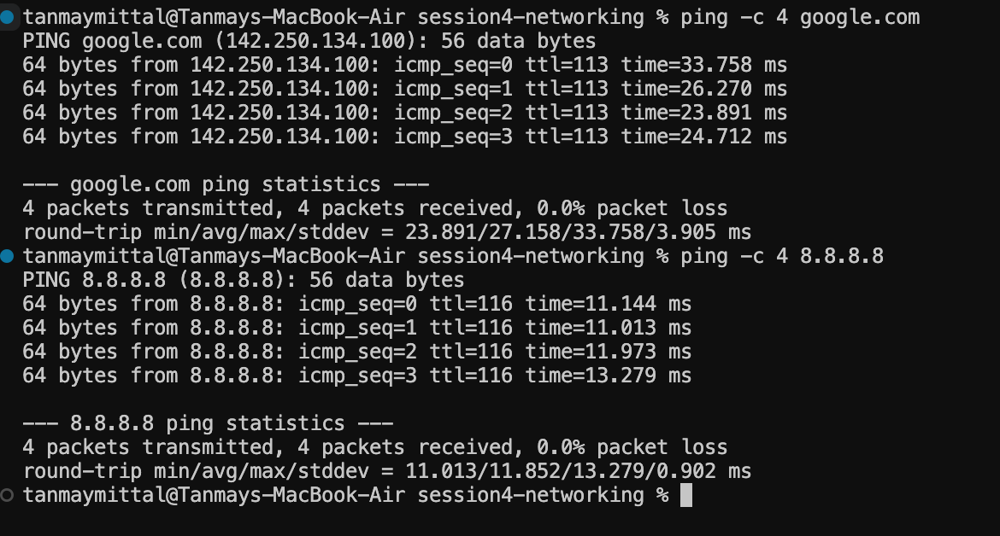
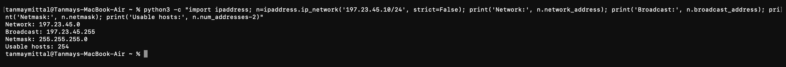

# Session 4 — Networking

## Overview

This session introduced fundamental networking concepts including IP
addressing, network interfaces, subnetting, subnet masks, gateways, and
basic network connectivity testing.

The practical work covered:

1. `ping` — Testing network connectivity
2. IP configuration — Inspecting network interfaces and routing
3. Subnetting — Calculating network and broadcast addresses

---

## 1. Ping

### Objective

The `ping` command was used to test whether a remote host is reachable over
a network and to observe the response time.

### Commands

```bash
ping -c 4 google.com
ping -c 4 8.8.8.8
```

The `-c 4` option sends four ICMP echo requests and then stops.

### Understanding the Output

The output provides information such as:

- Packets transmitted
- Packets received
- Packet loss
- Round-trip response time

This makes `ping` useful for basic network connectivity and troubleshooting.

### Practical Evidence



---

## 2. IP Configuration

### Objective

The network configuration of the local machine was inspected to understand
IP addresses, network interfaces, and the default gateway.

### Commands

```bash
ifconfig en0
```

This displays information about the `en0` network interface, including its
IP address, subnet mask, and interface status.

The IP address was also obtained using:

```bash
ipconfig getifaddr en0
```

The default route was checked using:

```bash
route -n get default
```

### Key Concepts

**Network Interface**

A network interface is the connection through which a device communicates
over a network. On this system, `en0` was the active network interface.

**IP Address**

An IP address identifies a device/interface on an IP network.

**Subnet Mask**

The subnet mask determines which portion of an IP address represents the
network and which portion represents the host.

**Default Gateway**

The default gateway is the router used to reach networks outside the
local network.

### Practical Evidence


---

## 3. Subnetting

### Objective

Subnetting was practiced by calculating the network address, broadcast
address, subnet mask, and number of usable hosts for an IPv4 network.

The example used was:

```text
197.23.45.10/24
```

The calculation was performed using:

```bash
python3 -c "import ipaddress; n=ipaddress.ip_network('197.23.45.10/24', strict=False); print('Network:', n.network_address); print('Broadcast:', n.broadcast_address); print('Netmask:', n.netmask); print('Usable hosts:', n.num_addresses-2)"
```

### Result

```text
Network: 197.23.45.0
Broadcast: 197.23.45.255
Netmask: 255.255.255.0
Usable hosts: 254
```

### Understanding the Calculation

A `/24` network contains:

```text
32 - 24 = 8 host bits
```

Therefore, the total number of addresses is:

```text
2^8 = 256
```

Two addresses are reserved:

- Network address
- Broadcast address

Therefore:

```text
Usable hosts = 256 - 2 = 254
```

### Practical Evidence



---

## Key Takeaways

- `ping` can be used to test basic network connectivity.
- Network interfaces provide the connection between a device and a network.
- An IP address identifies a device/interface within an IP network.
- A subnet mask separates the network portion from the host portion of an
  IP address.
- A default gateway is used to communicate with networks outside the local
  network.
- Subnetting allows networks to be divided into smaller logical networks.
- A `/24` IPv4 network contains 256 total addresses and 254 usable host
  addresses.

---

## Additional Networking Resources

The instructor provided additional resources for studying networking,
including network troubleshooting, OSI/network devices, subnetting,
IP addressing, DHCP, and NetFlow/NTP.

These resources are available in:

```text
resources.md
```

---

## Author

**Tanmay Mittal**  
**Roll No.: 24BCS10491**