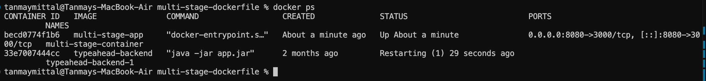

# Docker Multi-Stage Build

## Student Information

**Name:** Tanmay Mittal  
**Roll No.:** 24BCS10491

---

## Objective

The objective of this practical was to understand and implement a **Docker multi-stage build** for a Node.js application.

The application displays a simple Hello World webpage and is packaged into a Docker image using a multi-stage Dockerfile.

---

## Application

The application is a simple Node.js web server built using Express.

The server runs on port `3000` inside the container and displays:

    Hello World from Docker multi-stage build

    Name: Tanmay Mittal

    Roll No: 24BCS10491

### `server.js`

    const express = require("express");

    const app = express();
    const PORT = 3000;

    app.get("/", (req, res) => {
      res.send(`
        <h1>Hello World from Docker multi-stage build</h1>
        
<strong>Name:</strong> Tanmay Mittal

        
<strong>Roll No:</strong> 24BCS10491

      `);
    });

    app.listen(PORT, () => {
      console.log(`Server running on port ${PORT}`);
    });

---

## Dockerfile

The Dockerfile uses multiple stages to build the application and create the final runtime image.

    FROM node:22-alpine AS builder

    WORKDIR /app

    COPY package*.json ./

    RUN npm install

    COPY . .

    FROM node:22-alpine

    WORKDIR /app

    COPY --from=builder /app .

    EXPOSE 3000

    CMD ["npm", "start"]

### Multi-Stage Build

The multi-stage build separates the build environment from the final runtime environment.

The first stage installs the application dependencies and prepares the application.

The second stage creates the final image and copies the required application files from the builder stage.

This approach can help produce cleaner and smaller production images by keeping unnecessary build dependencies out of the final runtime image.

---

## Building the Docker Image

The Docker image was built using:

    docker build -t multi-stage-app .

The image was successfully created with the name:

    multi-stage-app

---

## Running the Container

The container was started using:

    docker run -d --name multi-stage-container -p 8080:3000 multi-stage-app

Port mapping:

    Host Port 8080 → Container Port 3000

The application was accessed through:

    http://localhost:8080

---

## Application Output

The application was successfully accessed through the browser and displayed the Hello World message along with the student information.

---

## Docker Container Verification

The running container was verified using:

    docker ps

The output confirmed that the `multi-stage-container` was running and that port `8080` on the host was mapped to port `3000` inside the container.

---

## Concepts Learned

### Multi-Stage Builds

A multi-stage Dockerfile allows multiple `FROM` instructions to be used in a single Dockerfile.

Different stages can be used for:

- Installing dependencies
- Building an application
- Creating the final runtime image

Only the required files from an earlier stage need to be copied into the final image.

### Port Mapping

Docker port mapping connects a host port to a container port:

    8080:3000

where:

- `8080` is the host port
- `3000` is the application port inside the container

### Docker Image

A Docker image is a packaged template containing the application and its required environment.

### Docker Container

A container is a running instance of a Docker image.

---

## Commands Used

| Command | Purpose |
|---|---|
| `docker build` | Builds a Docker image |
| `docker run` | Creates and starts a container |
| `docker ps` | Displays running containers |
| `-t` | Assigns a name/tag to an image |
| `-d` | Runs the container in detached mode |
| `-p` | Maps host and container ports |
| `COPY --from` | Copies files from a previous build stage |

---

## Directory Structure

    multi-stage-dockerfile/

    ├── images/
    │   ├── MultiStage.png
    │   └── MultistageTerminal.png
    │
    ├── Dockerfile
    ├── package.json
    ├── server.js
    └── README.md

---

## Result

The Node.js application was successfully containerized using a Docker multi-stage build.

The Docker image was built successfully, the container was started, and the application was verified through the browser using the mapped host port.

---

## Author

**Tanmay Mittal**  
**Roll No.: 24BCS10491**