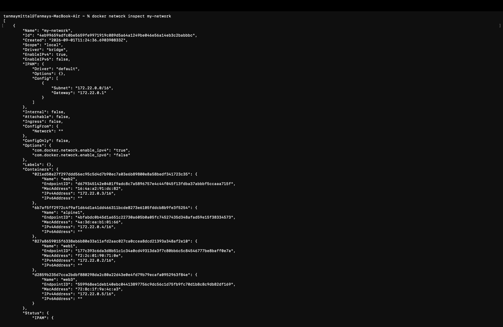
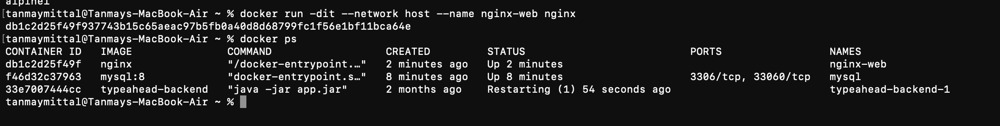
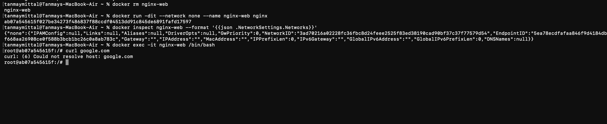
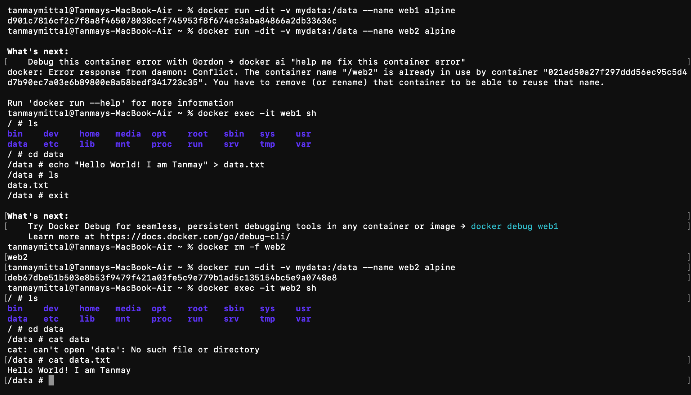
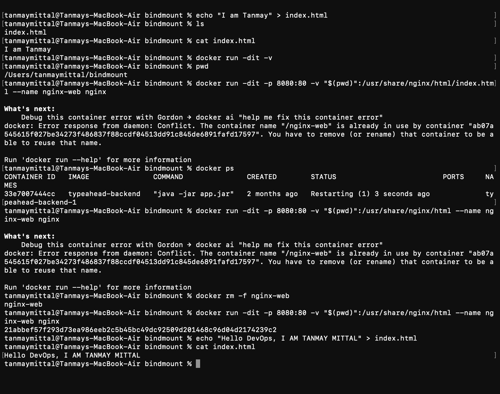

# Session 8 — Docker Networking & Volumes

## Overview

This practical focused on **Docker networking, container-to-container communication, network drivers, Docker volumes, and bind mounts**.

The experiments covered:

1. Creating and inspecting a custom Docker bridge network
2. Connecting multiple containers to the same network
3. Understanding the Host network
4. Understanding the None network
5. Sharing data between containers using Docker named volumes
6. Using bind mounts to share files between the host machine and a container

---

# 1. Docker Bridge Network

Docker provides different networking options for containers. The **bridge network** is commonly used when containers need to communicate with each other on the same Docker host.

First, a custom network was created:

```bash
docker network create my-network
```

The network was then inspected using:

```bash
docker network inspect my-network
```

The inspection showed that the network uses the **bridge** driver and has its own subnet and gateway.

```text
Subnet: 172.22.0.0/16
Gateway: 172.22.0.1
```

Multiple containers were connected to this network, including:

- `web1`
- `web2`
- `web3`
- `alpine1`

The containers received different IP addresses within the same network.



### Container-to-Container Communication

Containers connected to the same user-defined bridge network can communicate with each other.

For example, an Alpine container can be used to test communication with the Nginx containers:

```bash
docker exec -it alpine1 sh
```

Inside the Alpine container:

```bash
ping web1
ping web2
```

Docker's internal DNS allows containers to communicate using their **container names** instead of manually using IP addresses.

### Important Commands

Create a network:

```bash
docker network create my-network
```

Create a container directly on the network:

```bash
docker run -d --name web1 --network my-network nginx
```

Connect an existing container:

```bash
docker network connect my-network web1
```

Inspect the network:

```bash
docker network inspect my-network
```

---

# 2. Docker Network Drivers

Docker supports different network drivers for different use cases.

## Bridge

The **bridge** driver is used for communication between containers on the same Docker host.

```bash
docker network create my-network
```

Containers connected to the same user-defined bridge network can communicate with each other.

---

## Host

The **host** network removes the normal network isolation between the container and the host.

The container uses the host's network stack instead of receiving its own isolated network interface.

The experiment was performed using:

```bash
docker run -dit --network host --name nginx-web nginx
```

The running containers were checked with:

```bash
docker ps
```



With host networking, port publishing such as:

```bash
-p 8080:80
```

is not required in the same way because the container is using the host network.

> **Note:** Host networking behavior can differ between native Linux Docker and Docker Desktop on macOS. Docker Desktop uses a Linux VM, so host networking has additional platform-specific behavior.

---

# 3. None Network

The **none** network completely disables networking for a container.

A container was created using:

```bash
docker run -dit --network none --name nginx-web nginx
```

The network configuration was inspected with:

```bash
docker inspect nginx-web --format='{{json .NetworkSettings.Networks}}'
```

The container had no usable IP address or network connection.

To verify this, a shell was opened inside the container:

```bash
docker exec -it nginx-web /bin/bash
```

Then an attempt was made to access Google:

```bash
curl google.com
```

The request failed because the container has no network connectivity.



### Key Idea

```text
Bridge → Network enabled
Host   → Uses host network
None   → No network
```

---

# 4. Docker Named Volumes

Docker volumes provide persistent storage that is managed by Docker.

A named volume called `mydata` was used and mounted into two different containers at `/data`.

First container:

```bash
docker run -dit -v mydata:/data --name web1 alpine
```

Second container:

```bash
docker run -dit -v mydata:/data --name web2 alpine
```

Both containers use the same volume:

```text
mydata
   │
   ├── web1:/data
   │
   └── web2:/data
```

## Creating Data in `web1`

A shell was opened inside `web1`:

```bash
docker exec -it web1 sh
```

Then:

```bash
cd data
echo "Hello World! I am Tanmay" > data.txt
ls
```

The file `data.txt` was created inside the mounted volume.

## Reading the Same Data from `web2`

A shell was then opened inside `web2`:

```bash
docker exec -it web2 sh
```

Inside the container:

```bash
cd data
ls
cat data.txt
```

The same file created by `web1` was available inside `web2`.



### What This Demonstrates

The file is not stored only inside `web1`.

Instead, both containers are connected to the same Docker volume:

```text
web1 ─────┐
          │
          ▼
       mydata
          ▲
          │
web2 ─────┘
```

Therefore, data written by one container can be accessed by another container using the same volume.

### Important Concept

A **named volume** is managed by Docker and is independent of the lifecycle of an individual container.

---

# 5. Bind Mounts

A **bind mount** maps a directory or file from the host machine directly into a container.

A local directory named `bindmount` was used with an `index.html` file.

The file was created on the host:

```bash
echo "I am Tanmay" > index.html
```

The current directory was checked using:

```bash
pwd
```

Example:

```text
/Users/tanmaymittal/bindmount
```

The Nginx container was then started with the current directory mounted into Nginx's web root:

```bash
docker run -dit -p 8080:80 \
-v "$(pwd)":/usr/share/nginx/html \
--name nginx-web nginx
```

Here:

```text
Host directory
      │
      │ bind mount
      ▼
/usr/share/nginx/html
      │
      ▼
    Nginx
```

The host directory was therefore directly available inside the Nginx container.



## Updating the Host File

The `index.html` file was then changed directly on the host:

```bash
echo "Hello DevOps, I AM TANMAY MITTAL" > index.html
```

The updated file could then be viewed with:

```bash
cat index.html
```

Because the directory is bind-mounted into the container, the container sees the updated host file without rebuilding the Docker image.

---

# 6. Named Volume vs Bind Mount

| Feature | Named Volume | Bind Mount |
|---|---|---|
| Storage managed by | Docker | User/Host filesystem |
| Host path required | No | Yes |
| Example | `mydata:/data` | `$(pwd):/usr/share/nginx/html` |
| Useful for | Persistent application data | Development and live file editing |
| Direct host file access | Not normally | Yes |

### Named Volume

```bash
-v mydata:/data
```

Docker manages the storage.

### Bind Mount

```bash
-v "$(pwd)":/usr/share/nginx/html
```

A specific host directory is mapped directly into the container.

---

# 7. Port Mapping vs Docker Networking

Two concepts that were used throughout the practical are different:

### Port Mapping

```bash
-p 8080:80
```

This maps:

```text
Host port 8080 → Container port 80
```

It is primarily used when accessing a containerized service from the host machine.

### Docker Network

```bash
--network my-network
```

This connects a container to a Docker network so that it can communicate with other containers on that network.

For example:

```text
Browser
   │
   │ localhost:8080
   ▼
Host
   │
   │ port mapping
   ▼
Nginx container :80
```

while container-to-container communication works through a Docker network:

```text
web1 ───── my-network ───── web2
```

---

# 8. Commands Practiced

### Network

```bash
docker network create my-network
docker network ls
docker network inspect my-network
docker network connect my-network <container>
```

### Containers

```bash
docker run -d --name web1 --network my-network nginx
docker run -dit --name alpine1 --network my-network alpine
docker exec -it alpine1 sh
```

### Host Network

```bash
docker run -dit --network host --name nginx-web nginx
```

### None Network

```bash
docker run -dit --network none --name nginx-web nginx
```

### Named Volume

```bash
docker run -dit -v mydata:/data --name web1 alpine
docker run -dit -v mydata:/data --name web2 alpine
```

### Bind Mount

```bash
docker run -dit -p 8080:80 \
-v "$(pwd)":/usr/share/nginx/html \
--name nginx-web nginx
```

---

# 9. Key Takeaways

- **Bridge networks** allow containers on the same Docker network to communicate.
- User-defined bridge networks provide Docker DNS, allowing containers to be reached by name.
- `docker network inspect` can be used to view network configuration and connected containers.
- **Host networking** removes the normal network isolation between the container and host.
- **None networking** gives the container no network connectivity.
- **Named volumes** provide persistent Docker-managed storage that can be shared between containers.
- **Bind mounts** map files or directories from the host directly into a container.
- Port mapping (`-p`) and Docker networking (`--network`) solve different problems.
- Containers can be removed and recreated while data in a named volume can remain available.

---

## Conclusion

This practical provided hands-on experience with Docker's networking and storage features. The experiments demonstrated how containers communicate through user-defined networks, how different network drivers affect connectivity, and how Docker volumes and bind mounts allow data to persist or be shared between the host and containers.